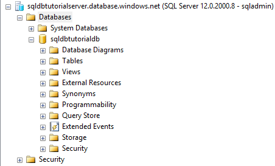
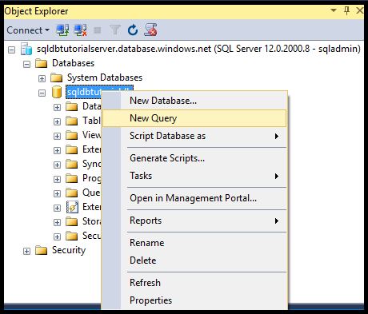

<properties
    pageTitle="Connect to SQL Database - SQL Server Management Studio | Azure"
    description="Learn how to connect to SQL Database on Azure by using SQL Server Management Studio (SSMS). Then, run a sample query using Transact-SQL (T-SQL)."
    metacanonical=""
    keywords="connect to sql database,sql server management studio"
    services="sql-database"
    documentationcenter=""
    author="CarlRabeler"
    manager="jhubbard"
    editor="" />
<tags
    ms.assetid="7cd2a114-c13c-4ace-9088-97bd9d68de12"
    ms.service="sql-database"
    ms.custom="development"
    ms.workload="data-management"
    ms.tgt_pltfrm="na"
    ms.devlang="na"
    ms.topic="article"
    ms.date="02/01/2017"
    wacn.date=""
    ms.author="sstein;carlrab" />

# Connect to SQL Database with SQL Server Management Studio and execute a sample T-SQL query

This article shows how to connect to an Azure SQL database using SQL Server Management Studio (SSMS). After successfully connecting, we run a simple Transact-SQL (T-SQL) query to verify communication with the database.

[AZURE.INCLUDE [SSMS Install](../../includes/sql-server-management-studio-install.md)]

1. If you have not already done so, download and install the latest version of SSMS at [Download SQL Server Management Studio](https://msdn.microsoft.com/zh-cn/library/mt238290.aspx). To stay up-to-date, the latest version of SSMS prompts you when there is a new version available to download.

2. After installing, type **Microsoft SQL Server Management Studio** in the Windows search box and click **Enter** to open SSMS:

    
3. In the Connect to Server dialog box, enter the necessary information to connect to your SQL server using SQL Server Authentication.

    
4. Click **Connect**.

    
5. In Object Explorer, expand **Databases**, expand any database to view objects in that database.

    
6. Right-click this database and then click **New Query**.

    
7. In the query window, type the following query:

   	select * from sys.objects
   
8.  On toolbar, click **Execute** to return a list of all system objects in the sample database.

    

> [AZURE.Tip]
> For a tutorial, see [Tutorial: Provision and access an Azure SQL database using the Azure portal and SQL Server Management Studio](/documentation/articles/sql-database-get-started/).    
>

## Next steps

- You can use T-SQL statements to create and manage databases in Azure in much the same way you can with SQL Server. If you're familiar with using T-SQL with SQL Server, see [Azure SQL Database Transact-SQL information)](/documentation/articles/sql-database-transact-sql-information/) for a summary of differences.
- If you're new to T-SQL, see [Tutorial: Writing Transact-SQL Statements](https://msdn.microsoft.com/zh-cn/library/ms365303.aspx) and the [Transact-SQL Reference (Database Engine)](https://msdn.microsoft.com/zh-cn/library/bb510741.aspx).
- For a getting started with SQL Server authentication tutorial, see [SQL authentication and authorization](/documentation/articles/sql-database-control-access-sql-authentication-get-started/)
- For a getting started with Azure Active Directory authentication tutorial, see [Azure AD authentication and authorization](/documentation/articles/sql-database-control-access-aad-authentication-get-started/)
- For more information about SSMS, see [Use SQL Server Management Studio](https://msdn.microsoft.com/zh-cn/library/ms174173.aspx).
