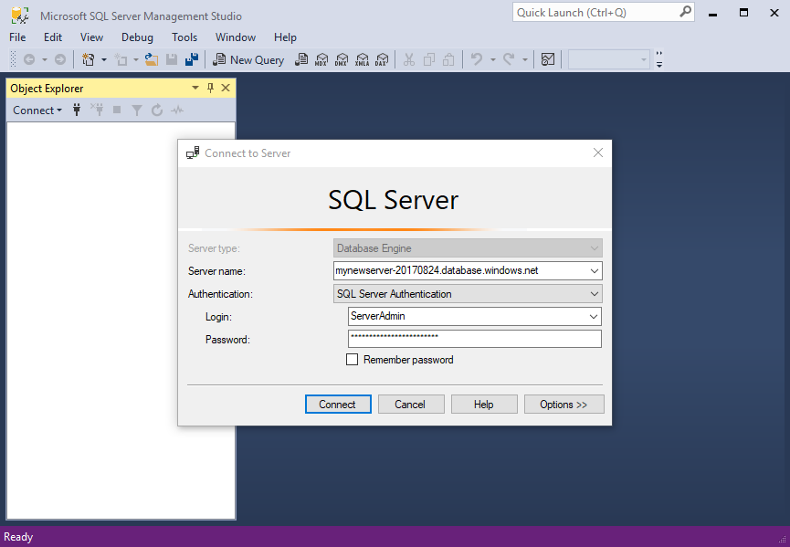
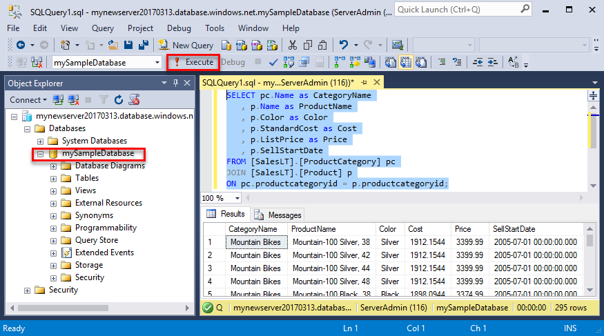

# Azure SQL Database: Use SQL Server Management Studio to connect and query data

[SQL Server Management Studio][ssms-install-latest-84g] (SSMS) is an integrated environment for managing any SQL infrastructure, from SQL Server to SQL Database for Microsoft Windows. This quickstart demonstrates how to use SSMS to connect to an Azure SQL database, and then use Transact-SQL statements to query, insert, update, and delete data in the database. 

## Prerequisites

This quickstart uses as its starting point the resources created in one of these quickstarts:

[!INCLUDE [prerequisites-create-db](../../includes/sql-database-connect-query-prerequisites-create-db-includes.md)]

#### Install the latest SSMS

Before you start, make sure you have installed the newest version of [SSMS][ssms-install-latest-84g]. 

## SQL server connection information

[!INCLUDE [prerequisites-server-connection-info](../../includes/sql-database-connect-query-prerequisites-server-connection-info-includes.md)]

## Connect to your database

Use SQL Server Management Studio to establish a connection to your Azure SQL Database server. 

> [!IMPORTANT]
> An Azure SQL Database logical server listens on port 1433. If you are attempting to connect to an Azure SQL Database logical server from within a corporate firewall, this port must be open in the corporate firewall for you to successfully connect.
>

1. Open SQL Server Management Studio.

2. In the **Connect to Server** dialog box, enter the following information:

   | Setting       | Suggested value | Description | 
   | ------------ | ------------------ | ------------------------------------------------- | 
   | **Server type** | Database engine | This value is required. |
   | **Server name** | The fully qualified server name | The name should be something like this: **mynewserver20170313.database.chinacloudapi.cn**. |
   | **Authentication** | SQL Server Authentication | SQL Authentication is the only authentication type that we have configured in this tutorial. |
   | **Login** | The server admin account | This is the account that you specified when you created the server. |
   | **Password** | The password for your server admin account | This is the password that you specified when you created the server. |
   ||||

     

3. Click **Options** in the **Connect to server** dialog box. In the **Connect to database** section, enter **mySampleDatabase** to connect to this database.

     

4. Click **Connect**. The Object Explorer window opens in SSMS. 

     

5. In Object Explorer, expand **Databases** and then expand **mySampleDatabase** to view the objects in the sample database.

## Query data

Use the following code to query for the top 20 products by category using the [SELECT](https://msdn.microsoft.com/library/ms189499.aspx) Transact-SQL statement.

1. In Object Explorer, right-click **mySampleDatabase** and click **New Query**. A blank query window opens that is connected to your database.
2. In the query window, enter the following query:

   ```sql
   SELECT pc.Name as CategoryName, p.name as ProductName
   FROM [SalesLT].[ProductCategory] pc
   JOIN [SalesLT].[Product] p
   ON pc.productcategoryid = p.productcategoryid;
   ```

3. On the toolbar, click **Execute** to retrieve data from the Product and ProductCategory tables.

    

## Insert data

Use the following code to insert a new product into the SalesLT.Product table using the [INSERT](https://msdn.microsoft.com/library/ms174335.aspx) Transact-SQL statement.

1. In the query window, replace the previous query with the following query:

   ```sql
   INSERT INTO [SalesLT].[Product]
           ( [Name]
           , [ProductNumber]
           , [Color]
           , [ProductCategoryID]
           , [StandardCost]
           , [ListPrice]
           , [SellStartDate]
           )
     VALUES
           ('myNewProduct'
           ,123456789
           ,'NewColor'
           ,1
           ,100
           ,100
           ,GETDATE() );
   ```

2. On the toolbar, click **Execute**  to insert a new row in the Product table.

    

## Update data

Use the following code to update the new product that you previously added using the [UPDATE](https://msdn.microsoft.com/library/ms177523.aspx) Transact-SQL statement.

1. In the query window, replace the previous query with the following query:

   ```sql
   UPDATE [SalesLT].[Product]
   SET [ListPrice] = 125
   WHERE Name = 'myNewProduct';
   ```

2. On the toolbar, click **Execute** to update the specified row in the Product table.

    

## Delete data

Use the following code to delete the new product that you previously added using the [DELETE](https://msdn.microsoft.com/library/ms189835.aspx) Transact-SQL statement.

1. In the query window, replace the previous query with the following query:

   ```sql
   DELETE FROM [SalesLT].[Product]
   WHERE Name = 'myNewProduct';
   ```

2. On the toolbar, click **Execute** to delete the specified row in the Product table.

    

## Next steps

- To learn about creating and managing servers and databases with Transact-SQL, see [Learn about Azure SQL Database servers and databases](sql-database-servers-databases.md).
- For information about SSMS, see [Use SQL Server Management Studio](https://msdn.microsoft.com/library/ms174173.aspx).
- To connect and query using the Azure portal, see [Connect and query with the Azure portal SQL Query editor](sql-database-connect-query-portal.md).
- To connect and query using Visual Studio Code, see [Connect and query with Visual Studio Code](sql-database-connect-query-vscode.md).
- To connect and query using .NET, see [Connect and query with .NET](sql-database-connect-query-dotnet.md).
- To connect and query using PHP, see [Connect and query with PHP](sql-database-connect-query-php.md).
- To connect and query using Node.js, see [Connect and query with Node.js](sql-database-connect-query-nodejs.md).
- To connect and query using Java, see [Connect and query with Java](sql-database-connect-query-java.md).
- To connect and query using Python, see [Connect and query with Python](sql-database-connect-query-python.md).
- To connect and query using Ruby, see [Connect and query with Ruby](sql-database-connect-query-ruby.md).


<!-- Article link references. -->

[ssms-install-latest-84g]: https://docs.microsoft.com/sql/ssms/sql-server-management-studio-ssms

