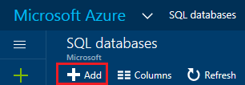

<properties
    pageTitle="Create an Azure SQL database | Azure"
    description="Quick reference on how to create an Azure SQL database using the Azure portal, PowerShell, Transact-SQL."
    services="sql-database"
    documentationcenter=""
    author="CarlRabeler"
    manager="jhubbard"
    editor="" />
<tags
    ms.service="sql-database"
    ms.custom="single databases"
    ms.devlang="NA"
    ms.workload="data-management"
    ms.topic="article"
    ms.tgt_pltfrm="NA"
    ms.date="11/14/2016"
    wacn.date=""
    ms.author="carlrab" />

# Create an Azure SQL database

You can create an Azure SQL database using the [Azure portal](https://portal.azure.cn/), PowerShell, Transact-SQL, the REST API or C#. 

## Create an Azure SQL database using the Azure portal

1. Open the **SQL databases** blade in the [Azure portal](https://portal.azure.cn/). 

    
2. On the SQL databases blade, click **Add**.

    

> [AZURE.TIP]
> For a getting started tutorial using the Azure portal and SQL Server Management Studio, see [Get started with Azure SQL Database servers, databases and firewall rules by using the Azure portal and SQL Server Management Studio](/documentation/articles/sql-database-get-started/).
>

## Create an Azure SQL database using PowerShell

To create a SQL database, use the [New-AzureRmSqlDatabase](https://docs.microsoft.com/powershell/resourcemanager/azurerm.sql/v2.3.0/new-azurermsqldatabase) cmdlet. The resource group, and server must already exist in your subscription. 

	$resourceGroupName = "resourcegroup1"
	$sqlServerName = "server1"

	$databaseName = "database1"
	$databaseEdition = "Standard"
	$databaseServiceLevel = "S0"

	$currentDatabase = New-AzureRmSqlDatabase -ResourceGroupName $resourceGroupName `
	 -ServerName $sqlServerName -DatabaseName $databaseName `
	 -Edition $databaseEdition -RequestedServiceObjectiveName $databaseServiceLevel

> [AZURE.TIP]
> For a sample script, see [Create a SQL database PowerShell script](/documentation/articles/sql-database-get-started-powershell/).
>

## Create an Azure SQL database using Transact-SQL in SQL Server Management Studio

To create a SQL Database using Transact-SQL in SQL Server Management Studio:

1. Using SQL Server Management Studio, connect to the Azure Database server using the server-level principal login or a login that is a member of the **dbmanager** role. For more information on logins, see [Manage logins](/documentation/articles/sql-database-manage-logins/).
2. In Object Explorer, open the Databases node, expand the **System Databases** folder, right-click on **master**, and then click **New Query**.
3. Use the **CREATE DATABASE** statement to create a database. For
  more information, see [CREATE DATABASE (SQL Database)](https://msdn.microsoft.com/zh-cn/library/dn268335.aspx). The following statement creates a database named **myTestDB** and specifies that it is a Standard S0 Edition database with a default maximum size of 250 GB.
  
      CREATE DATABASE myTestDB
      (EDITION='Standard',
       SERVICE_OBJECTIVE='S0');

4. Click **Execute** to run the query.
5. In Object Explorer, right-click the Databases node and click **Refresh** to view the new database in Object Explorer. 

> [AZURE.TIP]
> For a getting started tutorial using the Azure portal and SQL Server Management Studio, see [Get started with Azure SQL Database servers, databases and firewall rules by using the Azure portal and SQL Server Management Studio](/documentation/articles/sql-database-get-started/).
>

## Additional resources
* For an overview of management tools, see [Overview of management tools](/documentation/articles/sql-database-manage-overview/).
* To see how to perform management tasks using the Azure portal, see [Manage Azure SQL Databases using the Azure portal](/documentation/articles/sql-database-manage-portal/).
* To see how to perform management tasks using PowerShell, see [Manage Azure SQL Databases using PowerShell](/documentation/articles/sql-database-manage-powershell/).
* To see how to perform management tasks using SQL Server Management Studio, see [SQL Server Management Studio](/documentation/articles/sql-database-manage-azure-ssms/).
* For information about the SQL Database service, see [What is SQL Database](/documentation/articles/sql-database-technical-overview/). 
* For information about Azure Database servers and database features, see [Features](/documentation/articles/sql-database-features/).
