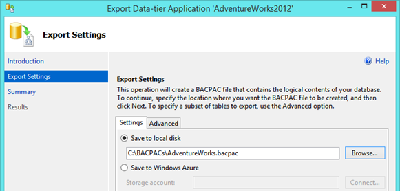

# Export an Azure SQL database or a SQL Server database to a BACPAC file using SQL Server Management Studio		

This article shows how to export an Azure SQL database or a SQL Server database to a [BACPAC](https://msdn.microsoft.com/zh-cn/library/ee210546.aspx#Anchor_4) file using the Export Data Tier Application Wizard in SQL Server Management Studio. For an overview of exporting to a BACPAC file, see [Export to a BACPAC](./sql-database-export.md).	

1. Verify that you have the latest version of SQL Server Management Studio. New versions of Management Studio are updated monthly to remain in sync with updates to the Azure portal.		

   > [!IMPORTANT]		
   > It is recommended that you always use the latest version of Management Studio to remain synchronized with updates to Azure and SQL Database. [Newest version of SSMS](https://msdn.microsoft.com/zh-cn/library/mt238290.aspx).		
   > 		

 2. Open Management Studio and connect to your source database in Object Explorer.		

     		
 3. Right-click the source database in the Object Explorer, point to **Tasks**, and click **Export Data-Tier Application…**		

     		
 4. In the export wizard, configure the export to save the BACPAC file to either a local disk location or to an Azure blob. The exported BACPAC always includes the complete database schema and, by default, data from all the tables. Use the Advanced tab if you want to exclude data from some or all the tables. You might, for example, choose to export only the data for reference tables rather than from all tables.		

     		

    > [!IMPORTANT]		
    > When exporting a BACPAC to Azure blob storage, use standard storage. Importing a BACPAC from premium storage is not supported.		
    >		

## Next steps		
* [Newest version of SSMS](https://msdn.microsoft.com/zh-cn/library/mt238290.aspx)
* To learn about importing a BACPAC to a SQL Server database, see [Import a BACPCAC to a SQL Server database](https://msdn.microsoft.com/zh-cn/library/hh710052.aspx)
* For a discussion of the entire SQL Server database migration process, including performance recommendations, see [Migrate a SQL Server database to Azure SQL Database](./sql-database-cloud-migrate.md).
* To learn about long-term backup retention of an Azure SQL database backup as an alternative to exported a database for archive purposes, see [Long term backup retention](./sql-database-long-term-retention.md)