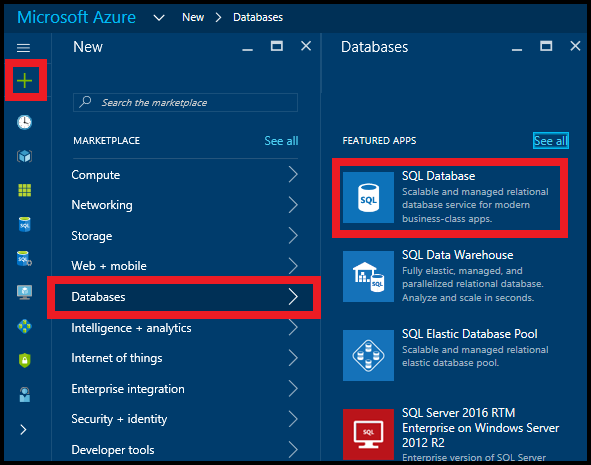
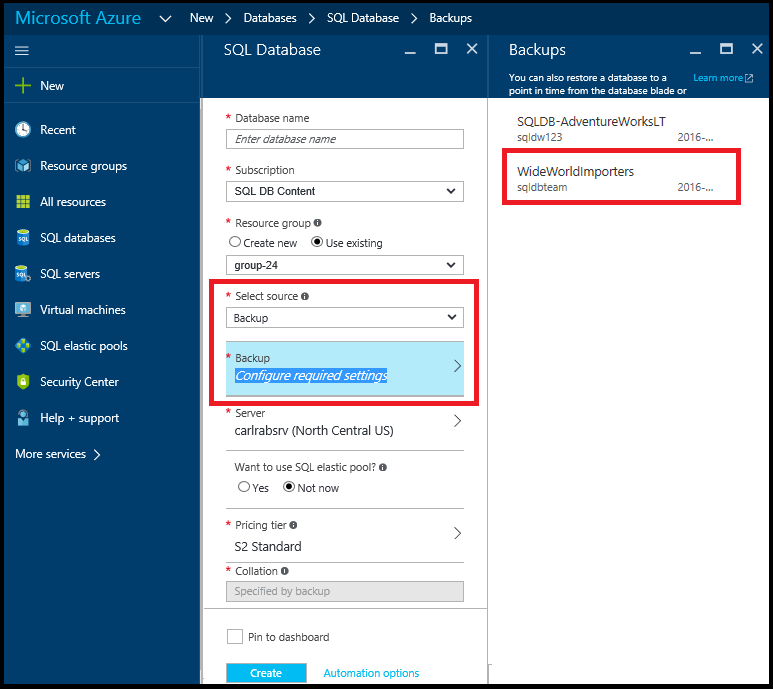

<properties
    pageTitle="Azure portal:Restore SQL Database from geo-redundant backup | Azure"
    description="Restore an Azure SQL Database into a new server from a geo-redundant backup using the Azure portal"
    services="sql-database"
    documentationcenter=""
    author="stevestein"
    manager="jhubbard"
    editor="" />
<tags
    ms.service="sql-database"
    ms.custom="business continuity"
    ms.devlang="NA"
    ms.topic="article"
    ms.tgt_pltfrm="powershell"
    ms.workload="NA"
    ms.date="12/19/2016"
    wacn.date=""
    ms.author="sstein; carlrab" />

# Restore an Azure SQL Database from a geo-redundant backup with the Azure portal

This article shows you how to restore your database into a new server by using geo-restore with the Azure portal. This task can also be done [using PowerShell](/documentation/articles/sql-database-geo-restore-powershell/).

## Restore an Azure SQL Database from a geo-redundant backup by using the Azure portal

To geo-restore a database in the Azure portal, do the following steps:

1. Go to the [Azure portal](https://portal.azure.cn).
2. On the left side of the screen select **+New** > **Databases** > **SQL Database**:
   
   
3. Select **Backup** as the source, and then select the backup you want to restore. Specify a database name, a server you want to restore the database into, and then click **Create**:
   
   

4. Monitor the status of the restore operation by clicking the notification icon in the upper right of the page.

## Next steps
- For a business continuity overview and scenarios, see [Business continuity overview](/documentation/articles/sql-database-business-continuity/)
- To learn about Azure SQL Database automated backups, see [SQL Database automated backups](/documentation/articles/sql-database-automated-backups/)
- To learn about using automated backups for recovery, see [restore a database from the service-initiated backups](/documentation/articles/sql-database-recovery-using-backups/)
- To learn about faster recovery options, see [Active-Geo-Replication](/documentation/articles/sql-database-geo-replication-overview/)  
- To learn about using automated backups for archiving, see [database copy](/documentation/articles/sql-database-copy/)
