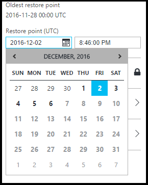
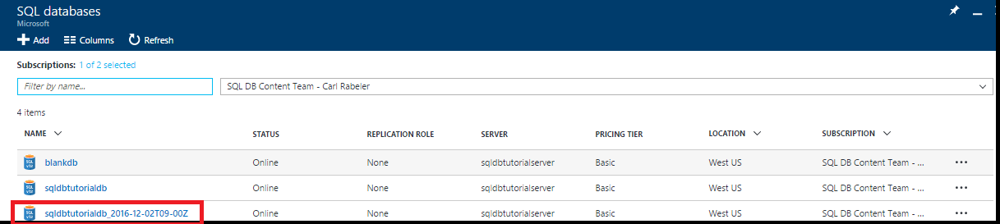

<!------------------
This topic is annotated with TEMPLATE guidelines for TUTORIAL TOPICS.

Metadata guidelines

title
    60 characters or less. Tells users clearly what they will do (deploy an ASP.NET web app to App Service). Not the same as H1. It's 60 characters or fewer including all characters between the quotes and the Microsoft Docs site identifier.

description
    115-145 characters. Duplicate of the first sentence in the introduction. This is the abstract of the article that displays under the title when searching in Bing or Google. 

```
Example: "This tutorial shows how to deploy an ASP.NET web application to a web app in Azure App Service by using Visual Studio 2015."
```
------------------>

<!----------------

TEMPLATE GUIDELINES for tutorial topics

The tutorial topic shows users how to solve a problem using a product or service. It includes the prerequisites and steps users need to be successful.  

It is a "solve a problem" topic, not a "learn concepts" topic.

DO include this:
    • What users will do
    • What they will create or accomplish by the end of the tutorial
    • Time estimate
    • Optional but useful: Include a diagram or video. Diagrams help users see the big picture of what they are doing. A video of the steps can be used by customers as an alternative to following the steps in the topic.
    • Prerequisites: Technical expertise and software requirements
    • End-to-end steps. At the end, include next steps to deeper or related tutorials so users can learn more about the service

DON'T include this:
    • Conceptual info about the service. This info is in overview topics that you can link to in the prerequisites section if necessary

------------------->

<!------------------
GUIDELINES for the H1 

```
The H1 should answer the question "What will I do in this topic?" Write the H1 heading in conversational language and use search keywords as much as possible. Since this is a "solve a problem" topic, make sure the title indicates that. Use a strong, specific verb like "Deploy."  

Heading must use an industry standard term. If your feature is a proprietary name like "elastic pools", use a synonym. For example: "Learn about elastic pools for multi-tenant databases." In this case multi-tenant database is the industry-standard term that will be an anchor for finding the topic.
```

-------------------->

# Get Started with Backup and Restore for Data Protection and Recovery

<!------------------
    GUIDELINES for introduction

```
The introduction is 1-2 sentences.  It is optimized for search and sets proper expectations about what to expect in the article. It should contain the top keywords that you are using throughout the article.The introduction should be brief and to the point of what users will do and what they will accomplish. 

In this example:
```

Sentence #1 Explains what the user will do. This is also the metadata description. 
    This tutorial shows how to deploy an ASP.NET web application to a web app in Azure App Service by using Visual Studio 2015. 

Sentence #2 Explains what users will learn and the benefit.  
    When you’re finished, you’ll have a simple web application up and running in the cloud.

-------------------->

In this getting-started tutorial, you learn how to use the Azure portal to:

- View existing backups of a database
- Restore a database to a previous point in time
- Configure long-term retention of a database backup file in the Azure Recovery Services vault
- Restore a database from the Azure Recovery Services vault

**Time estimate**: This tutorial takes approximately 30 minutes to complete (assuming you have already met the prerequisites).

## Prerequisites

* You need an Azure account. You can [open a 1rmb Azure account](https://www.azure.cn/pricing/1rmb-trial/?WT.mc_id=A261C142F). 

* You must be able to connect to the Azure portal using an account that is a member of either the subscription owner or contributor role. For more information on role-based access control (RBAC), see [Getting started with access management in the Azure portal](../active-directory/role-based-access-control-what-is.md).

* You have completed the [Get started with Azure SQL Database servers, databases, and firewall rules by using the Azure portal and SQL Server Management Studio](./sql-database-get-started.md) or the equivalent [PowerShell version](./sql-database-get-started-powershell.md) of this tutorial. If you have not, either complete this prerequisite tutorial or execute the PowerShell script at the end of the [PowerShell version](./sql-database-get-started-powershell.md) of this tutorial before continuing.

<!------------------
> [!TIP]
> You can perform these same tasks in a getting started tutorial by using either [C#](./sql-database-get-started-csharp.md) or [PowerShell](./sql-database-get-started-powershell.md).
>
-------------------->

## Sign in by using your existing account
Using your [existing subscription](https://account.windowsazure.cn/Home/Index), follow these steps to connect to the Azure portal.

1. Open your browser of choice and connect to the [Azure portal](https://portal.azure.cn/).
2. Sign in to the [Azure portal](https://portal.azure.cn/).
3. On the **Sign in** page, provide the credentials for your subscription.

   

<a name="create-logical-server-bk"></a>

## View the oldest restore point from the service-generated backups of a database

In this section of the tutorial, you view information about the oldest restore point from the [service-generated automated backups](./sql-database-automated-backups.md) of your database. 

1. Open the **SQL database** blade for your database, **sqldbtutorialdb**.

    

2. On the toolbar, click **Restore**.

    

3. On the Restore blade, review the oldest restore point.

    

## Restore a database to a previous point in time

In this section of the tutorial, you restore the database to a new database as of a specific point in time.

1. On the **Restore** blade for the database, review the default name for the new database to which to restore you database to an earlier point in time (the name is the existing database name appended with a timestamp). This name changes to reflect the time you specify in the next few steps.

    

2. Click the **calendar** icon in the **Restore point (UTC)** input box.

    

2. On the calendar, select a date within the retention period

    

3. In the **Restore point (UTC)** input box, specify the time on the selected date to which you wish to restore the data in the database from the automated database backups.

    

    >[!NOTE]
    >Notice that the database name has changed to reflect the date and time that you selected. Notice also that you cannot change the server to which you are restoring to a specific point in time. To restore to a different server, use [Geo-Restore](./sql-database-disaster-recovery.md#recover-using-geo-restore).
    >

4. Click **OK** to restore your database to an earlier point in time to the new database.

5. On the toolbar, click the notification icon to view the status of the restore job.

    

6. When the restore job is completed, open the **SQL databases** blade to view the newly restored database.

    

   > [!NOTE]
   > From here, you can connect to the restored database using SQL Server Management Studio to perform needed tasks, such as to [extract a bit of data from the restored database to copy into the existing database or to delete the existing database and rename the restored database to the existing database name](./sql-database-recovery-using-backups.md#point-in-time-restore).
   >


## Next steps

- To learn about service-generated automatic backups, see [automatic backups](./sql-database-automated-backups.md)
- To learn about restoring from backups, see [restore from backup](./sql-database-recovery-using-backups.md)