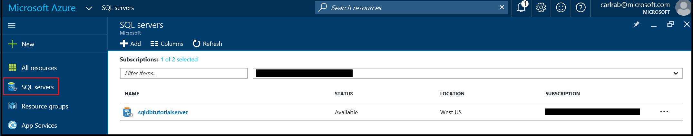
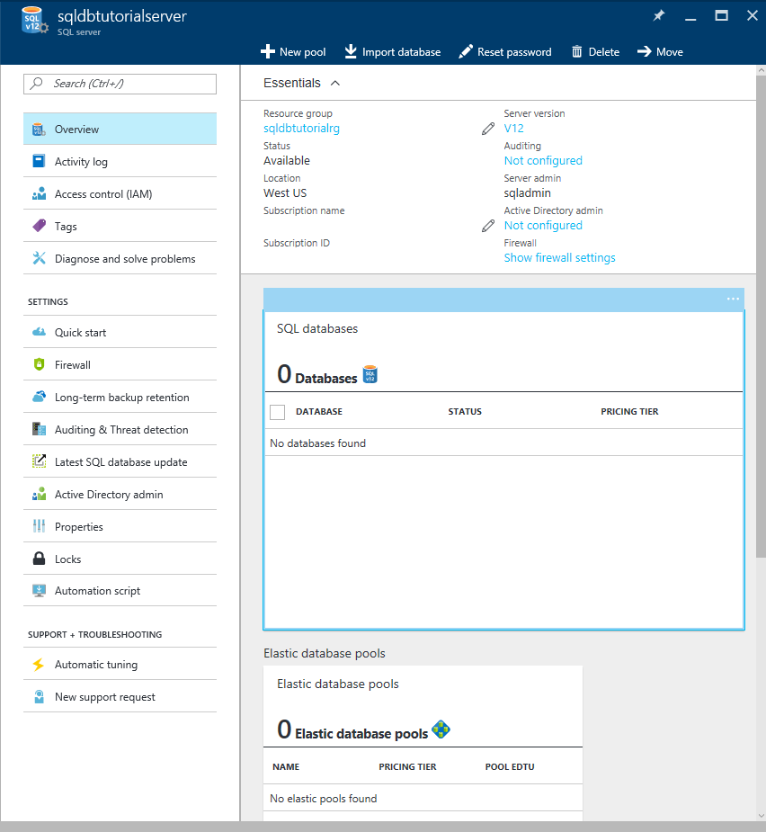

<properties
    pageTitle="Azure portal: Create and manage Azure SQL Database servers | Azure"
    description="Quick reference on how to create and manage Azure SQL Database servers with the Azure portal."
    services="sql-database"
    documentationcenter=""
    author="CarlRabeler"
    manager="jhubbard"
    editor="" />
<tags
    ms.service=”sql-database"
    ms.custom="servers"
    ms.devlang="NA"
    ms.workload="data-management"
    ms.topic="article"
    ms.tgt_pltfrm="NA"
    ms.date="02/06/2017"
    wacn.date=""
    ms.author="carlrab" />

# Create and manage Azure SQL Database servers with the Azure portal

You can create and manage Azure SQL Database server with the [Azure portal](https://portal.azure.cn/), PowerShell, the REST API, or C#. This topic is about using the Azure portal. For PowerShell, see [Create and manage servers using Powershell](/documentation/articles/sql-database-manage-servers-powershell/).

## Create an Azure SQL Database server using the Azure portal

1. Open the **SQL servers** blade in the [Azure portal](https://portal.azure.cn/). 

    

2. Click **Add** to create a SQL server

    

> [AZURE.TIP]
> For a getting started tutorial using the Azure portal and SQL Server Management Studio, see [Get started with Azure SQL Database servers, databases and firewall rules by using the Azure portal and SQL Server Management Studio](/documentation/articles/sql-database-get-started/).
>

## View and update Azure SQL server settings using the Azure portal
1. Open the **SQL servers** blade in the [Azure portal](https://portal.azure.cn/). 

    

2. Click the server you want to work with and then click the desired setting on the SQL servers blade. 

    

> [AZURE.TIP]
> For a getting started tutorial that creates a server using the Azure portal, see [Create a database - Azure portal](/documentation/articles/sql-database-get-started/).
>

## Next steps
* For an overview of management tools, see [Overview of management tools](/documentation/articles/sql-database-manage-overview/)
* To see how to perform management tasks using the Azure portal, see [Manage Azure SQL Databases using the Azure portal](/documentation/articles/sql-database-manage-portal/)
* To see how to perform management tasks using PowerShell, see [Manage Azure SQL Databases using PowerShell](/documentation/articles/sql-database-manage-powershell/)
* To see how to perform additional tasks using SQL Server Management Studio, see [SQL Server Management Studio](/documentation/articles/sql-database-manage-azure-ssms/).
* For information about the SQL Database service, see [What is SQL Database](/documentation/articles/sql-database-technical-overview/). 
* For information about Azure Database servers and database features, see [Features](/documentation/articles/sql-database-features/).
