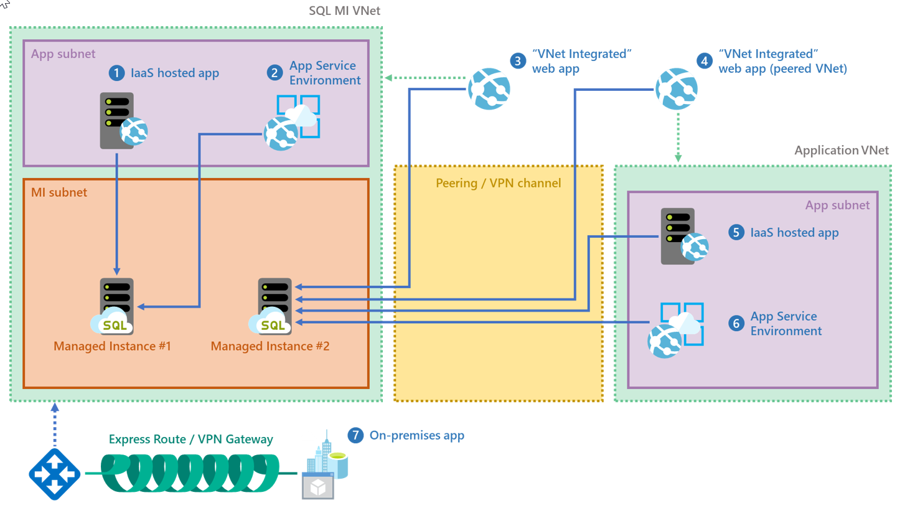
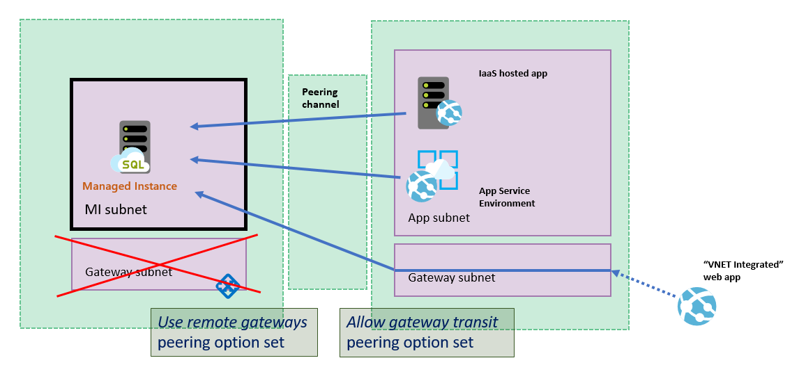

# Connect your application to Azure SQL Database Managed Instance

Today you have multiple choices when deciding how and where you host your application. 
 
You may choose to host application in the cloud either by using Azure App Service or some of Azure's virtual network (VNet) integrated options like Azure App Service Environment, Virtual Machine, Virtual Machine Scale Set. You could also take hybrid cloud approach and keep your applications on-premises. 
 
Whatever choice you made, you can connect it to a Managed Instance (preview).  

  

## Connect an application inside the same VNet 

This scenario is the simplest. Virtual machines inside the VNet can connect to each other directly even if they are inside different subnets. That means that all you need to connect application inside an Azure Application Environment or Virtual Machine is to set the connection string appropriately.  
 
In case you can’t establish the connection, check if you have a Network Security Group set on application subnet. In this case, you need to open outbound connection on SQL port 1433 as well as 11000-12000 range of ports for redirection. 

## Connect an application inside a different VNet 

This scenario is a bit more complex because Managed Instance has private IP address in its own VNet. To connect, an application needs access to the VNet where Managed Instance is deployed. So, first you need to make a connection between the application and the Managed Instance VNet. The VNets don’t have to be in the same subscription in order for this scenario to work. 
 
There are two options for connecting VNets: 
- [Azure Virtual Network peering](../virtual-network/virtual-network-peering-overview.md) 
- VNet-to-VNet VPN gateway ([Azure portal](../vpn-gateway/vpn-gateway-howto-vnet-vnet-resource-manager-portal.md), [PowerShell](../vpn-gateway/vpn-gateway-vnet-vnet-rm-ps.md), [Azure CLI](../vpn-gateway/vpn-gateway-howto-vnet-vnet-cli.md)) 
 
The peering option is the preferable one because peering uses the Microsoft backbone network so, from the connectivity perspective, there is no noticeable difference in latency between virtual machines in peered VNet and in the same VNet. VNet peering is limited to the networks in the same region, although cross-region peering is enabled in some regions as a preview.  
 
> [!IMPORTANT]
> VNet peerings created cross-region may not have the same level of availability and reliability as peerings in a general availability release. VNet peerings may have constrained capabilities and may not be available in all Azure regions. For the most up-to-date notifications on availability and status of this feature, check the [Azure Virtual Network](https://azure.microsoft.com/updates/?product=virtual-network) updates page. 

## Connect an on-premises application 

Managed Instance can only be accessed through a private IP address. In order to access it from on-premises, you need to make a Site-to-Site connection between the application and the Managed Instance VNet. 
 
There are two options how to connect on-premises to Azure VNet: 
- Site-to-Site VPN connection ([Azure portal](../vpn-gateway/vpn-gateway-howto-site-to-site-resource-manager-portal.md), [PowerShell](../vpn-gateway/vpn-gateway-create-site-to-site-rm-powershell.md), [Azure CLI](../vpn-gateway/vpn-gateway-howto-site-to-site-resource-manager-cli.md)) 
- [ExpressRoute](../expressroute/expressroute-introduction.md) connection  
 
If you've established on-premises to Azure connection successfully and you can't establish connection to Managed Instance, check if your firewall has open outbound connection on SQL port 1433 as well as 11000-12000 range of ports for redirection. 

## Connect an Azure App Service hosted application 

Managed Instance can be accessed only through a private IP address so in order to access it from Azure App Service you first need to make a connection between the application and the Managed Instance VNet. See [Integrate your app with an Azure Virtual Network](../app-service/web-sites-integrate-with-vnet.md).  
 
For troubleshooting, see [Troubleshooting VNets and Applications](../app-service/web-sites-integrate-with-vnet.md#troubleshooting). If a connection cannot be established, try [synching the networking configuration](sql-database-managed-instance-sync-network-configuration.md). 
 
A special case of connecting Azure App Service to Managed Instance is when you integrated Azure App Service to a network peered to Managed Instance VNet. That case requires the following configuration to be set up: 

- Managed Instance VNet must NOT have gateway  
- Managed Instance VNet must have Use remote gateways option set 
- Peered VNet must have Allow gateway transit option set 
 
This scenario is illustrated in the following diagram:

 
## Connect an application on the developers box 

Managed Instance can be accessed only through a private IP address so in order to access it from your developer box, you first need to make a connection between your developer box and the Managed Instance VNet.  
 
Configure a Point-to-Site connection to a VNet using native Azure certificate authentication articles ([Azure portal](../vpn-gateway/vpn-gateway-howto-point-to-site-resource-manager-portal.md), [PowerShell](../vpn-gateway/vpn-gateway-howto-point-to-site-rm-ps.md), [Azure CLI](../vpn-gateway/vpn-gateway-howto-point-to-site-classic-azure-portal.md)) shows in detail how it could be done.  

## Next steps

- For information about Managed Instance, see [What is a Managed Instance](sql-database-managed-instance.md).
- For a tutorial showing you how to create a new Managed Instance, see [Create a Managed Instance](sql-database-managed-instance-create-tutorial-portal.md).

