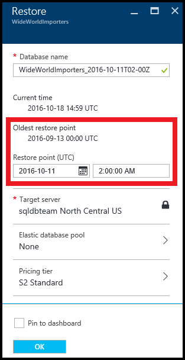
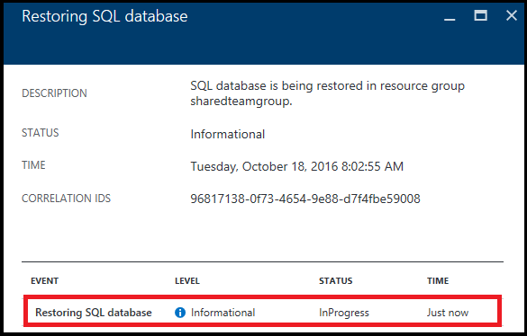

<properties
    pageTitle="Azure portal:Restore Azure SQL Database to point in time | Azure"
    description="Restore an Azure SQL Database to a previous point in time using the Azure portal"
    documentationcenter=""
    author="stevestein"
    manager="jhubbard"
    editor="" />
<tags
    ms.service="sql-database"
    ms.custom="business continuity"
    ms.devlang="NA"
    ms.topic="article"
    ms.tgt_pltfrm="powershell"
    ms.workload="NA"
    ms.date="12/08/2016"
    wacn.date=""
    ms.author="carlrab" />

# Restore an Azure SQL database to a previous point in time with the Azure portal

This artcile shows you how to restore your database to an earlier point in time from [SQL Database automated backups](/documentation/articles/sql-database-automated-backups/). using PowerShell. This task can also be done [with PowerShell](/documentation/articles/sql-database-point-in-time-restore-powershell/).

## Restore to a previous point in time 

> [AZURE.TIP]
> For a tutorial, see [Get Started with Backup and Restore for data protection and recovery](/documentation/articles/sql-database-get-started-backup-recovery-portal/)
>

Select a database to restore in the Azure portal:

1. Open the [Azure portal](https://portal.azure.cn).
2. On the left side of the screen, select **More services** > **SQL databases**.
3. Click the database you want to restore.
4. At the top of your database's page, select **Restore**:
   
   
5. On the **Restore** page, select the date and time (in UTC time) to restore the database to, and then click **OK**:
   
   

6. After clicking **OK** in the previous step, click the notification icon at the upper right of the page, and click the **Restoring SQL database** notification for details.
   
    
7. The Restoring SQL database page opens with information about the status of the restore. You can click the line-item for more details:
   
    

## Next steps
- To learn about Azure SQL Database automated backups, see [SQL Database automated backups](/documentation/articles/sql-database-automated-backups/)
- To learn about using automated backups for recovery, see [restore a database from the service-initiated backups](/documentation/articles/sql-database-recovery-using-backups/)
- For a business continuity overview and scenarios, see [Business continuity overview](/documentation/articles/sql-database-business-continuity/)

