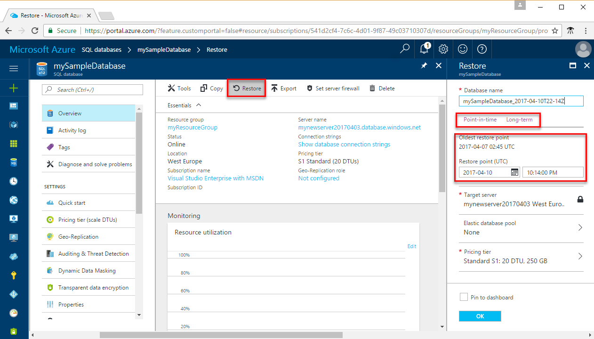
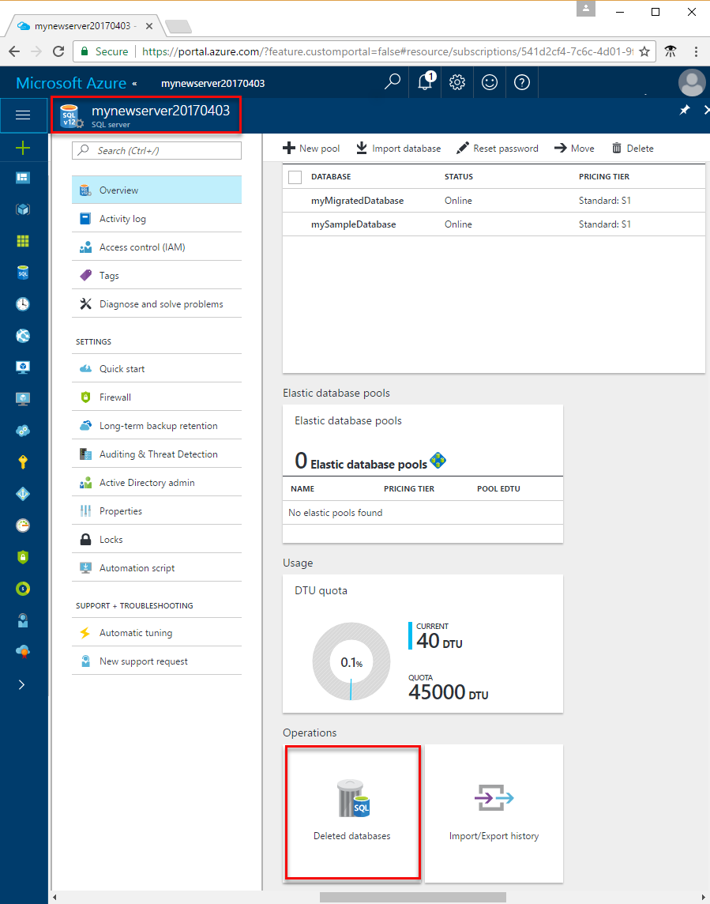
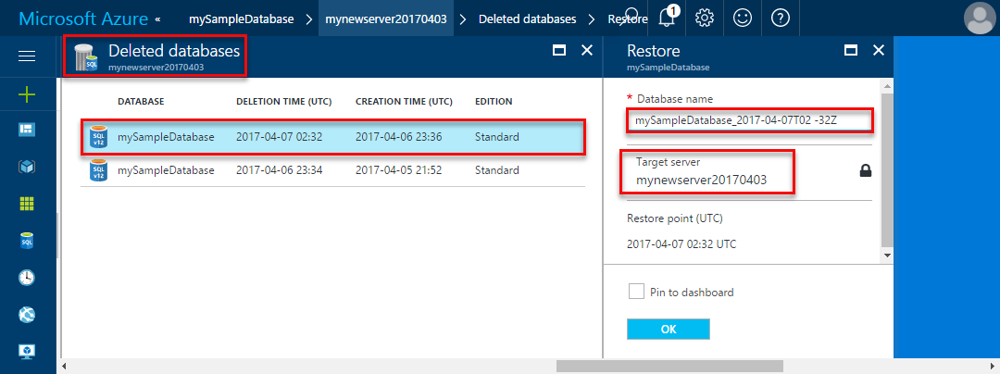

# Recover an Azure SQL database using automated database backups
SQL Database provides these options for database recovery using [automated database backups](sql-database-automated-backups.md) . You can restore from a database backup to:

* A new database on the same logical server recovered to a specified point in time within the retention period. 
* A database on the same logical server recovered to the deletion time for a deleted database.
* A new database on any logical server in any region recovered to the point of the most recent daily backups in geo-replicated blob storage (RA-GRS).

> [!IMPORTANT]
> You cannot overwrite an existing database during restore.
>

A restored database incurs an extra storage cost under the following conditions: 
- Restore of P11–P15 to S4-S12 or P1–P6 if the database max size is greater than 500 GB.
- Restore of P1–P6 to S4-S12 if the database max size is greater than 250 GB.

The extra cost is because the max size of the restored database is greater than the amount of storage included for the performance level, and any extra storage provisioned above the included amount is charged extra.  For pricing details of extra storage, see the [SQL Database pricing page](https://www.azure.cn/pricing/details/sql-database/).  If the actual amount of space used is less than the amount of storage included, then this extra cost can be avoided by reducing the database max size to the included amount. For more information about database storage sizes and changing the database maximum size, see [single database resource limits](sql-database-resource-limits.md#single-database-storage-sizes-and-performance-levels).  

> [!NOTE]
> [Automated database backups](sql-database-automated-backups.md) are used when you create a [database copy](sql-database-copy.md). 
>

## Recovery time
The recovery time to restore a database using automated database backups is impacted by several factors: 

* The size of the database
* The performance level of the database
* The number of transaction logs involved
* The amount of activity that needs to be replayed to recover to the restore point
* The network bandwidth if the restore is to a different region 
* The number of concurrent restore requests being processed in the target region. 
  
  For a very large and/or active database, the restore may take several hours. If there is prolonged outage in a region, it is possible that there are large numbers of geo-restore requests being processed by other regions. When there are many requests, the recovery time may increase for databases in that region. Most database restores complete within 12 hours.
  
  There is no built-in functionality to do bulk restore. The [Azure SQL Database: Full Server Recovery](https://gallery.technet.microsoft.com/Azure-SQL-Database-Full-82941666) script is an example of one way of accomplishing this task.

> [!IMPORTANT]
> To recover using automated backups, you must be a member of the SQL Server Contributor role in the subscription or be the subscription owner. You can recover using the Azure portal, PowerShell, or the REST API. You cannot use Transact-SQL. 
> 

## Point-in-time restore

You can restore an existing database to an earlier point in time as a new database on the same logical server using the Azure portal, [PowerShell](https://docs.microsoft.com/powershell/module/azurerm.sql/restore-azurermsqldatabase), or the [REST API](https://msdn.microsoft.com/library/azure/mt163685.aspx). 

> [!TIP]
> For a sample PowerShell script showing how to perform a point-in-time restore of a database, see [Restore a SQL database using PowerShell](scripts/sql-database-restore-database-powershell.md).
>

The database can be restored to any service tier or performance level, and as a single database or into an elastic pool. Ensure you have sufficient resources on the logical server or in the elastic pool to which you are restoring the database. Once complete, the restored database is a normal, fully accessible, online database. The restored database is charged at normal rates based on its service tier and performance level. You do not incur charges until the database restore is complete.

You generally restore a database to an earlier point for recovery purposes. When doing so, you can treat the restored database as a replacement for the original database or use it to retrieve data from and then update the original database. 

* ***Database replacement:*** If the restored database is intended as a replacement for the original database, you should verify the performance level and/or service tier are appropriate and scale the database if necessary. You can rename the original database and then give the restored database the original name using the [ALTER DATABASE](https://docs.microsoft.com/sql/t-sql/statements/alter-database-azure-sql-database) command in T-SQL. 
* ***Data recovery:*** If you plan to retrieve data from the restored database to recover from a user or application error, you need to write and execute the necessary data recovery scripts to extract data from the restored database to the original database. Although the restore operation may take a long time to complete, the restoring database is visible in the database list throughout the restore process. If you delete the database during the restore, the restore operation is canceled and you are not charged for the database that did not complete the restore. 

### Azure portal

To recover to a point in time using the Azure portal, open the page for your database and click **Restore** on the toolbar.

## Deleted database restore
You can restore a deleted database to the deletion time for a deleted database on the same logical server using the Azure portal, [PowerShell](https://docs.microsoft.com/powershell/module/azurerm.sql/restore-azurermsqldatabase), or the [REST (createMode=Restore)](https://msdn.microsoft.com/library/azure/mt163685.aspx). You can restore a deleted database to an earlier point in time during the retention using [PowerShell](https://docs.microsoft.com/powershell/module/azurerm.sql/restore-azurermsqldatabase).

> [!TIP]
> For a sample PowerShell script showing how to restore a deleted database, see [Restore a SQL database using PowerShell](scripts/sql-database-restore-database-powershell.md).
>

> [!IMPORTANT]
> If you delete an Azure SQL Database server instance, all its databases are also deleted and cannot be recovered. There is currently no support for restoring a deleted server.
> 

### Azure portal

To recover a deleted database during its [retention period](sql-database-service-tiers.md) using the Azure portal, open the page for your server and in the Operations area, click **Deleted databases**.

## Geo-restore
You can restore a SQL database on any server in any Azure region from the most recent geo-replicated full and differential backups. Geo-restore uses a geo-redundant backup as its source and can be used to recover a database even if the database or datacenter is inaccessible due to an outage. 

Geo-restore is the default recovery option when your database is unavailable because of an incident in the region where the database is hosted. If a large-scale incident in a region results in unavailability of your database application, you can restore a database from the geo-replicated backups to a server in any other region. There is a delay between when a differential backup is taken and when it is geo-replicated to an Azure blob in a different region. This delay can be up to an hour, so, if a disaster occurs, there can be up to one hour data loss. The following illustration shows restore of the database from the last available backup in another region.

> [!TIP]
> For a sample PowerShell script showing how to perform a geo-restore, see [Restore a SQL database using PowerShell](scripts/sql-database-restore-database-powershell.md).
> 

Point-in-time restore on a geo-secondary is not currently supported. Point-in-time restore can be done only on a primary database. For detailed information about using geo-restore to recover from an outage, see [Recover from an outage](sql-database-disaster-recovery.md).

> [!IMPORTANT]
> Recovery from backups is the most basic of the disaster recovery solutions available in SQL Database with the longest Recovery Point Objective (RPO) and Estimate Recovery Time (ERT). For solutions using Basic databases, geo-restore is frequently a reasonable DR solution with an ERT of 12 hours. For solutions using larger Standard or Premium databases that require shorter recovery times, you should consider using [active geo-replication](sql-database-geo-replication-overview.md). Active geo-replication offers a much lower RPO and ERT as it only requires you initiate a failover to a continuously replicated secondary. For more information on business continuity choices, see [Overview of business continuity](sql-database-business-continuity.md).
> 

### Azure portal

To geo-restore a database during its [retention period](sql-database-service-tiers.md) using the Azure portal, open the SQL Databases page and then click **Add**. In the **Select source** text box, select **Backup**. Specify the backup from which to perform the recovery in the region and on the server of your choice. 

## Programmatically performing recovery using automated backups
As previously discussed, in addition to the Azure portal, database recovery can be performed programmatically using Azure PowerShell or the REST API. The following tables describe the set of commands available.

### PowerShell
| Cmdlet | Description |
| --- | --- |
| [Get-AzureRmSqlDatabase](https://docs.microsoft.com/powershell/module/azurerm.sql/get-azurermsqldatabase) |Gets one or more databases. |
| [Get-AzureRMSqlDeletedDatabaseBackup](https://docs.microsoft.com/powershell/module/azurerm.sql/get-azurermsqldeleteddatabasebackup) | Gets a deleted database that you can restore. |
| [Get-AzureRmSqlDatabaseGeoBackup](https://docs.microsoft.com/powershell/module/azurerm.sql/get-azurermsqldatabasegeobackup) |Gets a geo-redundant backup of a database. |
| [Restore-AzureRmSqlDatabase](https://docs.microsoft.com/powershell/module/azurerm.sql/restore-azurermsqldatabase) |Restores a SQL database. |
|  | |

### REST API
| API | Description |
| --- | --- |
| [REST (createMode=Recovery)](https://msdn.microsoft.com/library/azure/mt163685.aspx) |Restores a database |
| [Get Create or Update Database Status](https://msdn.microsoft.com/library/azure/mt643934.aspx) |Returns the status during a restore operation |
|  | |

## Summary
Automatic backups protect your databases from user and application errors, accidental database deletion, and prolonged outages. This built-in capability is available for all service tiers and performance levels. 

## Next steps
* For a business continuity overview and scenarios, see [Business continuity overview](sql-database-business-continuity.md)
* To learn about Azure SQL Database automated backups, see [SQL Database automated backups](sql-database-automated-backups.md)
* To learn about faster recovery options, see [Failover groups and active geo-replication](sql-database-geo-replication-overview.md).  
<!--Update_Description: wording update-->