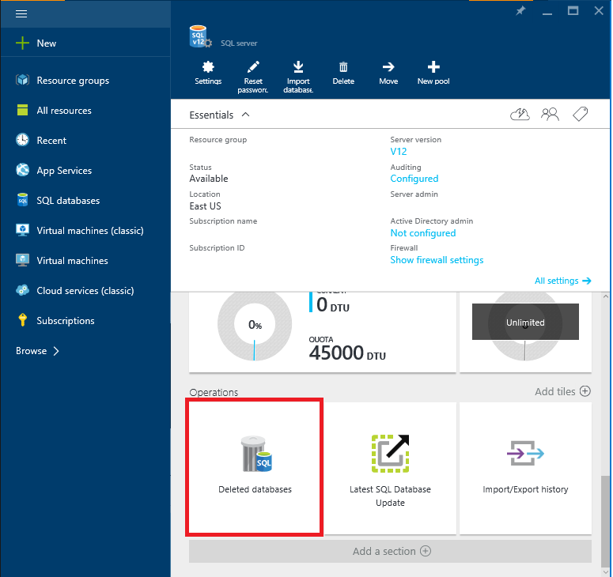

<properties
	pageTitle="Restore a deleted Azure SQL database (Azure Portal) | Azure"
	description="Restore a deleted Azure SQL database (Azure Portal)."
	services="sql-database"
	documentationCenter=""
	authors="stevestein"
	manager="jhubbard"
	editor=""/>

<tags
	ms.service="sql-database"
	ms.devlang="NA"
	ms.date="10/12/2016"
	ms.author="sstein"
	ms.workload="NA"
	ms.topic="article"
	ms.tgt_pltfrm="NA"/>

# Restore a deleted Azure SQL database using the Azure Portal

> [AZURE.SELECTOR]
- [Overview](/documentation/articles/sql-database-recovery-using-backups/)
- [**Restore Deleted DB: Portal**](/documentation/articles/sql-database-restore-deleted-database-portal/)
- [Restore Deleted DB: PowerShell](/documentation/articles/sql-database-restore-deleted-database-powershell/)

## Select the database to restore 

To restore a deleted database in the Azure portal:

1.	In the [Azure portal](https://portal.azure.cn), click **More services** > **SQL servers**.
3.  Select the server that contained the database you want to restore.
4.  Scroll down to the **operations** section of your server blade and select **Deleted databases**:
	
5.  Select the database you want to restore.
6.  Specify a database name, and click **OK**:

    

## Next steps

- For a business continuity overview and scenarios, see [Business continuity overview](/documentation/articles/sql-database-business-continuity/)
- To learn about Azure SQL Database automated backups, see [SQL Database automated backups](/documentation/articles/sql-database-automated-backups/)
- To learn about using automated backups for recovery, see [restore a database from the service-initiated backups](/documentation/articles/sql-database-recovery-using-backups/)
- To learn about faster recovery options, see [Active-Geo-Replication](/documentation/articles/sql-database-geo-replication-overview/)  
- To learn about using automated backups for archiving, see [database copy](/documentation/articles/sql-database-copy/)
