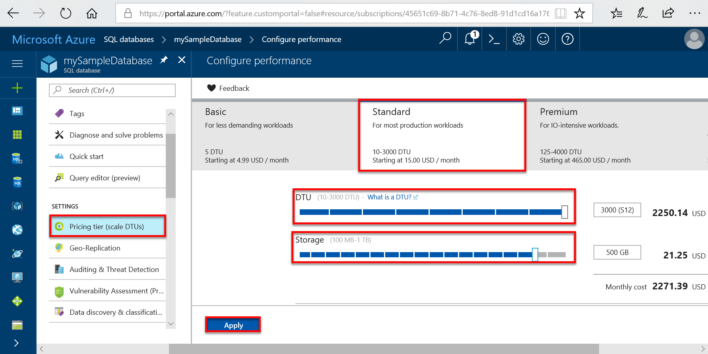
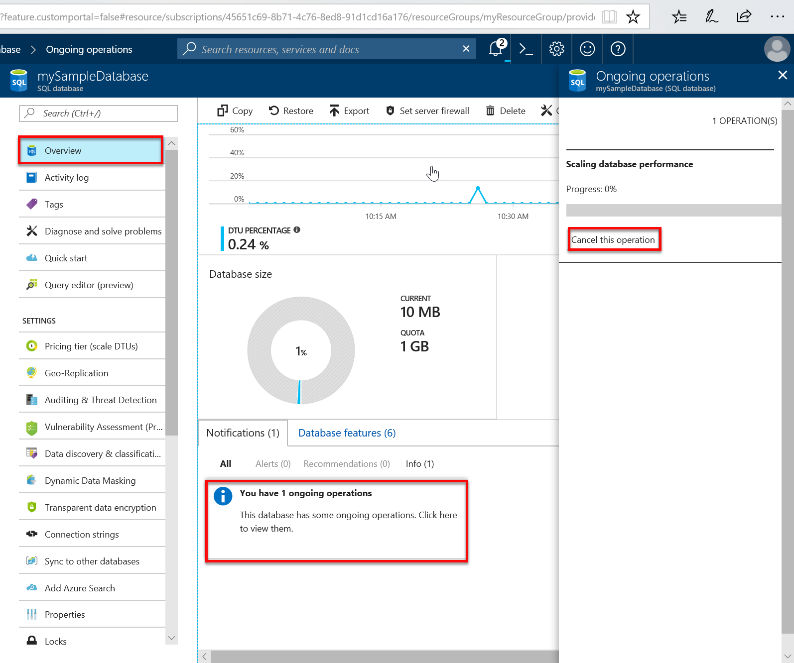

# Manage resources for a single database in Azure SQL Database

With a single database, you determine the amount of resources that the database requires to handle its workload at the service tier, performance level, and amount of storage it requires. 

## Manage single database resources using the Azure portal

To set or change the service tier, performance level, or storage amount for a new or existing Azure SQL database using the Azure portal, open the **Configure performance** window for your database by clicking **Pricing tier (scale DTUs)** - as shown in the following screenshot. 

- Set or change the service tier by selecting the service tier for your workload. 
- Set or change the performance level (**DTUs**) within a service tier using the **DTU** slider.
- Set or change the storage amount for the performance level using the **Storage** slider. 



Click **Overview** to monitor and/or cancel an ongoing operation.


## Manage single database resources using PowerShell

To set or change Azure SQL databases service tiers, performance levels, and storage amount using PowerShell, use these PowerShell cmdlets. If you need to install or upgrade PowerShell, see [Install Azure PowerShell module](https://docs.microsoft.com/powershell/azure/install-azurerm-ps). 

| Cmdlet | Description |
| --- | --- |
|[New-AzureRmSqlDatabase](https://docs.microsoft.com/powershell/module/azurerm.sql/new-azurermsqldatabase)|Creates a database |
|[Get-AzureRmSqlDatabase](https://docs.microsoft.com/powershell/module/azurerm.sql/get-azurermsqldatabase)|Gets one or more databases|
|[Set-​Azure​Rm​Sql​Database](https://docs.microsoft.com/powershell/module/azurerm.sql/set-azurermsqldatabase)|Sets properties for a database, or moves an existing database into an elastic pool. For example, use the **MaxSizeBytes** property to set the maximum size for a database.|
|[Get-AzureRmSqlDatabaseActivity](https://docs.microsoft.com/powershell/module/azurerm.sql/get-azurermsqldatabaseactivity)|Gets the status of database operations. |
|[Stop-AzureRmSqlDatabaseActivity](https://docs.microsoft.com/powershell/module/azurerm.sql/stop-azurermsqldatabaseactivity)|Cancels the asynchronous update operation on the database.|


> [!TIP]
> For a PowerShell example script that monitors the performance metrics of a database, scales it to a higher performance level, and creates an alert rule on one of the performance metrics, see [Monitor and scale a single SQL database using PowerShell](scripts/sql-database-monitor-and-scale-database-powershell.md).

## Manage single database resources using the Azure CLI

To set or change Azure SQL databases service tiers, performance levels, and storage amount using the Azure CLI, use these [Azure CLI SQL Database](/cli/sql/db) commands. [Install](/cli/install-azure-cli) CLI on macOS, Linux, or Windows. For creating and managing SQL elastic pools, see [Elastic pools](sql-database-elastic-pool.md).

| Cmdlet | Description |
| --- | --- |
|[az sql server firewall-rule create](/cli/sql/server/firewall-rule#az_sql_server_firewall_rule_create)|Creates a server firewall rule|
|[az sql server firewall-rule list](/cli/sql/server/firewall-rule#az_sql_server_firewall_rule_list)|Lists the firewall rules on a server|
|[az sql server firewall-rule show](/cli/sql/server/firewall-rule#az_sql_server_firewall_rule_show)|Shows the detail of a firewall rule|
|[az sql server firewall-rule update](/cli/sql/server/firewall-rule##az_sql_server_firewall_rule_update)|Updates a firewall rule|
|[az sql server firewall-rule delete](/cli/sql/server/firewall-rule#az_sql_server_firewall_rule_delete)|Deletes a firewall rule|
|[az sql db op list](/cli/sql/db/op?#az_sql_db_op_list)|Gets a list of operations performed on the database.|
|[az sql db op cancel](/cli/sql/db/op#az_sql_db_op_cancel)|Cancels the asynchronous operation on the database.|

> [!TIP]
> For an Azure CLI example script that scales a single Azure SQL database to a different performance level after querying the size information of the database, see [Use CLI to monitor and scale a single SQL database](scripts/sql-database-monitor-and-scale-database-cli.md).
>

## Manage single database resources using Transact-SQL

To set or change Azure SQL databases service tiers, performance levels, and storage amount with Transact-SQL, use these T-SQL commands. You can issue these commands using the Azure portal, [SQL Server Management Studio](https://docs.microsoft.com/sql/ssms/use-sql-server-management-studio), [Visual Studio Code](https://code.visualstudio.com/docs), or any other program that can connect to an Azure SQL Database server and pass Transact-SQL commands. 

| Command | Description |
| --- | --- |
|[CREATE DATABASE (Azure SQL Database)](https://docs.microsoft.com/sql/t-sql/statements/create-database-azure-sql-database)|Creates a new database. You must be connected to the master database to create a new database.|
| [ALTER DATABASE (Azure SQL Database)](https://docs.microsoft.com/sql/t-sql/statements/alter-database-azure-sql-database) |Modifies an Azure SQL database. |
|[sys.database_service_objectives (Azure SQL Database)](https://docs.microsoft.com/sql/relational-databases/system-catalog-views/sys-database-service-objectives-azure-sql-database)|Returns the edition (service tier), service objective (pricing tier), and elastic pool name, if any, for an Azure SQL database or an Azure SQL Data Warehouse. If logged on to the master database in an Azure SQL Database server, returns information on all databases. For Azure SQL Data Warehouse, you must be connected to the master database.|
|[sys.database_usage (Azure SQL Database)](https://docs.microsoft.com/sql/relational-databases/system-catalog-views/sys-database-usage-azure-sql-database)|Lists the number, type, and duration of databases on an Azure SQL Database server.|

The following example shows the maximum size for a database being changed using the ALTER DATABASE command:

 ```sql
ALTER DATABASE <myDatabaseName> 
   MODIFY (MAXSIZE = 4096 GB);
```

## Manage single database resources using the REST API

To set or change Azure SQL databases service tiers, performance levels, and storage amount use these REST API requests.

| Command | Description |
| --- | --- |
|[Databases - Create Or Update](https://docs.microsoft.com/rest/api/sql/databases/createorupdate)|Creates a new database or updates an existing database.|
|[Databases - Get](https://docs.microsoft.com/rest/api/sql/databases/get)|Gets a database.|
|[Databases - Get By Elastic Pool](https://docs.microsoft.com/rest/api/sql/databases/getbyelasticpool)|Gets a database inside of an elastic pool.|
|[Databases - Get By Recommended Elastic Pool](https://docs.microsoft.com/rest/api/sql/databases/getbyrecommendedelasticpool)|Gets a database inside of a recommented elastic pool.|
|[Databases - List By Elastic Pool](https://docs.microsoft.com/rest/api/sql/databases/listbyelasticpool)|Returns a list of databases in an elastic pool.|
|[Databases - List By Recommended Elastic Pool](https://docs.microsoft.com/rest/api/sql/databases/listbyrecommendedelasticpool)|Returns a list of databases inside a recommented elastic pool.|
|[Databases - List By Server](https://docs.microsoft.com/rest/api/sql/databases/listbyserver)|Returns a list of databases in a server.|
|[Databases - Update](https://docs.microsoft.com/rest/api/sql/databases/update)|Updates an existing database.|
|[Operations - List](https://docs.microsoft.com/rest/api/sql/Operations/List)|Lists all of the available SQL Rest API operations.|


## Next steps

- Learn about service tiers, performance levels, and storage amounts, see [Service tiers](sql-database-service-tiers.md).
- Learn about elastic pools, see [Elastic pools](sql-database-elastic-pool.md).
<!--Update_Description:update Global CLI 2.0 links to Mooncake CLI 2.0 links-->