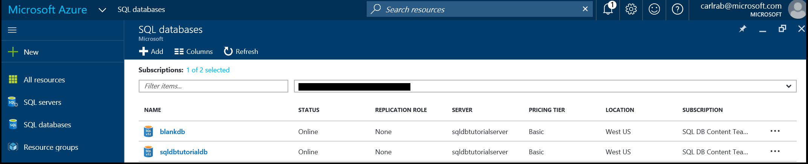

<properties
    pageTitle="View and update an Azure SQL database and its settings | Azure"
    description="Quick reference on how to view and update Azure SQL database settings using the Azure portal and PowerShell."
    services="sql-database"
    documentationcenter=""
    author="CarlRabeler"
    manager="jhubbard"
    editor="" />
<tags
    ms.service="sql-database"
    ms.custom="single databases"
    ms.devlang="NA"
    ms.workload="data-management"
    ms.topic="article"
    ms.tgt_pltfrm="NA"
    ms.date="11/14/2016"
    wacn.date=""
    ms.author="carlrab" />

# View and update an Azure SQL database and its settings

You can view and update an Azure SQL database and its settings using the [Azure portal](/documentation/articles/sql-database-manage-portal/), [PowerShell](/documentation/articles/sql-database-manage-powershell/), [SQL Server Management Studio](/documentation/articles/sql-database-manage-azure-ssms/), the REST API or C#. 

## View and update SQL database settings using the Azure portal

1. Open the **SQL databases** blade in the [Azure portal](https://portal.azure.cn/). 

    

2. Click the database you want to work with and then click the desired setting on the SQL database blade.

    

> [AZURE.TIP]
> For a getting started tutorial using the Azure portal, see [Get started with Azure SQL Database servers, databases, and firewall rules by using the Azure portal and SQL Server Management Studio](/documentation/articles/sql-database-get-started/).
>

## Additional resources
* For an overview of management tools, see [Overview of management tools](/documentation/articles/sql-database-manage-overview/).
* To see how to perform additional management tasks using the Azure portal, see [Manage Azure SQL Databases using the Azure portal](/documentation/articles/sql-database-manage-portal/).
* To see how to perform additional management tasks using PowerShell, see [Manage Azure SQL Databases using PowerShell](/documentation/articles/sql-database-manage-powershell/).
* To see how to perform additional management tasks using SQL Server Management Studio, see [SQL Server Management Studio](/documentation/articles/sql-database-manage-azure-ssms/). 
* For information about the SQL Database service, see [What is SQL Database](/documentation/articles/sql-database-technical-overview/). 
* For information about Azure Database servers and database features, see [Features](/documentation/articles/sql-database-features/).
