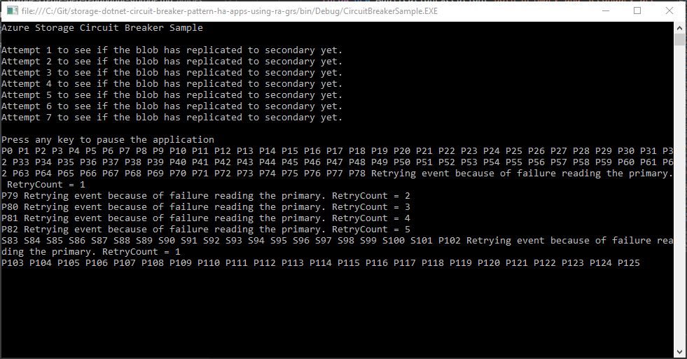
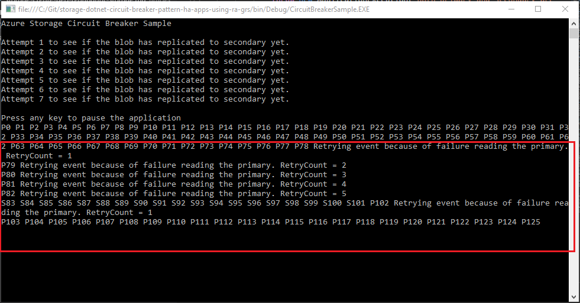
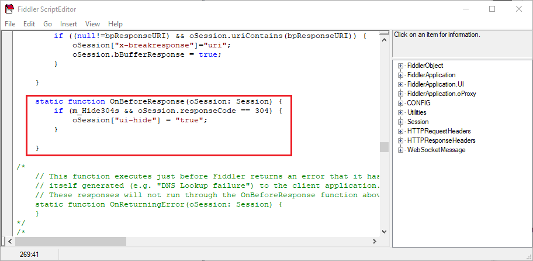

# Simulate a failure in accessing read-access redundant storage

This tutorial is part two of a series. In this tutorial, you inject a failed response with Fiddler for requests to a [read-access geo-redundant](../common/storage-redundancy.md#read-access-geo-redundant-storage) (RA-GRS) storage account to simulate a failure and have the application read from the secondary endpoint.



In part two of the series, you learn how to:

> [!div class="checklist"]
> * Run and pause the application
> * Simulate a failure
> * Simulate primary endpoint restoration

## Prerequisites

To complete this tutorial:

* Download and install [Fiddler](https://www.telerik.com/download/fiddler)

[!INCLUDE [quickstarts-free-trial-note](../../../includes/quickstarts-free-trial-note.md)]

To complete this tutorial, you must have completed the previous storage tutorial: [Make your application data highly available with Azure storage][previous-tutorial].

## Launch fiddler

Open Fiddler, select **Rules** and **Customize Rules**.


The Fiddler ScriptEditor launches showing the **SampleRules.js** file. This file is used to customize Fiddler. Paste the following code sample in the `OnBeforeResponse` function. The new code is commented out to ensure that the logic it creates is not implemented immediately. Once complete select **File** and **Save** to save your changes.

```javascript
	/*
		// Simulate data center failure
		// After it is successfully downloading the blob, pause the code in the sample,
		// uncomment these lines of script, and save the script.
		// It will intercept the (probably successful) responses and send back a 503 error. 
		// When you're ready to stop sending back errors, comment these lines of script out again 
		//     and save the changes.

		if ((oSession.hostname == "contosoragrs.blob.core.chinacloudapi.cn") 
	    	&& (oSession.PathAndQuery.Contains("HelloWorld"))) {
			oSession.responseCode = 503;  
		}
	*/
```


## Start and pause the application

In Visual Studio, press **F5** or select **Start** to start debugging the application. Once the application begins reading from the primary endpoint, press **any key** in the console window to pause the application.

## Simulate failure

With the application paused you can now uncomment the custom rule we saved in Fiddler a preceding step. This code sample looks for requests to the RA-GRS storage account and if the path contains the name of the image, `HelloWorld`, it returns a response code of `503 - Service Unavailable`.

Navigate to Fiddler and select **Rules** -> **Customize Rules...**.  Uncomment out the following lines, replace `STORAGEACCOUNTNAME` with the name of your storage account. Select **File** -> **Save** to save your changes.

```javascript
         if ((oSession.hostname == "STORAGEACCOUNTNAME.blob.core.chinacloudapi.cn")
         && (oSession.PathAndQuery.Contains("HelloWorld"))) {
         oSession.responseCode = 503;
         }
```

To resume the application, press **any key** .

Once the application starts running again, the requests to the primary endpoint begin to fail. The application attempts to reconnect to the primary endpoint 5 times. After the failure threshold of five attempts, it requests the image from the secondary read-only endpoint. After the application successfully retrieves the image 20 times from the secondary endpoint, the application attempts to connect to the primary endpoint. If the primary endpoint is still unreachable, the application resumes reading from the secondary endpoint. This pattern is the [Circuit Breaker](https://docs.microsoft.com/azure/architecture/patterns/circuit-breaker) pattern described in the previous tutorial.



## Simulate primary endpoint restoration

With the Fiddler custom rule set in the preceding step, requests to the primary endpoint fail. In order to simulate the primary endpoint functioning again, you remove the logic to inject the `503` error.

To pause the application, press **any key**.

### Remove the custom rule

Navigate to Fiddler and select **Rules** and **Customize Rules...**.  Comment or remove the custom logic in the `OnBeforeResponse` function, leaving the default function. Select **File** and **Save** to save the changes.



When complete, press **any key** to resume the application. The application continues reading from the primary endpoint until it hits 999 reads.


## Next steps

In part two of the series, you learned about simulating a failure to test read access geo-redundant storage such as how to:

> [!div class="checklist"]
> * Run and pause the application
> * Simulate a failure
> * Simulate primary endpoint restoration

Follow this link to see pre-built storage samples.

> [!div class="nextstepaction"]
> [Azure storage script samples](storage-samples-blobs-cli.md)

[previous-tutorial]: storage-create-geo-redundant-storage.md