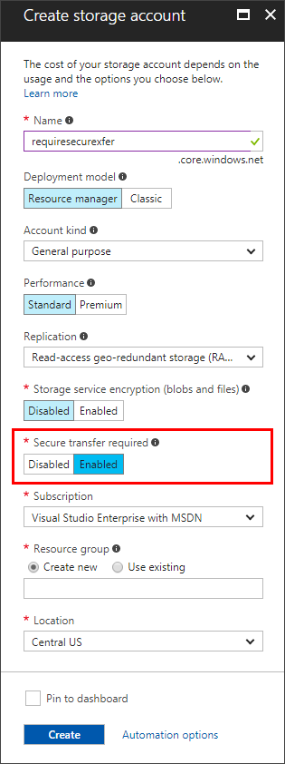

# Require secure transfer

The "Secure transfer required" option enhances the security of your storage account by only allowing requests to the storage account from secure connections. For example, when calling REST APIs to access your storage account, you must connect using HTTPS. Any requests using HTTP are rejected when "Secure transfer required" is enabled.

When you are using the Azure Files service, any connection without encryption fails when "Secure transfer required" is enabled. This includes scenarios using SMB 2.1, SMB 3.0 without encryption, and some flavors of the Linux SMB client. 

By default, the "Secure transfer required" option is disabled.

> [!NOTE]
> Because Azure Storage doesn't support HTTPS for custom domain names, this option is not applied when using a custom domain name.

## Enable "Secure transfer required" in the Azure portal

You can enable the "Secure transfer required" setting both when you create a storage account in the [Azure portal](https://portal.azure.cn), and for existing storage accounts.

### Require secure transfer when you create a storage account

1. Open the **Create storage account** blade in the Azure portal.
1. Under **Secure transfer required**, select **Enabled**.

  

### Require secure transfer for an existing storage account

1. Select an existing storage account in the Azure portal.
1. Select **Configuration** under **SETTINGS** in the storage account menu blade.
1. Under **Secure transfer required**, select **Enabled**.

  

## Enable "Secure transfer required" programmatically

The setting name is _supportsHttpsTrafficOnly_ in storage account properties. You can enable "Secure transfer required" setting with REST API, tools or libraries:

* **REST API** (Version: 2016-12-01): [release package](https://docs.microsoft.com/rest/api/storagerp/storageaccounts)
* **PowerShell** (Version: 4.1.0): [release package](https://docs.microsoft.com/powershell/module/azurerm.storage/set-azurermstorageaccount?view=azurermps-4.1.0)
* **CLI** (Version: 2.0.11): [release package](https://pypi.python.org/pypi/azure-cli-storage/2.0.11)
* **NodeJS** (Version: 1.1.0): [release package](https://www.npmjs.com/package/azure-arm-storage/)
* **.NET SDK** (Version: 6.3.0): [release package](https://www.nuget.org/packages/Microsoft.Azure.Management.Storage/6.3.0-preview)
* **Python SDK** (Version: 1.1.0): [release package](https://pypi.python.org/pypi/azure-mgmt-storage/1.1.0)
* **Ruby SDK** (Version: 0.11.0): [release package](https://rubygems.org/gems/azure_mgmt_storage)

### Enable "Secure transfer required" setting with REST API

To simplify testing with REST API, you can use [ArmClient](https://github.com/projectkudu/ARMClient) to call from command line.

 You can use below command line to check the setting with the REST API:

```
# Login Azure and proceed with your credentials
> armclient login

> armclient GET  /subscriptions/{subscriptionId}/resourceGroups/{resourceGroupName}/providers/Microsoft.Storage/storageAccounts/{accountName}?api-version=2016-12-01
```

In the response, you can find _supportsHttpsTrafficOnly_ setting. Sample:

```Json
{
  "id": "/subscriptions/{subscriptionId}/resourceGroups/{resourceGroupName}/providers/Microsoft.Storage/storageAccounts/{accountName}",
  "kind": "Storage",
  ...
  "properties": {
    ...
    "supportsHttpsTrafficOnly": false
  },
  "type": "Microsoft.Storage/storageAccounts"
}
```

You can use below command line to enable the setting with the REST API:

```
# Login Azure and proceed with your credentials
> armclient login

> armclient PUT /subscriptions/{subscriptionId}/resourceGroups/{resourceGroupName}/providers/Microsoft.Storage/storageAccounts/{accountName}?api-version=2016-12-01 < Input.json
```
Sample of Input.json:
```Json
{
  "location": "chinanorth",
  "properties": {
    "supportsHttpsTrafficOnly": true
  }
}
```

## Next steps
Azure Storage provides a comprehensive set of security capabilities, which together enable developers to build secure applications. For more details, visit the [Storage Security Guide](storage-security-guide.md).
<!--Update_Description: wording update add "Enable "Secure transfer required" programmatically"-->