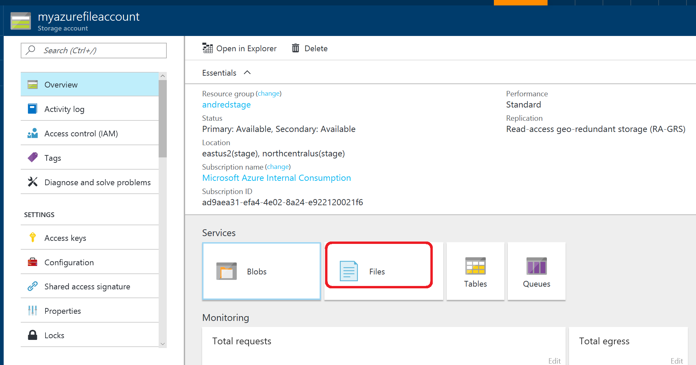
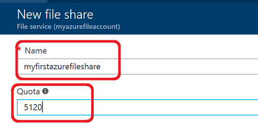
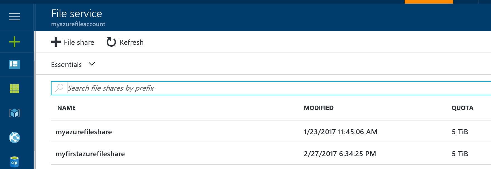
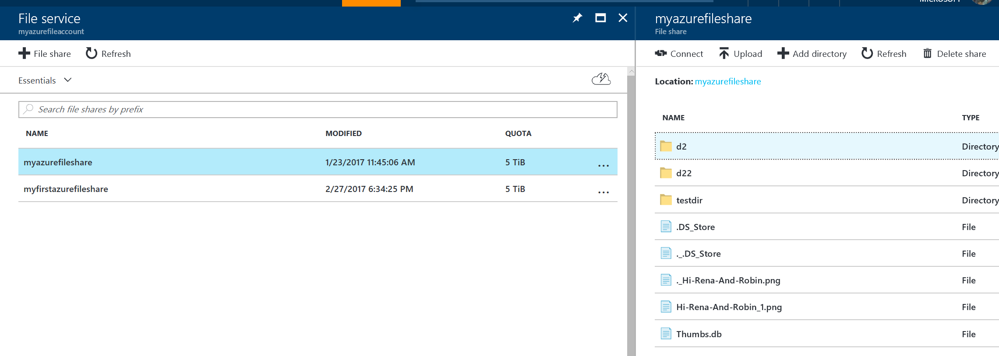

# Create a file share in Azure Files
You can create Azure File shares using [Azure portal](https://portal.azure.cn/), the Azure Storage PowerShell cmdlets, the Azure Storage client libraries, or the Azure Storage REST API.In this tutorial, you will learn:
* [How to create an Azure File share using the Azure portal](#Create file share through the Portal)
* [How to create an Azure File share using Powershell](#Create file share using PowerShell)
* [How to create an Azure File share using CLI](#create-file-share-using-command-line-interface-cli)

## Prerequisites
To create an Azure File share, you can use a storage account that already exists, or [create a new Azure storage account](../common/storage-create-storage-account.md?toc=%2fstorage%2ffiles%2ftoc.json). To create an Azure File share with PowerShell, you will need the account key and name of your storage account.. You will need Storage account key if you plan to use Powershell or CLI.

## Create file share through the Azure portal
1. **Go to Storage Account blade on Azure portal**:    
    

2. **Click on add File Share button**:    
    

3. **Provide Name and Quota. Quota currently can be maximum 5 TiB**:    
    

4. **View your new file share**:
    

5. **Upload a file**:
    

6. **Browse into your file share and manage your directories and files**:
    


## Create file share through PowerShell
To prepare to use PowerShell, download and install the Azure PowerShell cmdlets. See [How to install and configure Azure PowerShell](https://www.azure.cn/documentation/articles/powershell-install-configure/) for the install point and installation instructions.

> [!Note]  
> It's recommended that you download and install or upgrade to the latest Azure PowerShell module.

1. **Create a context for your storage account and key**
    The context encapsulates the storage account name and account key. For instructions on copying your account key from the [Azure portal](https://portal.azure.cn/), see [View and copy storage access keys](../common/storage-create-storage-account.md?toc=%2fstorage%2ffiles%2ftoc.json#view-and-copy-storage-access-keys).

    ```powershell
    $storageContext = New-AzureStorageContext <storage-account-name> <storage-account-key>
    ```

2. **Create a new file share**:    

    ```powershell
    $share = New-AzureStorageShare logs -Context $storageContext
    ```

> [!Note]  
> The name of your file share must be all lowercase. For complete details about naming file shares and files, see [Naming and Referencing Shares, Directories, Files, and Metadata](https://msdn.microsoft.com/library/azure/dn167011.aspx).

## Create file share through Command Line Interface (CLI)
1. **To prepare to use a Command Line Interface (CLI), download and install the Azure CLI.**  
    See [Install Azure CLI 2.0](https://docs.microsoft.com/cli/azure/install-az-cli2.md) and [Get started with Azure CLI 2.0](https://docs.microsoft.com/cli/azure/get-started-with-azure-cli.md).

2. **Create a connection string to the storage account where you want to create the share.**  
    Replace ```<storage-account>``` and ```<resource_group>``` with your storage account name and resource group in the following example.

   ```azurecli
    current_env_conn_string = $(az storage account show-connection-string -n <storage-account> -g <resource-group> --query 'connectionString' -o tsv)

    if [[ $current_env_conn_string == "" ]]; then  
        echo "Couldn't retrieve the connection string."
    fi
    ```

3. **Create file share**
    ```azurecli
    az storage share create --name files --quota 2048 --connection-string $current_env_conn_string 1 > /dev/null
    ```

## Next steps
* [Connect and Mount File Share - Windows](storage-how-to-use-files-windows.md)
* [Connect and Mount File Share - Linux](../storage-how-to-use-files-linux.md)
* [Connect and Mount File Share - macOS](storage-how-to-use-files-mac.md)

See these links for more information about Azure Files.

* [FAQ](../storage-files-faq.md)
* [Troubleshooting on Windows](storage-troubleshoot-windows-file-connection-problems.md)      
* [Troubleshooting on Linux](storage-troubleshoot-linux-file-connection-problems.md)   
<!--Update_Description: wording update-->