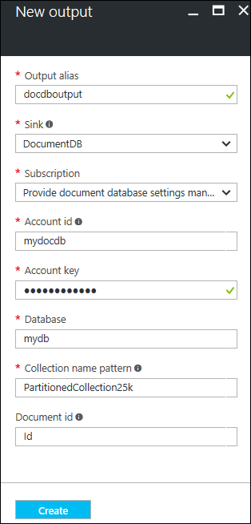
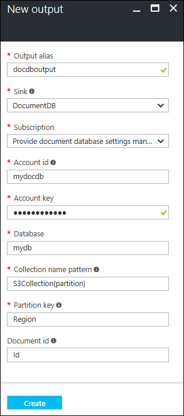

<properties
    pageTitle="JSON output for Stream Analytics | Azure"
    description="Learn how Stream Analytics can target Azure DocumentDB for JSON output, for data archiving and low-latency queries on unstructured JSON data."
    keywords="JSON output"
    documentationcenter=""
    services="stream-analytics,documentdb"
    author="jeffstokes72"
    manager="jhubbard"
    editor="cgronlun" />
<tags
    ms.assetid="5d2a61a6-0dbf-4f1b-80af-60a80eb25dd1"
    ms.service="stream-analytics"
    ms.devlang="na"
    ms.topic="article"
    ms.tgt_pltfrm="na"
    ms.workload="data-services"
    ms.date="03/16/2017"
    wacn.date=""
    ms.author="jeffstok" />

# Target Azure DocumentDB for JSON output from Stream Analytics

Stream Analytics can target [Azure DocumentDB](/home/features/documentdb/) for JSON output, enabling data archiving and low-latency queries on unstructured JSON data. This document covers some best practices for implementing this configuration.

For those who are unfamiliar with DocumentDB, take a look at [DocumentDB's learning path](https://azure.microsoft.com/documentation/learning-paths/documentdb/) to get started.

## Basics of DocumentDB as an output target
The Azure DocumentDB output in Stream Analytics enables writing your stream processing results as JSON output into your DocumentDB collection(s). Stream Analytics does not create collections in your database, instead requiring you to create them upfront. This is so that the billing costs of DocumentDB collections are transparent to you, and so that you can tune the performance, consistency and capacity of your collections directly using the [DocumentDB APIs](https://msdn.microsoft.com/zh-cn/library/azure/dn781481.aspx). We recommend using one DocumentDB Database per streaming job to logically separate your collections for a streaming job.

Some of the DocumentDB collection options are detailed below.

## Tune consistency, availability, and latency

To match your application requirements, DocumentDB allows you to fine tune the Database and Collections and make trade-offs between consistency, availability and latency. Depending on what levels of read consistency your scenario needs against read and write latency, you can choose a consistency level on your database account. Also by default, DocumentDB enables synchronous indexing on each CRUD operation to your collection. This is another useful option to control the write/read performance in DocumentDB. For further information on this topic, review the [change your database and query consistency levels](/documentation/articles/documentdb-consistency-levels/) article.

## Upserts from Stream Analytics
Stream Analytics integration with DocumentDB allows you to insert or update records in your DocumentDB collection based on a given Document ID column. This is also referred to as an *Upsert*.

Stream Analytics utilizes an optimistic Upsert approach, where updates are only done when insert fails due to a Document ID conflict. This update is performed by Stream Analytics as a PATCH, so it enables partial updates to the document, i.e. addition of new properties or replacing an existing property is performed incrementally. Note that changes in the values of array properties in your JSON document result in the entire array getting overwritten, i.e. the array is not merged.

## Data partitioning in DocumentDB
DocumentDB [partitioned collections](/documentation/articles/documentdb-partition-data/#single-partition-and-partitioned-collections) are the recommended approach for partitioning your data. 

For single DocumentDB collections, Stream Analytics still allows you to partition your data based on both the query patterns and performance needs of your application. Each collection may contain up to 10GB of data (maximum) and currently there is no way to scale up (or overflow) a collection. For scaling out, Stream Analytics allows you to write to multiple collections with a given prefix (see usage details below). Stream Analytics uses the consistent [Hash Partition Resolver](https://msdn.microsoft.com/zh-cn/library/azure/microsoft.azure.documents.partitioning.hashpartitionresolver.aspx) strategy based on the user provided PartitionKey column to partition its output records. The number of collections with the given prefix at the streaming job's start time is used as the output partition count, to which the job writes to in parallel (DocumentDB Collections = Output Partitions). For a single collection with lazy indexing doing only inserts, about 0.4 MB/s write throughput can be expected. Using multiple collections can allow you to achieve higher throughput and increased capacity.

If you intend to increase the partition count in the future, you may need to stop your job, repartition the data from your existing collections into new collections and then restart the Stream Analytics job. More details on using PartitionResolver and re-partitioning along with sample code, will be included in a follow-up post. The article [Partitioning and scaling in DocumentDB](/documentation/articles/documentdb-partition-data/) also provides details on this.

## DocumentDB settings for JSON output
Creating DocumentDB as an output in Stream Analytics generates a prompt for information as seen below. This section provides an explanation of the properties definition.

Partitioned Collection | Multiple "Single Partition" collections
-----------------------|-----------------------------------------
 |  

  
> [AZURE.NOTE]
> The **Multiple "Single Partition" collections** scenario requires a partition key and is a supported configuration. 

* **Output Alias** - An alias to refer this output in your ASA query  
* **Account Name** - The name or endpoint URI of the DocumentDB account.  
* **Account Key** - The shared access key for the DocumentDB account.  
* **Database** - The DocumentDB database name.  
* **Collection Name Pattern** - The collection name or their pattern for the collections to be used. The collection name format can be constructed using the optional {partition} token, where partitions start from 0. Following are sample valid inputs:  
  1\) MyCollection - One collection named "MyCollection" must exist.  
  2\) MyCollection{partition} - Such collections must exist- "MyCollection0", "MyCollection1", "MyCollection2" and so on.  
* **Partition Key** - Optional. This is only needed if you are using a {parition} token in your collection name pattern. The name of the field in output events used to specify the key for partitioning output across collections. For single collection output, any arbitrary output column can be used e.g. PartitionId.  
* **Document ID** - Optional. The name of the field in output events used to specify the primary key on which insert or update operations are based.