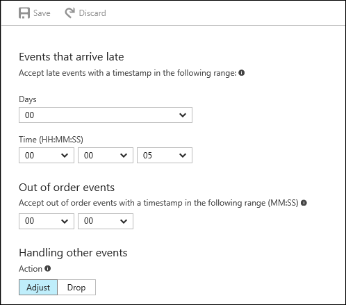

# Azure Stream Analytics event order handling

In a temporal data stream of events, each event is assigned a timestamp. Azure Stream Analytics assigns timestamps to each event by using either the arrival time or the application time. 

The **System.Timestamp** column has the timestamp assigned to the event. The arrival time is assigned at the input source when the event reaches the source. The arrival time is **EventEnqueuedTime** for event hub input and [blob last modified time](https://docs.microsoft.com/dotnet/api/microsoft.windowsazure.storage.blob.blobproperties.lastmodified?view=azurestorage-8.1.3) for blob input. The application time is assigned when the event is generated, and it is part of the payload. 

To process events by the application time, use the TIMESTAMP BY clause in the select query. If the TIMESTAMP BY clause is absent, events are processed by the arrival time. You can access the arrival time by using the **EventEnqueuedTime** property for event hub and by using the **BlobLastModified** property for blob input. 

Azure Stream Analytics produces output in timestamp order and provides a few settings to deal with out-of-order data.

Input streams that are not in order are either:
* Sorted (and therefore *delayed*).
* Adjusted by the system, according to the user-specified policy.

Stream Analytics tolerates late and out-of-order events when processing by the application time.

**Late arrival tolerance**

* The late arrival tolerance setting is applicable only when processing by the application time. Otherwise, it is ignored.
* Late arrival tolerance is the maximum difference between the arrival time and the application time. If the application time is before the *(Arrival Time - Late Arrival Window)*, it is set to *(Arrival Time - Late Arrival Window)*.
* When multiple partitions from the same input stream or multiple input streams are combined together, late arrival tolerance is the maximum amount of time every partition waits for new data. 

Briefly, the late arrival window is the maximum delay between event generation and the receipt of the event at the input source.
Adjustment based on late arrival tolerance is done first and out of order is done second. The **System.Timestamp** column has the final timestamp assigned to the event.

**Out of order tolerance**

* Events that arrive out of order, but within the "out of order tolerance window," are *reordered by timestamp*. 
* Events that arrive later than tolerance are either *dropped* or *adjusted*.
    * **Adjusted**: Adjusted to appear to have arrived at the latest acceptable time. 
    * **Dropped**: Discarded.

To reorder events received within the "out of order tolerance window", the output of the query is *delayed by out of order tolerance window*.

**Example**

Late arrival tolerance = 10 minutes 
Out of order tolerance = 3 minutes 
Processing by application time 

Events:

Event 1 _Application Time_ = 00:00:00, _Arrival Time_ = 00:10:01, _System.Timestamp_ = 00:00:01, adjusted because (_Arrival Time_ - _Application Time_) is more than the late arrival tolerance.

Event 2 _Application Time_ = 00:00:01, _Arrival Time_ = 00:10:01, _System.Timestamp_ = 00:00:01, not adjusted because the application time is within the late arrival window.

Event 3 _Application Time_ = 00:10:00, _Arrival Time_ = 00:10:02, _System.Timestamp_ = 00:10:00, not adjusted because the application time is within the late arrival window.

Event 4 _Application Time_ = 00:09:00, _Arrival Time_ = 00:10:03, _System.Timestamp_ = 00:09:00, accepted with the original timestamp as the application time is within the out of order tolerance.

Event 5 _Application Time_ = 00:06:00, _Arrival Time_ = 00:10:04, _System.Timestamp_ = 00:07:00, adjusted because the application time is older than the out of order tolerance.

## Get help
For additional assistance, try our [Azure Stream Analytics forum](https://social.msdn.microsoft.com/Forums/en-US/home?forum=AzureStreamAnalytics).

## Next steps
* [Introduction to Azure Stream Analytics](stream-analytics-introduction.md)
* [Get started with Azure Stream Analytics](stream-analytics-real-time-fraud-detection.md)
* [Scale Azure Stream Analytics jobs](stream-analytics-scale-jobs.md)
* [Azure Stream Analytics query language reference](https://msdn.microsoft.com/library/azure/dn834998.aspx)
* [Azure Stream Analytics management REST API reference](https://msdn.microsoft.com/library/azure/dn835031.aspx)

<!--Update_Description: wording update -->