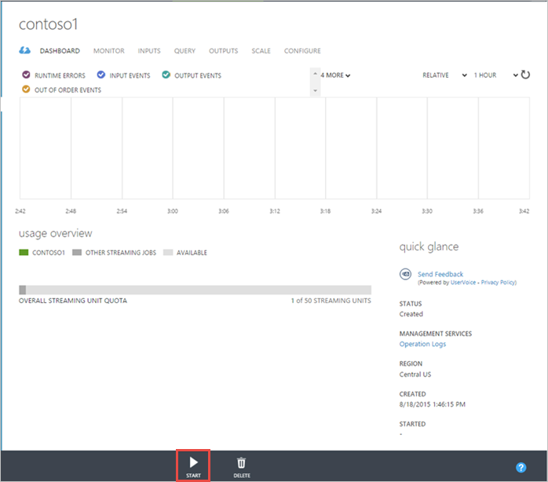
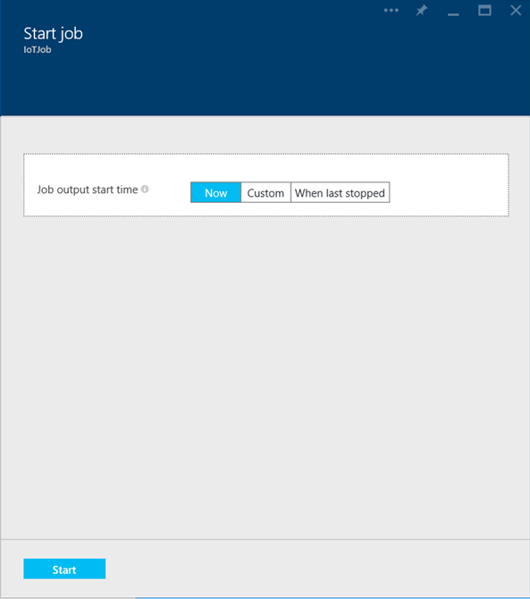

# How to run a streaming job in Azure Stream Analytics
When a job input, query and output have all been specified you can start the Stream Analytics job.

To start your job:

1. In the Azure Classic Management Portal, from the job dashboard, click **Start** at the bottom of the page.

      

    In the Azure portal, click **Start** at the top of your job page.

      
2. Specify a **Start Output** value to determine when this job will start producing output. The default setting for jobs that have not previously been started is **Job Start Time**, which means that the job will immediately start processing data. You can also specify a **Custom** time in the past (for consuming historical data) or the future (to delay processing until a future time). For cases when a job has been previously started and stopped, the option **Last Stopped Time** is available in order to resume the job from the last output time and avoid data loss.  

> [!NOTE]
> When using partitions, Last Stopped Time represents the minimum of last output time across all partitions.

      

      
3. Confirm your selection. The job status will change to *Starting* and will shortly move to *Running* once the job has started. You can monitor the progress of the **Start** operation in the **Notification Hub**:

      

      

## Get help
For further assistance, try our [Azure Stream Analytics forum](https://social.msdn.microsoft.com/Forums/en-US/home?forum=AzureStreamAnalytics)

## Next steps
* [Introduction to Azure Stream Analytics](stream-analytics-introduction.md)
* [Get started using Azure Stream Analytics](stream-analytics-real-time-fraud-detection.md)
* [Scale Azure Stream Analytics jobs](stream-analytics-scale-jobs.md)
* [Azure Stream Analytics Query Language Reference](https://msdn.microsoft.com/library/azure/dn834998.aspx)
* [Azure Stream Analytics Management REST API Reference](https://msdn.microsoft.com/library/azure/dn835031.aspx)

<!--Update_Description: update meta properties, wording update -->