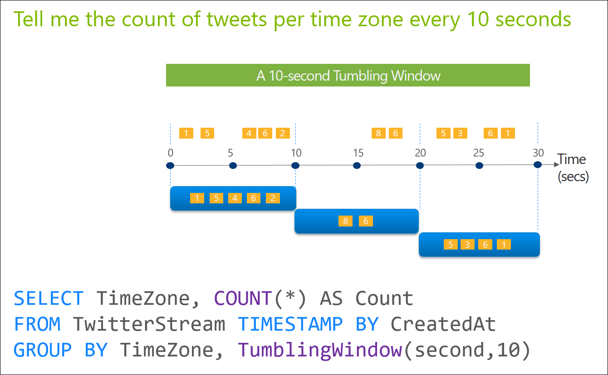
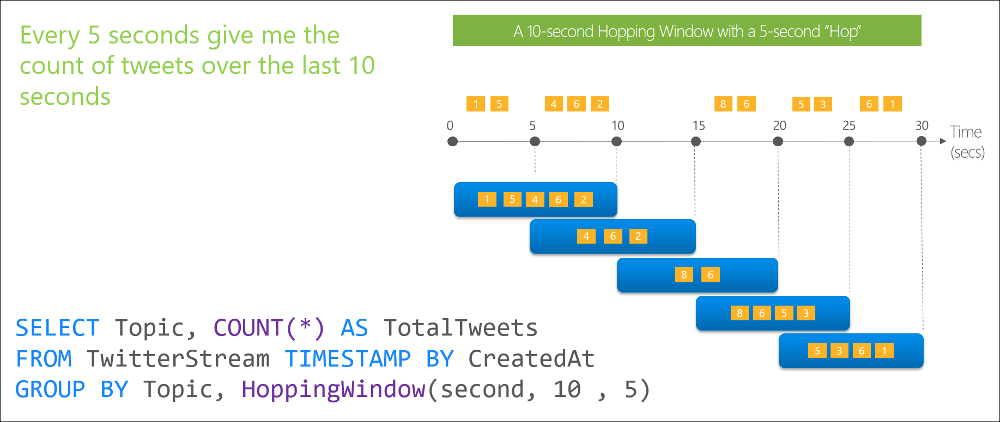

# Introduction to Stream Analytics Window functions
In many real time streaming scenarios, it is necessary to perform operations only on the data contained in temporal windows. Native support for windowing functions is a key feature of Azure Stream Analytics that moves the needle on developer productivity in authoring complex stream processing jobs. Stream Analytics enables developers to use [**Tumbling**](https://msdn.microsoft.com/library/dn835055.aspx), [**Hopping**](https://msdn.microsoft.com/library/dn835041.aspx) and [**Sliding**](https://msdn.microsoft.com/library/dn835051.aspx) windows to perform temporal operations on streaming data. It is worth noting that all [Window](https://msdn.microsoft.com/library/dn835019.aspx) operations output results at the **end** of the window. The output of the window will be single event based on the aggregate function used. The event will have the time stamp of the end of the window and all Window functions are defined with a fixed length. Lastly it is important to note that all Window functions should be used in a [**GROUP BY**](https://msdn.microsoft.com/library/dn835023.aspx) clause.

## Tumbling Window
Tumbling window functions are used to segment a data stream into distinct time segments and perform a function against them, such as the example below. The key differentiators of a Tumbling window are that they repeat, do not overlap and an event cannot belong to more than one tumbling window.

## Hopping Window
Hopping window functions hop forward in time by a fixed period. It may be easy to think of them as Tumbling windows that can overlap, so events can belong to more than one Hopping window result set. To make a Hopping window the same as a Tumbling window one would simply specify the hop size to be the same as the window size. 

## Sliding Window
Sliding window functions, unlike Tumbling or Hopping windows, produce an output **only**  when an event occurs. Every window will have at least one event and the window continuously moves forward by an € (epsilon). Like Hopping Windows, events can belong to more than one Sliding Window.

## Getting help with Window functions
For further assistance, try our [Azure Stream Analytics forum](https://social.msdn.microsoft.com/Forums/home?forum=AzureStreamAnalytics)

## Next steps
* [Introduction to Azure Stream Analytics](stream-analytics-introduction.md)
* [Get started using Azure Stream Analytics](stream-analytics-real-time-fraud-detection.md)
* [Scale Azure Stream Analytics jobs](stream-analytics-scale-jobs.md)
* [Azure Stream Analytics Query Language Reference](https://msdn.microsoft.com/library/azure/dn834998.aspx)
* [Azure Stream Analytics Management REST API Reference](https://msdn.microsoft.com/library/azure/dn835031.aspx)

<!--Update_Description: update link-->