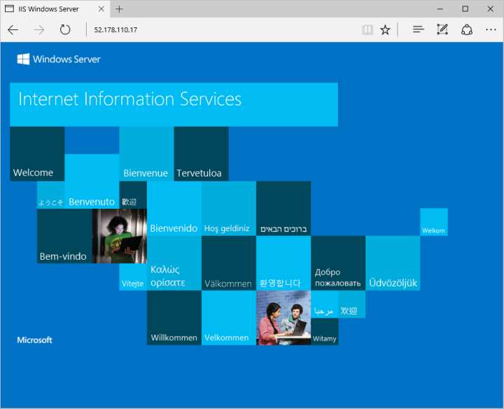

# Tutorial: Create and use a custom image for virtual machine scale sets with Azure PowerShell
When you create a scale set, you specify an image to be used when the VM instances are deployed. To reduce the number of tasks after VM instances are deployed, you can use a custom VM image. This custom VM image includes any required application installs or configurations. Any VM instances created in the scale set use the custom VM image and are ready to serve your application traffic. In this tutorial you learn how to:

> [!div class="checklist"]
> * Create and customize a VM
> * Deprovision and generalize the VM
> * Create a custom VM image from the source VM
> * Deploy a scale set that uses the custom VM image

If you don’t have an Azure subscription, create a [Trial](https://www.azure.cn/pricing/1rmb-trial/?WT.mc_id=A261C142F) before you begin.

If you choose to install and use the PowerShell locally, this tutorial requires the Azure PowerShell module version 5.6.0 or later. Run `Get-Module -ListAvailable AzureRM` to find the version. If you need to upgrade, see [Install Azure PowerShell module](https://docs.microsoft.com/powershell/azure/install-azurerm-ps). If you are running PowerShell locally, you also need to run `Login-AzureRmAccount -EnvironmentName AzureChinaCloud` to create a connection with Azure. 


## Create and configure a source VM

>[!NOTE]
> This tutorial walks through the process of creating and using a generalized VM image. It is not supported to create a scale set from a specialized VM image.

First, create a resource group with [New-AzureRmResourceGroup](https://docs.microsoft.com/powershell/module/azurerm.resources/new-azurermresourcegroup), then create a VM with [New-AzureRmVM](https://docs.microsoft.com/powershell/module/azurerm.compute/new-azurermvm). This VM is then used as the source for a custom VM image. The following example creates a VM named *myCustomVM* in the resource group named *myResourceGroup*. When prompted, enter a username and password to be used as logon credentials for the VM:

```azurepowershell
# Create a resource a group
New-AzureRmResourceGroup -Name "myResourceGroup" -Location "ChinaNorth"

# Create a Windows Server 2016 Datacenter VM
New-AzureRmVm `
  -ResourceGroupName "myResourceGroup" `
  -Name "myCustomVM" `
  -ImageName "Win2016Datacenter" `
  -OpenPorts 3389
```

To connect to your VM, list the public IP address with  [Get-AzureRmPublicIpAddress](https://docs.microsoft.com/powershell/module/azurerm.network/get-azurermpublicipaddress) as follows:

```azurepowershell
Get-AzureRmPublicIpAddress -ResourceGroupName myResourceGroup | Select IpAddress
```

Create a remote connection with the VM. Provide your own IP address from the previous command. When prompted, enter the credentials used when you created the VM in the first step:

```powershell
mstsc /v:<IpAddress>
```

To customize your VM, let's install a basic web server. When the VM instance in the scale set would be deployed, it would then have all the required packages to run a web application. Open a local PowerShell prompt on the VM and install the IIS web server with [Install-WindowsFeature](https://docs.microsoft.com/powershell/module/servermanager/install-windowsfeature) as follows:

```powershell
Install-WindowsFeature -name Web-Server -IncludeManagementTools
```

The final step to prepare your VM for use as a custom image is to generalize the VM. Sysprep removes all your personal account information and configurations, and resets the VM to a clean state for future deployments. For more information, see [How to Use Sysprep: An Introduction](http://technet.microsoft.com/library/bb457073.aspx).

To generalize the VM, run Sysprep and set the VM for an out-of-the-box experience. When finished, instruct Sysprep to shut down the VM:

```powershell
C:\Windows\system32\sysprep\sysprep.exe /oobe /generalize /shutdown
```

The remote connection to the VM is automatically closed when Sysprep completes the process and the VM is shut down.


## Create a custom VM image from the source VM
The source VM now customized with the IIS web server installed. Let's create the custom VM image to use with a scale set.

To create an image, the VM needs to be deallocated. Deallocate the VM with [Stop-AzureRmVm](https://docs.microsoft.com/powershell/module/azurerm.compute/stop-azurermvm). Then, set the state of the VM as generalized with [Set-AzureRmVm](https://docs.microsoft.com/powershell/module/azurerm.compute/set-azurermvm) so that the Azure platform knows the VM is ready for use a custom image. You can only create an image from a generalized VM:

```azurepowershell
Stop-AzureRmVM -ResourceGroupName "myResourceGroup" -Name "myCustomVM" -Force
Set-AzureRmVM -ResourceGroupName "myResourceGroup" -Name "myCustomVM" -Generalized
```

It may take a few minutes to deallocate and generalize the VM.

Now, create an image of the VM with [New-AzureRmImageConfig](https://docs.microsoft.com/powershell/module/azurerm.compute/new-azurermimageconfig) and [New-AzureRmImage](https://docs.microsoft.com/powershell/module/azurerm.compute/new-azurermimage). The following example creates an image named *myImage* from your VM:

```azurepowershell
# Get VM object
$vm = Get-AzureRmVM -Name "myCustomVM" -ResourceGroupName "myResourceGroup"

# Create the VM image configuration based on the source VM
$image = New-AzureRmImageConfig -Location "ChinaNorth" -SourceVirtualMachineId $vm.ID 

# Create the custom VM image
New-AzureRmImage -Image $image -ImageName "myImage" -ResourceGroupName "myResourceGroup"
```


## Create a scale set from the custom VM image
Now create a scale set with [New-AzureRmVmss](https://docs.microsoft.com/powershell/module/azurerm.compute/new-azurermvmss) that uses the `-ImageName` parameter to define the custom VM image created in the previous step. To distribute traffic to the individual VM instances, a load balancer is also created. The load balancer includes rules to distribute traffic on TCP port 80, as well as allow remote desktop traffic on TCP port 3389 and PowerShell remoting on TCP port 5985:

```azurepowershell
New-AzureRmVmss `
  -ResourceGroupName "myResourceGroup" `
  -Location "ChinaNorth" `
  -VMScaleSetName "myScaleSet" `
  -VirtualNetworkName "myVnet" `
  -SubnetName "mySubnet" `
  -PublicIpAddressName "myPublicIPAddress" `
  -LoadBalancerName "myLoadBalancer" `
  -UpgradePolicy "Automatic" `
  -ImageName "myImage"
```

It takes a few minutes to create and configure all the scale set resources and VMs.


## Test your scale set
To see your scale set in action, get the public IP address of your load balancer with [Get-AzureRmPublicIpAddress](https://docs.microsoft.com/powershell/module/AzureRM.Network/Get-AzureRmPublicIpAddress) as follows:

```azurepowershell
Get-AzureRmPublicIpAddress `
  -ResourceGroupName "myResourceGroup" `
  -Name "myPublicIPAddress" | Select IpAddress
```

Type the public IP address into your web browser. The default IIS web page is displayed, as shown in the following example:




## Clean up resources
To remove your scale set and additional resources, delete the resource group and all its resources with [Remove-AzureRmResourceGroup](https://docs.microsoft.com/powershell/module/azurerm.resources/remove-azurermresourcegroup). The `-Force` parameter confirms that you wish to delete the resources without an additional prompt to do so. The `-AsJob` parameter returns control to the prompt without waiting for the operation to complete.

```azurepowershell
Remove-AzureRmResourceGroup -Name "myResourceGroup" -Force -AsJob
```


## Next steps
In this tutorial, you learned how to create and use a custom VM image for your scale sets with Azure PowerShell:

> [!div class="checklist"]
> * Create and customize a VM
> * Deprovision and generalize the VM
> * Create a custom VM image
> * Deploy a scale set that uses the custom VM image

Advance to the next tutorial to learn how to deploy applications to your scale set.

> [!div class="nextstepaction"]
> [Deploy applications to your scale sets](tutorial-install-apps-powershell.md)

