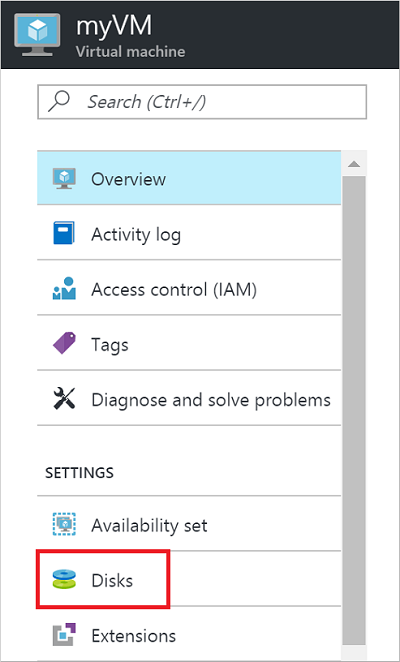

# How to attach a data disk to a Linux VM in the Azure portal
This article shows you how to attach both new and existing disks to a Linux virtual machine through the Azure portal.

Before you attach disks to your VM, review these tips:

* The size of the virtual machine controls how many data disks you can attach. For details, see [Sizes for virtual machines](sizes.md?toc=%2fvirtual-machines%2flinux%2ftoc.json).
* To use Premium storage, you need a DS-series or FS-series virtual machine. You can use both Premium and Standard disks with these virtual machines. Premium storage is available in certain regions. For details, see [Premium Storage: High-Performance Storage for Azure Virtual Machine Workloads](../../storage/storage-premium-storage.md?toc=%2fvirtual-machines%2flinux%2ftoc.json).
* Disks attached to virtual machines are actually .vhd files stored in Azure. For details, see [About disks and VHDs for virtual machines](../../storage/storage-about-disks-and-vhds-linux.md?toc=%2fvirtual-machines%2flinux%2ftoc.json).

## Find the virtual machine
1. Sign in to the [Azure portal](https://portal.azure.cn/).
2. On the Hub menu, click **Virtual Machines**.
3. Select the virtual machine from the list.
4. To the Virtual machines blade, in **Essentials**, click **Disks**.

    

Continue by following instructions for attaching either a [managed disk](#use-azure-managed-disks) or [unmanaged disk](#use-unmanaged-disks).

## Use Azure Managed Disks

Azure China does not support adding Managed Disk in Azure portal yet.

## Use unmanaged disks

### Attach a new disk

1. On the **Disks** blade, click **+ Add data disk**.
2. Review the default settings, update as necessary, and then click **OK**.

   
3. After Azure creates the disk and attaches it to the virtual machine, the new disk is listed in the virtual machine's disk settings under **Data Disks**.

### Attach an existing disk
1. On the **Disks** blade, click **+ Add data disk**.
2. Under **Attach existing disk**, click **VHD File**.

   
3. Under **Storage accounts**, select the account and container that holds the .vhd file.

   
4. Select the .vhd file.
5. Under **Attach existing disk**, the file you just selected is listed under **VHD File**. Click **OK**.
6. After Azure attaches the disk to the virtual machine, it's listed in the virtual machine's disk settings under **Data Disks**.

## Next steps
After the disk is added, you need to prepare it for use. For more information, see [How to: Initialize a new data disk in Linux](add-disk.md).
