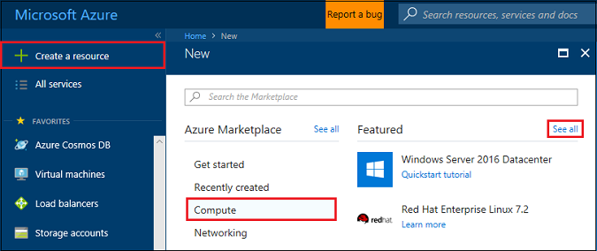
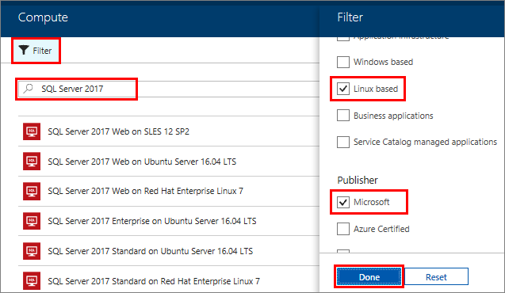
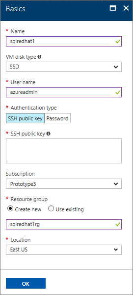
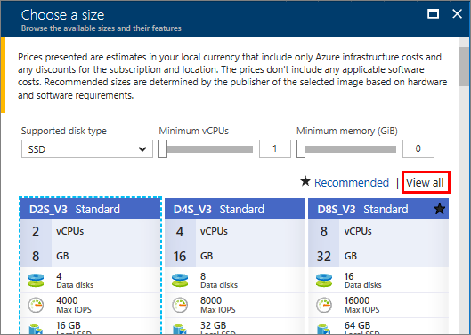
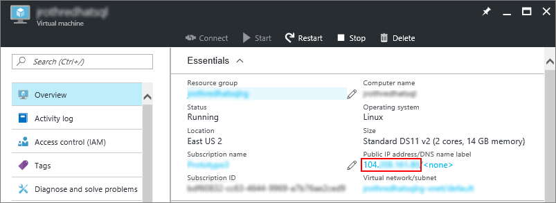
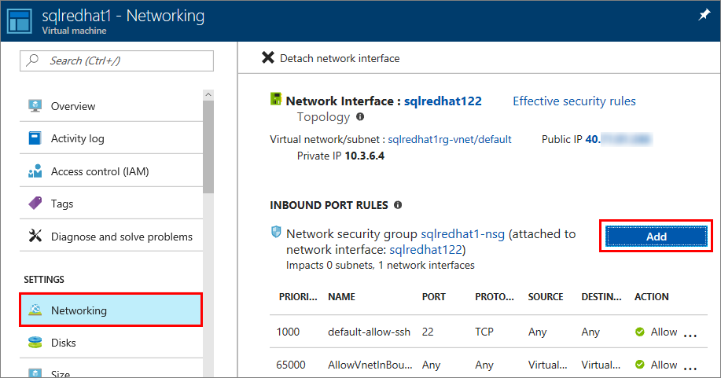
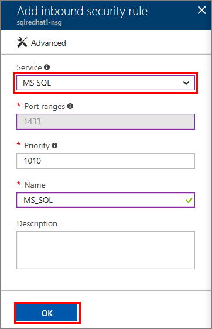

# Provision a Linux SQL Server virtual machine in the Azure portal

> [!div class="op_single_selector"]
> * [Linux](provision-sql-server-linux-virtual-machine.md)
> * [Windows](../../windows/sql/virtual-machines-windows-portal-sql-server-provision.md)

In this quick start tutorial, you use the Azure portal to create a Linux virtual machine with SQL Server 2017 installed.

In this tutorial, you will:

* [Create a Linux SQL VM from the gallery](#create)
* [Connect to the new VM with ssh](#connect)
* [Change the SA password](#password)
* [Configure for remote connections](#remote)

## Prerequisites

If you don't have an Azure subscription, create a [trial account](https://www.azure.cn/pricing/1rmb-trial) before you begin.

## <a id="create"></a> Create a Linux VM with SQL Server installed

1. Sign in to the [Azure portal](https://portal.azure.cn/).

1. In the left pane, click **New**.

1. In the **New** pane, click **Compute**.

1. Click **See all** next to the **Featured** heading.

   

1. In the search box, type **SQL Server 2017**, and press **Enter** to start the search.

1. Click the **Filter** icon, limit the search to **Linux based**, **Microsoft** images, and then click **Done**.

    

1. Select a SQL Server 2017 Linux image from the search results. This tutorial uses **Free SQL Server License: SQL Server 2017 Developer on Red Hat Enterprise Linux 7.4**.

   > [!TIP]
   > The Developer edition enables you to test or develop with the features of the Enterprise edition but no SQL Server licensing costs. You only pay for the cost of running the Linux VM.

1. Click **Create**.

1. In the **Basics** window, fill in the details for your Linux VM. 

    

    > [!Note]
    > You have the choice of using an SSH public key or a Password for authentication. SSH is more secure. For instructions on how to generate an SSH key, see [Create SSH keys on Linux and Mac for Linux VMs in Azure](/virtual-machines/virtual-machines-linux-mac-create-ssh-keys).

1. Click **OK**.

1. In the **Size** window, choose a machine size. To see other sizes, select **View all**. For more information about VM machine sizes, see [Linux VM sizes](/virtual-machines/virtual-machines-linux-sizes).

    

   > [!TIP]
   > For development and functional testing, we recommend a VM size of **DS2** or higher. For performance testing, use **DS13** or higher.

1. Click **Select**.

1. In the **Settings** window, you can make changes to the settings or keep the default settings.

1. Click **OK**.

1. On the **Summary** page, click **Purchase** to create the VM.

## <a id="connect"></a> Connect to the Linux VM

If you already use a BASH shell, connect to the Azure VM using the **ssh** command. In the following command, replace the VM user name and IP address to connect to your Linux VM.

```bash
ssh azureadmin@40.55.55.555
```

You can find the IP address of your VM in the Azure portal.



If you are running on Windows and do not have a BASH shell, you can install an SSH client, such as PuTTY.

1. [Download and install PuTTY](http://www.chiark.greenend.org.uk/~sgtatham/putty/download.html).

1. Run PuTTY.

1. On the PuTTY configuration screen, enter your VM's public IP address.

1. Click Open and enter your username and password at the prompts.

For more information about connecting to Linux VMs, see [Create a Linux VM on Azure using the Portal](/virtual-machines/virtual-machines-linux-quick-create-portal#ssh-to-the-vm).

## <a id="password"></a> Change the SA password

The new virtual machine installs SQL Server with a random SA password. You must reset this password before you can connect to SQL Server with the SA login.

1. After connecting to your Linux VM, open a new command terminal.

1. Change the SA password with the following commands:

   ```bash
   sudo systemctl stop mssql-server
   sudo /opt/mssql/bin/mssql-conf set-sa-password
   ```

   Enter a new SA password and password confirmation when prompted.

1. Restart the SQL Server service.

   ```bash
   sudo systemctl start mssql-server
   ```

## Add the tools to your path (optional)

Several SQL Server [packages](sql-server-linux-virtual-machines-overview.md#packages) are installed by default, including the SQL Server command-line Tools package. The tools package contains the **sqlcmd** and **bcp** tools. For convenience, you can optionally add the tools path, `/opt/mssql-tools/bin/`, to your **PATH** environment variable.

1. Run the following commands to modify the **PATH** for both login sessions and interactive/non-login sessions:

   ```bash
   echo 'export PATH="$PATH:/opt/mssql-tools/bin"' >> ~/.bash_profile
   echo 'export PATH="$PATH:/opt/mssql-tools/bin"' >> ~/.bashrc
   source ~/.bashrc
   ```

## <a id="remote"></a> Configure for remote connections

If you need to remotely connect to SQL Server on the Azure VM, you must configure an inbound rule on the network security group. The rule allows traffic on the port on which SQL Server listens (default of 1433). The following steps show how to use the Azure portal for this step. 

1. In the portal, select **Virtual machines**, and then select your SQL Server VM.

1. In the list of properties, select **Networking**.

1. In the **Networking** window, click the **Add** button under **Inbound Port Rules**.

   

1. In the **Service** list, select **MS SQL**.

    

1. Click **OK** to save the rule for your VM.

### Open the firewall on RHEL

This tutorial directed you to create a Red Hat Enterprise Linux (RHEL) VM. If you want to connect remotely to RHEL VMs, you also have to open up port 1433 on the Linux firewall.

1. [Connect](#connect) to your RHEL VM.

1. In the BASH shell, run the following commands:

   ```bash
   sudo firewall-cmd --zone=public --add-port=1433/tcp --permanent
   sudo firewall-cmd -reload
   ```

## Next steps

Now that you have a SQL Server 2017 virtual machine in Azure, you can connect locally with **sqlcmd** to run Transact-SQL queries.

If you configured the Azure VM for remote SQL Server connections, you should also be able to connect remotely. For an example of how to connect remotely to SQL Server on Linux from Windows, see [Use SSMS on Windows to connect to SQL Server on Linux](https://docs.microsoft.com/sql/linux/sql-server-linux-develop-use-ssms). To connect with Visual Studio Code, see [Use Visual Studio Code to create and run Transact-SQL scripts for SQL Server](https://docs.microsoft.com/sql/linux/sql-server-linux-develop-use-vscode)

For more general information about SQL Server on Linux, see the [Overview of SQL Server 2017 on Linux](https://docs.microsoft.com/sql/linux/sql-server-linux-overview). For more information about using SQL Server 2017 Linux virtual machines, see [Overview of SQL Server 2017 virtual machines on Azure](sql-server-linux-virtual-machines-overview.md).

<!--Update_Description: new articles on provision SQL server linux VM-->