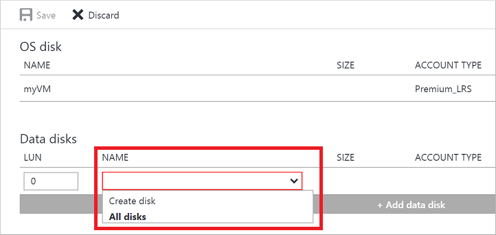
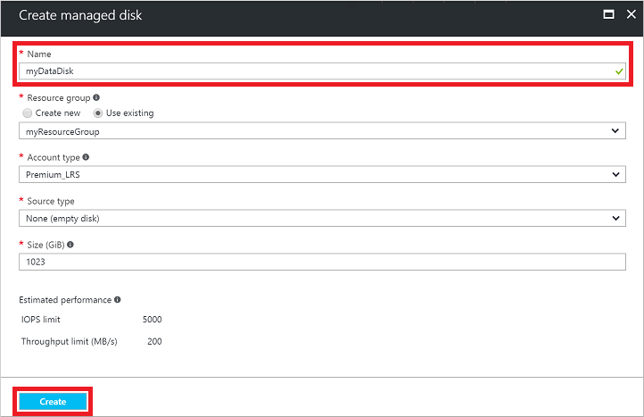
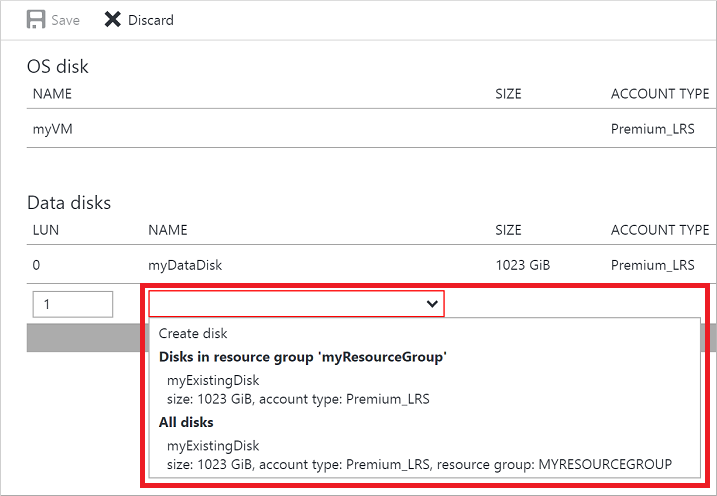
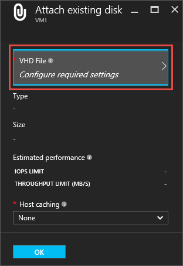

<properties
    pageTitle="Attach a data disk to a Linux VM | Azure"
    description="How to attach new or existing data disk to a Linux VM in the Azure portal preview using the Resource Manager deployment model."
    services="virtual-machines-linux"
    documentationcenter=""
    author="cynthn"
    manager="timlt"
    editor=""
    tags="azure-resource-manager" />
<tags
    ms.assetid="5e1c6212-976c-4962-a297-177942f90907"
    ms.service="virtual-machines-linux"
    ms.workload="infrastructure-services"
    ms.tgt_pltfrm="vm-linux"
    ms.devlang="na"
    ms.topic="article"
    ms.date="03/07/2017"
    wacn.date=""
    ms.author="cynthn" />

# How to attach a data disk to a Linux VM in the Azure portal preview
This article shows you how to attach both new and existing disks to a Linux virtual machine through the Azure portal preview. You can also [attach a data disk to a Windows VM in the Azure portal preview](/documentation/articles/virtual-machines-windows-attach-disk-portal/). You can choose to use either Azure Managed Disks or unmanaged disks. Managed disks are handled by the Azure platform and do not require any preparation or location to store them. Unmanaged disks require a storage account and have some [quotas and limits that apply](/documentation/articles/azure-subscription-service-limits/#storage-limits). For more information about Azure Managed Disks, see [Azure Managed Disks overview](/documentation/articles/storage-managed-disks-overview/).

Before you attach disks to your VM, review these tips:

* The size of the virtual machine controls how many data disks you can attach. For details, see [Sizes for virtual machines](/documentation/articles/virtual-machines-linux-sizes/).
* To use Premium storage, you need a DS-series or FS-series virtual machine. You can use both Premium and Standard disks with these virtual machines. Premium storage is available in certain regions. For details, see [Premium Storage: High-Performance Storage for Azure Virtual Machine Workloads](/documentation/articles/storage-premium-storage/).
* Disks attached to virtual machines are actually .vhd files stored in Azure. For details, see [About disks and VHDs for virtual machines](/documentation/articles/storage-about-disks-and-vhds-linux/).

## Find the virtual machine
1. Sign in to the [Azure portal preview](https://portal.azure.cn/).
2. On the Hub menu, click **Virtual Machines**.
3. Select the virtual machine from the list.
4. To the Virtual machines blade, in **Essentials**, click **Disks**.
   
    

Continue by following instructions for attaching either a [managed disk](#use-azure-managed-disks) or [unmanaged disk](#use-unmanaged-disks).

## Use Azure Managed Disks

###  Attach a new disk

1. On the **Disks** blade, click **+ Add data disk**.
2. Click the drop-down menu for **Name** and select **Create disk**:

    

3. Enter a name for your managed disk. Review the default settings, update as necessary, and then click **Create**.
   
   

4. Click **Save** to create the managed disk and update the VM configuration:

   

5. After Azure creates the disk and attaches it to the virtual machine, the new disk is listed in the virtual machine's disk settings under **Data Disks**. As managed disks are a top-level resource, the disk appears at the root of the resource group:

   

###  Attach an existing disk
1. On the **Disks** blade, click **+ Add data disk**.
2. Click the drop-down menu for **Name** to view a list of existing managed disks accessible to your Azure subscription. Select the managed disk to attach:

   

3. Click **Save** to attach the existing managed disk and update the VM configuration:
   
   

4. After Azure attaches the disk to the virtual machine, it's listed in the virtual machine's disk settings under **Data Disks**.

## Use unmanaged disks

### Attach a new disk

1. On the **Disks** blade, click **+ Add data disk**.
2. Review the default settings, update as necessary, and then click **OK**.
   
    
3. After Azure creates the disk and attaches it to the virtual machine, the new disk is listed in the virtual machine's disk settings under **Data Disks**.

### Attach an existing disk
1. On the **Disks** blade, click **+ Add data disk**.
2. Under **Attach existing disk**, click **VHD File**.
   
    
3. Under **Storage accounts**, select the account and container that holds the .vhd file.
   
    
4. Select the .vhd file.
5. Under **Attach existing disk**, the file you just selected is listed under **VHD File**. Click **OK**.
6. After Azure attaches the disk to the virtual machine, it's listed in the virtual machine's disk settings under **Data Disks**.

## Next steps
After the disk is added, you need to prepare it for use. For more information, see [How to: Initialize a new data disk in Linux](/documentation/articles/virtual-machines-linux-classic-attach-disk/#initialize-a-new-data-disk-in-linux).