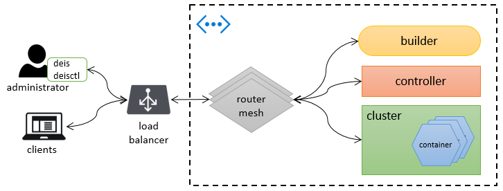
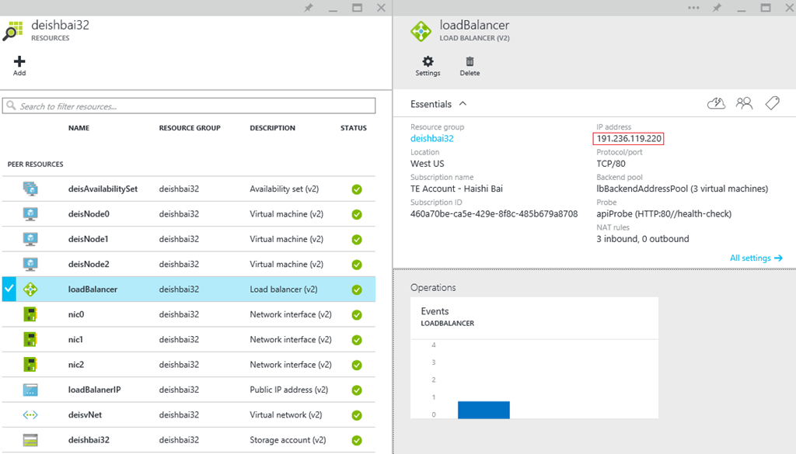
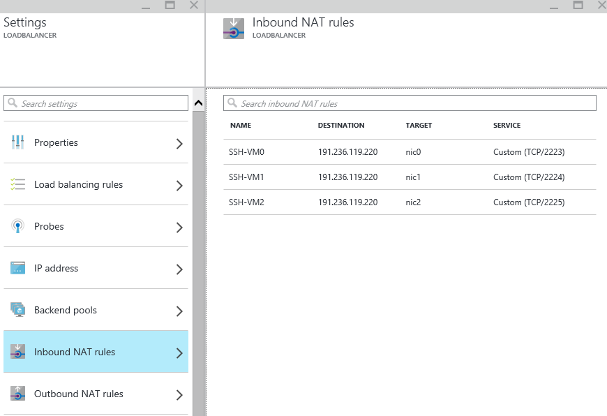
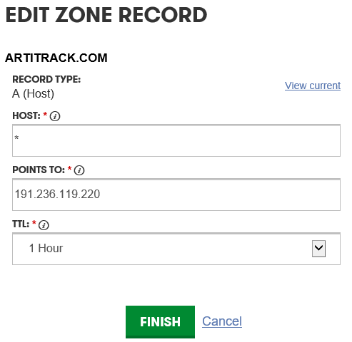
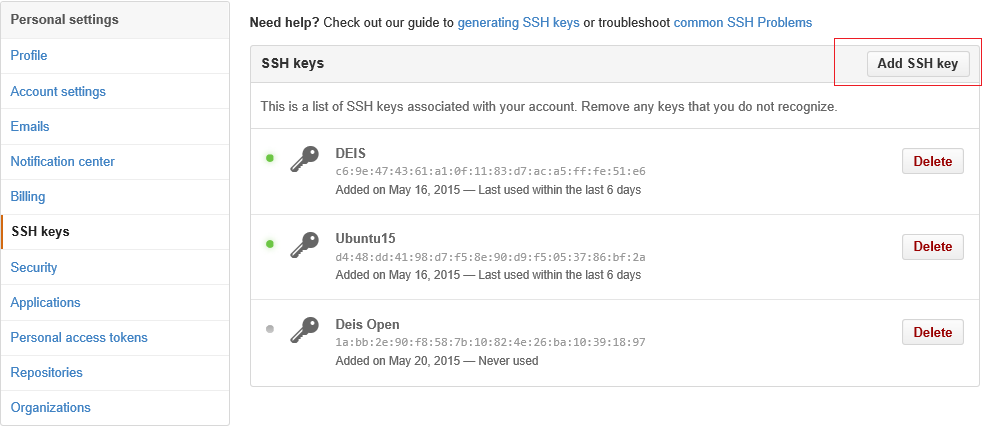

<!-- need to be customized -->

<properties
    pageTitle="Deploy a 3-node Deis cluster | Azure"
    description="This article describes how to create a 3-node Deis cluster on Azure using an Azure Resource Manager template"
    services="virtual-machines-linux"
    documentationcenter=""
    author="HaishiBai"
    manager="timlt"
    editor=""
    tags="azure-resource-manager" />
<tags
    ms.assetid="5eb67eb7-95d4-461d-8eac-44925224ba5f"
    ms.service="virtual-machines-linux"
    ms.devlang="multiple"
    ms.topic="article"
    ms.tgt_pltfrm="vm-linux"
    ms.workload="infrastructure-services"
    ms.date="06/24/2015"
    wacn.date=""
    ms.author="hbai"
    ms.custom="H1Hack27Feb2017" />

# Deploy and configure a 3-node Deis cluster in Azure
This article walks you through provisioning a [Deis](http://deis.io/) cluster on Azure. It covers all the steps from creating the necessary certificates to deploying and scaling a sample **Go** application on the newly provisioned cluster.

The following diagram shows the architecture of the deployed system. A system administrator manages the cluster using Deis tools such as **deis** and **deisctl**. Connections are established through an Azure load balancer, which forwards the connections to one of the member nodes on the cluster. The clients access deployed applications through the load balancer as well. In this case, the load balancer forwards the traffic to a Deis router mesh, which further routs traffic to corresponding Docker containers hosted on the cluster.

  

In order to run through the following steps, you'll need:

* An active Azure subscription. If you don't have one, you can get a free trail on [azure.com](https://azure.microsoft.com/).
* A work or school id to use Azure resource groups. If you have a personal account and log in with a Microsoft id, you need to [create a work id from your personal one](/documentation/articles/virtual-machines-windows-create-aad-work-id/).
* Either -- depending on your client operating system -- the [Azure PowerShell](https://docs.microsoft.com/powershell/azureps-cmdlets-docs) or the [Azure CLI for Mac, Linux, and Windows](/documentation/articles/cli-install-nodejs/).
* [OpenSSL](https://www.openssl.org/). OpenSSL is used to generate the necessary certificates.
* A Git client such as [Git Bash](https://git-scm.com/).
* To test the sample application, you'll also need a DNS server. You can use any DNS servers or services that support wildcard A records.
* A computer to run Deis client tools. You can use either a local machine or a virtual machine. You can run these tools on almost any Linux distribution, but the following instructions use Ubuntu.

## Provision the cluster
In this section, you'll use an [Azure Resource Manager](/documentation/articles/resource-group-overview/) template from the open source repository [azure-quickstart-templates](https://github.com/Azure/azure-quickstart-templates). First, you'll copy down the template. Then, you'll create a new SSH key pair for authentication. And then, you'll configure a new identifier for you cluster. And finally, you'll use either the Shell script or the PowerShell script to provision the cluster.

1. Clone the repository: [https://github.com/Azure/azure-quickstart-templates](https://github.com/Azure/azure-quickstart-templates).
   
        git clone https://github.com/Azure/azure-quickstart-templates
2. Go to the template folder:
   
        cd azure-quickstart-templates\deis-cluster-coreos
3. Create a new SSH key pair using ssh-keygen:
   
        ssh-keygen -t rsa -b 4096 -c "[your_email@domain.com]"
4. Generate a certificate using the above private key:
   
        openssl req -x509 -days 365 -new -key [your private key file] -out [cert file to be generated]
5. Go to [https://discovery.etcd.io/new](https://discovery.etcd.io/new) to generate a new cluster token, which looks something like:
   
        https://discovery.etcd.io/6a28e078895c5ec737174db2419bb2f3
     
    Each CoreOS cluster needs to have a unique token from this free service. Please see [CoreOS documentation](https://coreos.com/docs/cluster-management/setup/cluster-discovery/) for more details.
6. Modify the **cloud-config.yaml** file to replace the existing  **discovery** token with the new token:
   
        #cloud-config
        ---
        coreos:
          etcd:
            # generate a new token for each unique cluster from https://discovery.etcd.io/new
            # uncomment the following line and replace it with your discovery URL
            discovery: https://discovery.etcd.io/3973057f670770a7628f917d58c2208a
        ...
7. Modify the **azuredeploy-parameters.json** file: Open the certificate you created in step 4 in a text editor. Copy all text between `----BEGIN CERTIFICATE-----` and `-----END CERTIFICATE-----` into the **sshKeyData** parameter (you'll need to remove all newline characters).
8. Modify the **newStorageAccountName** parameter. This is the storage account for VM OS disks. This account name has to be globally unique.
9. Modify the **publicDomainName** parameter. This will become part of the DNS name associated with the load balancer public IP. The final FQDN will have the format of *[value of this parameter]*.*[region]*.chinacloudapp.cn. For example, if you specify the name as deishbai32, and the resource group is deployed to the China North region, then the final FQDN to your load balancer will be deishbai32.chinanorth.chinacloudapp.cn.
10. Save the parameter file. And then you can provision the cluster using Azure PowerShell:
    
        .\deploy-deis.ps1 -ResourceGroupName [resource group name] -ResourceGroupLocation "China North" -TemplateFile
        .\azuredeploy.json -ParametersFile .\azuredeploy-parameters.json -CloudInitFile .\cloud-config.yaml
    
    or Azure CLI:
    
        ./deploy-deis.sh -n "[resource group name]" -l "China North" -f ./azuredeploy.json -e ./azuredeploy-parameters.json
        -c ./cloud-config.yaml  
11. Once the resource group is provisioned, you can see all the resources in the group on Azure Classic Management Portal. As shown in the following screenshot, the resource group contains a virtual network with three VMs, which are joined to the same availability set. The group also contains a load balancer, which has an associated public IP.
    
    

## Install the client
You need **deisctl** to control your Deis cluster. Although deisctl is automatically installed in all the cluster nodes, it's a good practice to use deisctl on a separate administrative machine. Furthermore, because all nodes are configured with only private IP addresses, you'll need to use SSH tunneling through the load balancer, which has a public IP, to connect to the node machines. The following are the steps of setting up deisctl on a separate Ubuntu physical or virtual machine.

1. Install deisctl:mkdir deis
   
        cd deis
        curl -sSL http://deis.io/deisctl/install.sh | sh -s 1.6.1
        sudo ln -fs $PWD/deisctl /usr/local/bin/deisctl
2. Add your private key to ssh agent:
   
        eval `ssh-agent -s`
        ssh-add [path to the private key file, see step 1 in the previous section]
3. Configure deisctl:
   
        export DEISCTL_TUNNEL=[public ip of the load balancer]: 2223

The template defines inbound NAT rules that map 2223 to instance 1, 2224 to instance 2, and 2225 to instance 3. This provides redundancy for using the deisctl tool. You can examine these rules on Azure Classic Management Portal:

> [AZURE.NOTE]
> Currently the template only supports 3-node clusters. This is because of a limitation in Azure Resource Manager template NAT rule definition, which doesn't support loop syntax.
> 
> 

## Install and start the Deis platform
Now you can use deisctl to install and start the Deis platform:

    deisctl config platform set domain=[some domain]
    deisctl config platform set sshPrivateKey=[path to the private key file]
    deisctl install platform
    deisctl start platform

> [AZURE.NOTE]
> Starting the platform takes a while (as much as 10 minutes). Especially, starting the builder service can take a long time. And sometimes it takes a few tries to succeed: If the operation seems to hang, try typing `ctrl+c` to break execution of the command and retry.
> 
> 

You can use `deisctl list` to verify if all services are running:

    deisctl list
    UNIT                            MACHINE                 LOAD    ACTIVE          SUB
    deis-builder.service            ebe3005e.../10.0.0.6    loaded  active          running
    deis-controller.service         ebe3005e.../10.0.0.6    loaded  active          running
    deis-database.service           9c79bbdd.../10.0.0.5    loaded  active          running
    deis-logger.service             9c79bbdd.../10.0.0.5    loaded  active          running
    deis-logspout.service           8d658d5a.../10.0.0.4    loaded  active          running
    deis-logspout.service           9c79bbdd.../10.0.0.5    loaded  active          running
    deis-logspout.service           ebe3005e.../10.0.0.6    loaded  active          running
    deis-publisher.service          8d658d5a.../10.0.0.4    loaded  active          running
    deis-publisher.service          9c79bbdd.../10.0.0.5    loaded  active          running
    deis-publisher.service          ebe3005e.../10.0.0.6    loaded  active          running
    deis-registry@1.service         ebe3005e.../10.0.0.6    loaded  active          running
    deis-router@1.service           ebe3005e.../10.0.0.6    loaded  active          running
    deis-router@2.service           8d658d5a.../10.0.0.4    loaded  active          running
    deis-router@3.service           9c79bbdd.../10.0.0.5    loaded  active          running
    deis-store-daemon.service       8d658d5a.../10.0.0.4    loaded  active          running
    deis-store-daemon.service       9c79bbdd.../10.0.0.5    loaded  active          running
    deis-store-daemon.service       ebe3005e.../10.0.0.6    loaded  active          running
    deis-store-gateway@1.service    9c79bbdd.../10.0.0.5    loaded  active          running
    deis-store-metadata.service     8d658d5a.../10.0.0.4    loaded  active          running
    deis-store-metadata.service     9c79bbdd.../10.0.0.5    loaded  active          running
    deis-store-metadata.service     ebe3005e.../10.0.0.6    loaded  active          running
    deis-store-monitor.service      8d658d5a.../10.0.0.4    loaded  active          running
    deis-store-monitor.service      9c79bbdd.../10.0.0.5    loaded  active          running
    deis-store-monitor.service      ebe3005e.../10.0.0.6    loaded  active          running
    deis-store-volume.service       8d658d5a.../10.0.0.4    loaded  active          running
    deis-store-volume.service       9c79bbdd.../10.0.0.5    loaded  active          running
    deis-store-volume.service       ebe3005e.../10.0.0.6    loaded  active          running

Congratulations! Now you've got a running Deis clsuter on Azure! Next, let's deploy a sample Go application to see the cluster in action.

## Deploy and scale a Hello World application
The following steps show how to deploy a "Hello World" Go application to the cluster. The steps are based on [Deis documentation](http://docs.deis.io/en/latest/using_deis/using-dockerfiles/#using-dockerfiles).

1. For the routing mesh to work properly, you'll need to have a wildcard A record for your domain pointing to the public IP of the load balancer. The following screenshot shows the A record for a sample domain registration on GoDaddy:
   
    
   
    

2. Install deis:
   
        mkdir deis
        cd deis
        curl -sSL http://deis.io/deis-cli/install.sh | sh
        ln -fs $PWD/deis /usr/local/bin/deis
3. Create a new SSH key, and then add the public key to GitHub (of course, you can also reuse your existing keys). To create a new SSH key pair, use:
   
        cd ~/.ssh
        ssh-keygen (press [Enter]s to use default file names and empty passcode)
4. Add id_rsa.pub, or the public key of your choice, to GitHub. You can do this by using the Add SSH key button in your SSH keys configuration screen:
   
    
   
    

5. Register a new user:
   
        deis register http://deis.[your domain]
    

6. Add the SSH key:
   
        deis keys:add [path to your SSH public key]
    
      
7. Create an application.
   
        git clone https://github.com/deis/helloworld.git
        cd helloworld
        deis create
        git push deis master
    

8. The git push will trigger Docker images to be built and deployed, which will take a few minutes. From my experience, occasionally, Step 10 (Pushing image to private repository) may hang. When this happens, you can stop the process, remove the application using `deis apps:destroy -a <application name>` to remove the application and try again. You can use `deis apps:list` to find out the name of your application. If everything works out, you should see something like the following at the end of command outputs:
   
        -----> Launching...
               done, lambda-underdog:v2 deployed to Deis
               http://lambda-underdog.artitrack.com
               To learn more, use `deis help` or visit http://deis.io
        To ssh://git@deis.artitrack.com:2222/lambda-underdog.git
         * [new branch]      master -> master
    

9. Verify if the application is working:
   
        curl -S http://[your application name].[your domain]
    You should see:
   
        Welcome to Deis!
        See the documentation at http://docs.deis.io/ for more information.
        (you can use geis apps:list to get the name of your application).
    

10. Scale the application to 3 instances:
    
        deis scale cmd=3
    

11. Optionally, you can use deis info to examine details of your application. The following outputs are from my application deployment:
    
        deis info
        === lambda-underdog Application
        {
          "updated": "2015-05-22T06:14:10UTC",
          "uuid": "10c74ee7-b7ff-4786-967a-7e65af7eabc3",
          "created": "2015-05-22T06:07:55UTC",
          "url": "lambda-underdog.artitrack.com",
          "owner": "haishi",
          "id": "lambda-underdog",
          "structure": {
            "cmd": 3
          }
        }
    
        === lambda-underdog Processes
        --- cmd:
        cmd.1 up (v2)
        cmd.2 up (v2)
        cmd.3 up (v2)
    
        === lambda-underdog Domains
        No domains

## Next Steps
This article walked you through all the steps to provision a new Deis cluster on Azure using an Azure Resource Manager template. The template supports redundancy in tooling connections as well as load balancing for deployed applications. The template also avoids using public IPs on member nodes, which saves precious public IP resources and provides a more secured environment to host applications. To learn more, see the following articles:

[Azure Resource Manager Overview][resource-group-overview]  
[How to use the Azure CLI][azure-command-line-tools]  
[Using Azure PowerShell with Azure Resource Manager][powershell-azure-resource-manager]  

[azure-command-line-tools]: /documentation/articles/cli-install-nodejs/
[resource-group-overview]: /documentation/articles/resource-group-overview/
[powershell-azure-resource-manager]: /documentation/articles/powershell-azure-resource-manager/