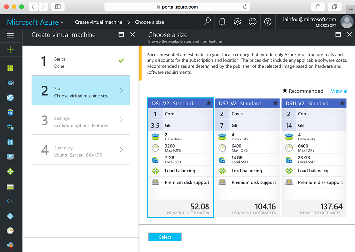
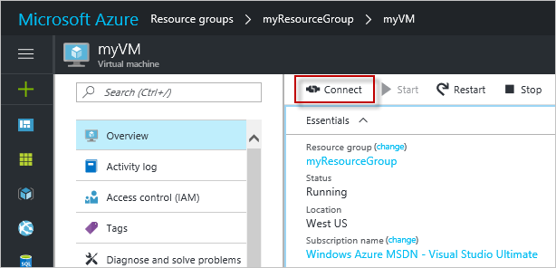

# Create a Linux virtual machine with the Azure portal preview

Azure virtual machines can be created through the Azure portal preview. This method provides a browser-based user interface for creating and configuring VMs, and all related Azure resources.

## Create SSH key pair

You need an SSH key pair to complete this quick start. If you have an existing SSH key pair, this step can be skipped. If you are using a Windows machine, follow the instructions found [here](./virtual-machines-linux-ssh-from-windows.md). 

From a Bash shell, run this command and follow the on-screen directions. The command output includes the file name of the public key file. The contents of this file are needed when creating the virtual machine.

```bash
ssh-keygen -t rsa -b 2048
```

## Log in to Azure 

Log in to the Azure portal preview at http://portal.azure.cn.

## Create virtual machine

1. Click the **New** button found on the upper left-hand corner of the Azure portal preview.

2. Select **Compute** from the **New** blade, select **Ubuntu Server 16.04 LTS** from the **Compute** blade, and then click the **Create** button.

3. Fill out the virtual machine **Basics** form. For **Authentication type**, select **SSH**. When pasting in your **SSH public key**, take care to remove any leading or trailing white space. For **Resource group**, create a new one. A resource group is a logical container into which Azure resources are created and collectively managed. When complete, click **OK**.

      

4. Choose a size for the VM and click **Select**. 

    

5. On the settings blade, select **Yes** under **Use managed disks**, keep the defaults for the rest of the settings, and click **OK**.

6. On the summary page, click **Ok** to start the virtual machine deployment.

7. To monitor deployment status, click the virtual machine. The VM can be found on the Azure portal preview dashboard, or by selecting **Virtual Machines** from the left-hand menu. When the VM has been created, the status changes from **Deploying** to **Running**.

## Connect to virtual machine

After the deployment has completed, create an SSH connection with the virtual machine.

1. Click the virtual machine. The VM can be found on the home screen of the Azure portal preview, or by selecting **Virtual Machines** from the left-hand menu.

2. Click the **Connect** button. The connect button displays an SSH connection string that can be used to connect to the virtual machine.

     

3. Run the following command to create an SSH session. Replace the connection string with the one you copied from the Azure portal preview.

```bash 
ssh <replace with IP address>
```
## Delete virtual machine

When no longer needed, delete the resource group, virtual machine, and all related resources. To do so, select the resource group from the virtual machine blade and click **Delete**.

## Next steps

[Create highly available virtual machines tutorial](./virtual-machines-linux-create-cli-complete.md?toc=%2fazure%2fvirtual-machines%2flinux%2ftoc.json)

[Explore VM deployment CLI samples](./virtual-machines-linux-cli-samples.md?toc=%2fazure%2fvirtual-machines%2flinux%2ftoc.json)