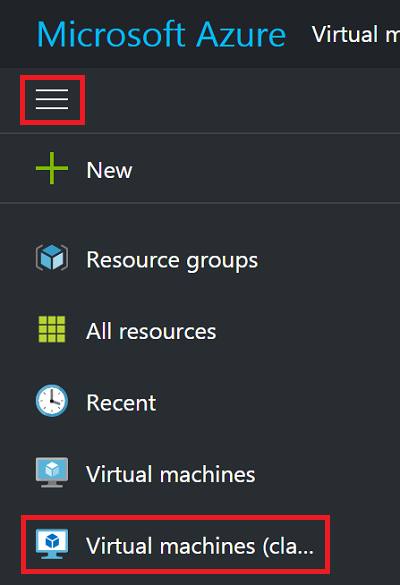
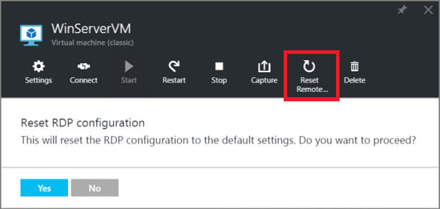
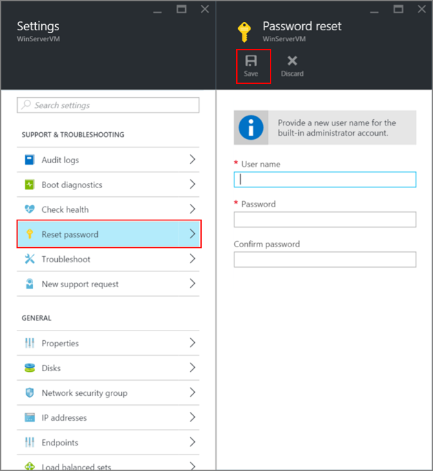

<properties
    pageTitle="Reset the password or Remote Desktop configuration on a Windows VM in Azure | Azure"
    description="Learn how to reset an account password or Remote Desktop services on a Windows VM created using the Classic deployment model using the Azure portal preview or Azure PowerShell."
    services="virtual-machines-windows"
    documentationcenter=""
    author="iainfoulds"
    manager="timlt"
    editor=""
    tags="azure-service-management" />
<tags
    ms.assetid=""
    ms.service="virtual-machines-windows"
    ms.workload="infrastructure-services"
    ms.tgt_pltfrm="vm-windows"
    ms.devlang="na"
    ms.topic="article"
    ms.date="03/14/2017"
    wacn.date=""
    ms.author="iainfou" />

# How to reset the Remote Desktop service or its login password in a Windows VM created using the Classic deployment model
> [AZURE.IMPORTANT]
> Azure has two different deployment models for creating and working with resources: [Resource Manager and classic](/documentation/articles/resource-manager-deployment-model/). This article covers using the Classic deployment model. Azure recommends that most new deployments use the Resource Manager model. You can also [perform these steps for VMs created with the Resource Manager deployment model](/documentation/articles/virtual-machines-windows-reset-rdp/).

If you can't connect to a Windows virtual machine (VM), you can reset the local administrator password or reset the Remote Desktop service configuration. You can use either the Azure portal preview or the VM Access extension in Azure PowerShell to reset the password.

## Ways to reset configuration or credentials
You can reset Remote Desktop services and credentials in a few different ways, depending on your needs:

- [Reset using the Azure portal preview](#azure-portal)
- [Reset using Azure PowerShell](#vmaccess-extension-and-powershell)

## Azure portal preview
You can use the [Azure portal preview](https://portal.azure.cn) to reset the Remote Desktop service. To expand the portal menu, click the three bars in the upper left corner and then click **Virtual machines (classic)**:

Select your Windows virtual machine and then click **Reset Remote...**. The following dialog appears to reset the Remote Desktop configuration:

You can also reset the username and password of the local administrator account. From your VM, click **Support + Troubleshooting** > **Reset password**. The password reset blade is displayed:

After you enter the new user name and password, click **Save**.

## VMAccess extension and PowerShell
Make sure the VM Agent is installed on the virtual machine. The VMAccess extension doesn't need to be installed before you can use it, as long as the VM Agent is available. Verify that the VM Agent is already installed by using the following command. (Replace "myCloudService" and "myVM" by the names of your cloud service and your VM, respectively. You can learn these names by running `Get-AzureVM` without any parameters.)

    $vm = Get-AzureVM -ServiceName "myCloudService" -Name "myVM"
    write-host $vm.VM.ProvisionGuestAgent

If the **write-host** command displays **True**, the VM Agent is installed. If it displays **False**, see the instructions and a link to the download in the [VM Agent and Extensions - Part 2](https://azure.microsoft.com/zh-cn/blog/vm-agent-and-extensions-part-2/) Azure blog post.

If you created the virtual machine by using the portal, check whether `$vm.GetInstance().ProvisionGuestAgent` returns **True**. If not, you can set it by using this command:

    $vm.GetInstance().ProvisionGuestAgent = $true

This command prevents the following error when you're running the **Set-AzureVMExtension** command in the next steps: "Provision Guest Agent must be enabled on the VM object before setting IaaS VM Access Extension."

### **Reset the local administrator account password**
Create a sign-in credential with the current local administrator account name and a new password, and then run the `Set-AzureVMAccessExtension` as follows.

    $cred=Get-Credential
    Set-AzureVMAccessExtension -vm $vm -UserName $cred.GetNetworkCredential().Username `
        -Password $cred.GetNetworkCredential().Password  | Update-AzureVM

If you type a different name than the current account, the VMAccess extension renames the local administrator account, assigns the password to that account, and issues a Remote Desktop sign-out. If the local administrator account is disabled, the VMAccess extension enables it.

These commands also reset the Remote Desktop service configuration.

### **Reset the Remote Desktop service configuration**
To reset the Remote Desktop service configuration, run the following command:

    Set-AzureVMAccessExtension -vm $vm | Update-AzureVM

The VMAccess extension runs two commands on the virtual machine:

    netsh advfirewall firewall set rule group="Remote Desktop" new enable=Yes

This command enables the built-in Windows Firewall group that allows incoming Remote Desktop traffic, which uses TCP port 3389.

    Set-ItemProperty -Path 'HKLM:\System\CurrentControlSet\Control\Terminal Server' -name "fDenyTSConnections" -Value 0

This command sets the fDenyTSConnections registry value to 0, enabling Remote Desktop connections.

## Next steps
If the Azure VM access extension does not respond and you are unable to reset the password, you can [reset the local Windows password offline](/documentation/articles/virtual-machines-windows-reset-local-password-without-agent/). This method is a more advanced process and requires you to connect the virtual hard disk of the problematic VM to another VM. Follow the steps documented in this article first, and only attempt the offline password reset method as a last resort.

[Azure VM extensions and features](/documentation/articles/virtual-machines-windows-extensions-features/)

[Connect to an Azure virtual machine with RDP or SSH](http://msdn.microsoft.com/zh-cn/library/azure/dn535788.aspx)

[Troubleshoot Remote Desktop connections to a Windows-based Azure virtual machine](/documentation/articles/virtual-machines-windows-troubleshoot-rdp-connection/)