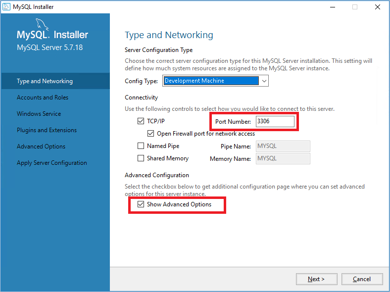
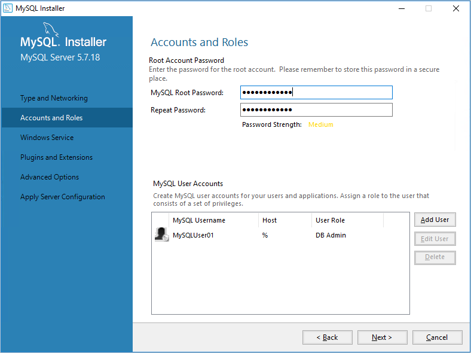
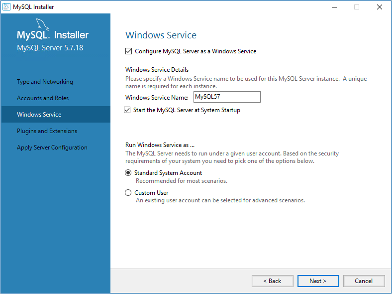
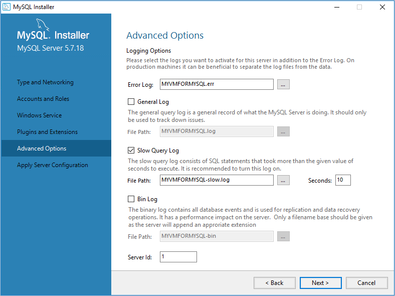
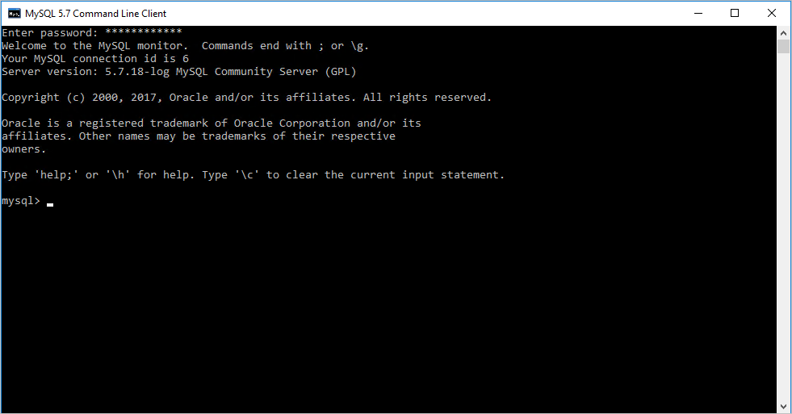
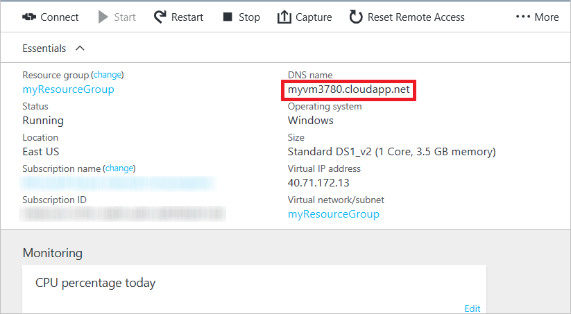

# Install MySQL on a virtual machine created with the classic deployment model running Windows Server 2016
[MySQL](https://www.mysql.com) is a popular open source, SQL database. This tutorial shows you how to install and run the **community version of MySQL 5.7.18** as a MySQL Server on a virtual machine running **Windows Server 2016**. Your experience might be slightly different for other versions of MySQL or Windows Server.

For instructions on installing MySQL on Linux, refer to: [How to install MySQL on Azure](../../linux/mysql-install.md).

> [!IMPORTANT]
> Azure has two different deployment models for creating and working with resources: [Resource Manager and Classic](../../../resource-manager-deployment-model.md). This article covers using the Classic deployment model. Azure recommends that most new deployments use the Resource Manager model.
> [!INCLUDE [virtual-machines-common-classic-createportal](../../../../includes/virtual-machines-classic-portal.md)]

## Create a virtual machine running Windows Server 2016
If you don't already have a VM running Windows Server 2016, you can use this [tutorial](./tutorial.md) to create the virtual machine.

## Attach a data disk
After the virtual machine is created, you can optionally attach a data disk. Adding a data disk is recommended for production workloads and to avoid running out of space on the OS drive (C:), which includes the operating system.

See [How to attach a data disk to a Windows virtual machine](../attach-managed-disk-portal.md) and follow the instructions for attaching an empty disk. Set the host cache setting to **None** or **Read-only**.

## Log on to the virtual machine
Next, you'll [log on to the virtual machine](./connect-logon.md) so you can install MySQL.

## Install and run MySQL Community Server on the virtual machine
Follow these steps to install, configure, and run the Community version of MySQL Server:

> [!NOTE]
> When downloading items using Internet Explorer, you can set the IE **Enhanced Security Configuration** to Off, and simplify the downloading process. From the Start menu, click Administrative Tools/Server Manager/Local Server, then click IE **Enhanced Security Configuration** and set the configuration to Off).
>
>

1. After you've connected to the virtual machine using Remote Desktop, click **Internet Explorer** from the start screen.
2. Select the **Tools** button in the upper-right corner (the cogged wheel icon), and then click **Internet Options**. Click the **Security** tab, click the **Trusted Sites** icon, and then click the **Sites** button. Add http://*.mysql.com to the list of trusted sites. Click **Close**, and then click **OK**.
3. In the address bar of Internet Explorer, type https://dev.mysql.com/downloads/mysql/.
4. Use the MySQL site to locate and download the latest version of the MySQL Installer for Windows. When choosing the MySQL Installer, download the version that has the complete file set (for example, the mysql-installer-community-5.7.18.0.msi with a file size of 352.8 MB), and save the installer.
5. When the installer has finished downloading, click **Run** to launch setup.
6. On the **License Agreement** page, accept the license agreement and click **Next**.
7. On the **Choosing a Setup Type** page, click the setup type that you want, and then click **Next**. The following steps assume the selection of the **Server only** setup type.
8. If the **Check Requirements** page displays, click **Execute** to let the installer install any missing components. Follow any instructions that display, such as the C++ Redistributable runtime.
9. On the **Installation** page, click **Execute**. When installation is complete, click **Next**.

10. On the **Product Configuration** page, click **Next**.

11. On the **Type and Networking** page, specify your desired configuration type and connectivity options, including the TCP port if needed. Select **Show Advanced Options**, and then click **Next**.
    

12. On the **Accounts and Roles** page, specify a strong MySQL root password. Add additional MySQL user accounts as needed, and then click **Next**.

    
13. On the **Windows Service** page, specify changes to the default settings for running the MySQL Server as a Windows service as needed, and then click **Next**.

    
14. The choices on the **Plugins and Extensions** page are optional. Click **Next** to continue.
15. On the **Advanced Options** page, specify changes to logging options as needed, and then click **Next**.

    
16. On the **Apply Server Configuration** page, click **Execute**. When the configuration steps are complete, click **Finish**.
17. On the **Product Configuration** page, click **Next**.
18. On the **Installation Complete** page, click **Copy Log to Clipboard** if you want to examine it later, and then click **Finish**.
19. From the start screen, type **mysql**, and then click **MySQL 5.7 Command-Line Client**.
20. Enter the root password that you specified in step 12 and you are presented with a prompt where you can issue commands to configure MySQL. For the details of commands and syntax, see [MySQL Reference Manuals](https://dev.mysql.com/doc/refman/5.7/en/server-configuration.html).

    
21. You can also configure server configuration default settings, such as the base and data directories and drives. For more information, see [6.1.2 Server Configuration Defaults](https://dev.mysql.com/doc/refman/5.7/en/server-configuration-defaults.html).

## Configure endpoints

For the MySQL service to be available to client computers on the Internet, you must configure an endpoint for the TCP port and create a Windows Firewall rule. The default port value on which the MySQL Server service listens for MySQL clients is 3306. You can specify another port, as long as the port is consistent with the value supplied on the **Type and Networking** page (step 11 of the previous procedure).

> [!NOTE]
> For production use, consider the security implications of making the MySQL Server service available to all computers on the Internet. You can define the set of source IP addresses that are allowed to use the endpoint with an Access Control List (ACL). For more information, see [How to Set Up Endpoints to a Virtual Machine](setup-endpoints.md).
>
>

To configure an endpoint for the MySQL Server service:

1. In the Azure portal, click **Virtual Machines (classic)**, click the name of your MySQL virtual machine, and then click **Endpoints**.
2. In the command bar, click **Add**.
3. On the **Add endpoint** page, type a unique name for **Name**.
4. Select **TCP** as the protocol.
5. Type the port number, such as **3306**, in both **Public Port** and **Private Port**, and then click **OK**.

## Add a Windows Firewall rule to allow MySQL traffic
To add a Windows Firewall rule that allows MySQL traffic from the Internet, run the following command at an _elevated Windows PowerShell command prompt_ on the MySQL server virtual machine.

    New-NetFirewallRule -DisplayName "MySQL57" -Direction Inbound -Protocol TCP -LocalPort 3306 -Action Allow -Profile Public

## Test your remote connection
To test your remote connection to the Azure VM running the MySQL Server service, you must provide the DNS name of the cloud service containing the VN.

1. In the Azure portal, click **Virtual Machines (classic)**, click the name of your MySQL server virtual machine, and then click **Overview**.
2. From the virtual machine dashboard, note the **DNS Name** value. Here is an example:

   
3. From a local computer running MySQL or the MySQL client, run the following command to log in as a MySQL user.

        mysql -u <yourMysqlUsername> -p -h <yourDNSname>

   For example, using the MySQL user name _dbadmin3_ and the _testmysql.chinacloudapp.cn_ DNS name for the virtual machine, you could start MySQL using the following command:

        mysql -u dbadmin3 -p -h testmysql.chinacloudapp.cn

## Next steps
To learn more about running MySQL, see the [MySQL Documentation](http://dev.mysql.com/doc/).
<!-- Update_Description: update meta properties -->