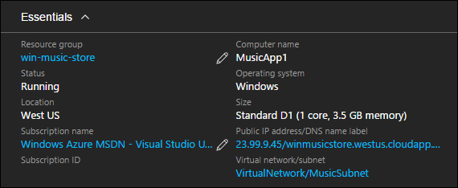
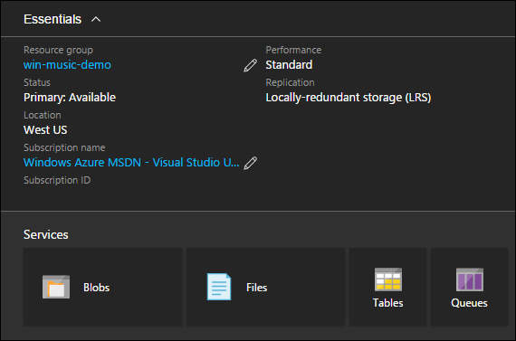
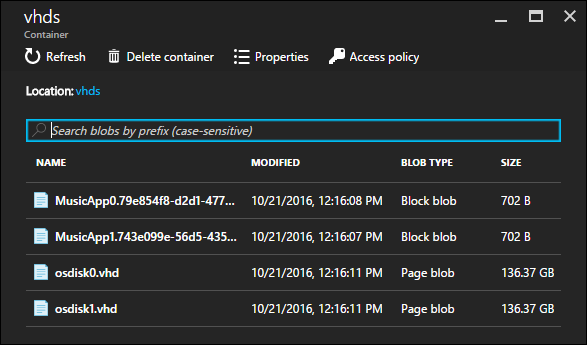
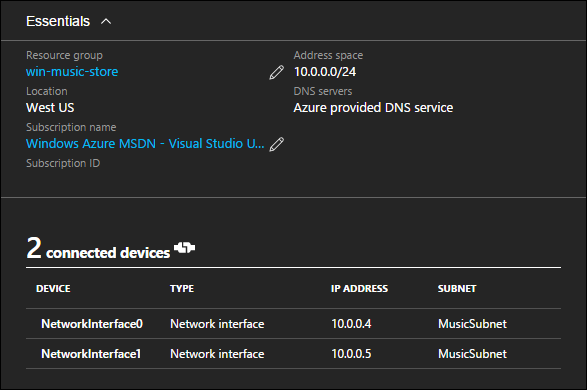
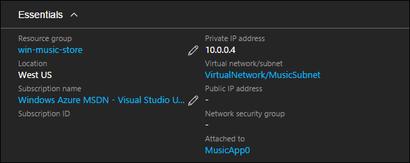
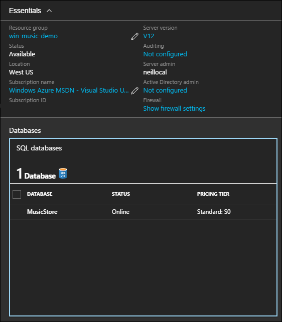

# Application architecture with Azure Resource Manager templates for Windows VMs

When developing an Azure Resource Manager deployment, compute requirements need to be mapped to Azure resources and services. If an application consists of several http endpoints, a database, and a data caching service, the Azure resources that host each of these components needs to be rationalized. For instance, the sample Music Store application includes a web application that is hosted on a virtual machine, and a SQL database, which is hosted in Azure SQL database. 

This document details how the Music Store compute resources are configured in the sample Azure Resource Manager template. All dependencies and unique configurations are highlighted. For the best experience, pre-deploy an instance of the solution to your Azure subscription and work along with the Azure Resource Manager template. The complete template can be found here - [Music Store Deployment on Windows](https://github.com/Microsoft/dotnet-core-sample-templates/tree/master/dotnet-core-music-windows).

## Virtual Machine
The Music Store application includes a web application where customers can browse and purchase music. While there are several Azure services that can host web applications, for this example, a Virtual Machine is used. Using the sample Music Store template, a virtual machine is deployed, a web server install, and the Music Store website installed and configured. For the sake of this article, only the virtual machine deployment is detailed. The configuration of the web server and the application is detailed in a later article.

A virtual machine can be added to a template using the Visual Studio Add New Resource wizard, or by inserting valid JSON into the deployment template. When deploying a virtual machine, several related resources are also needed. If using Visual Studio to create the template, these resources are created for you. If manually constructing the template, these resources need to be inserted and configured.

Follow this link to see the JSON sample within the Resource Manager template - [Virtual Machine JSON](https://github.com/Microsoft/dotnet-core-sample-templates/blob/master/dotnet-core-music-windows/azuredeploy.json#L285).

>[!NOTE]
> Templates you downloaded must be modified in order to fit in the Azure China Cloud Environment. For example, replace some endpoints -- "blob.core.windows.net" by "blob.core.chinacloudapi.cn", "cloudapp.azure.com" by "chinacloudapp.cn", and "database.windows.net" by "database.chinacloudapi.cn"; change some unsupported VM images; and, changes some unsupported VM sizes.

```json
{
  {
  "apiVersion": "2015-06-15",
  "type": "Microsoft.Compute/virtualMachines",
  "name": "[concat(variables('vmName'),copyindex())]",
  "location": "[resourceGroup().location]",
  "copy": {
    "name": "virtualMachineLoop",
    "count": "[parameters('numberOfInstances')]"
  },
  "tags": {
    "displayName": "virtual-machine"
  },
  "dependsOn": [
    "[concat('Microsoft.Storage/storageAccounts/', variables('vhdStorageName'))]",
    "[concat('Microsoft.Compute/availabilitySets/', variables('availabilitySetName'))]",
    "nicLoop"
  ],
  "properties": {
    "availabilitySet": {
      "id": "[resourceId('Microsoft.Compute/availabilitySets', variables('availabilitySetName'))]"
    },
  ........<truncated>  
}
```

Once deployed, the virtual machine properties can be seen in the Azure portal.



## Storage Account
Storage accounts have many storage options and capabilities. For the context of Azure Virtual machines, a storage account holds the virtual hard drives of the virtual machine and any additional data disks. The Music Store sample includes one storage account to hold the virtual hard drive of each virtual machine in the deployment. 

Follow this link to see the JSON sample within the Resource Manager template - [Storage Account](https://github.com/Microsoft/dotnet-core-sample-templates/blob/master/dotnet-core-music-windows/azuredeploy.json#L98).

```json
{
  "apiVersion": "2015-06-15",
  "type": "Microsoft.Storage/storageAccounts",
  "name": "[variables('vhdStorageName')]",
  "location": "[resourceGroup().location]",
  "tags": {
    "displayName": "storage-account"
  },
  "properties": {
    "accountType": "[variables('vhdStorageType')]"
  }
}
```

A storage account is associate with a virtual machine inside the Resource Manager template declaration of the virtual machine. 

Follow this link to see the JSON sample within the Resource Manager template - [Virtual Machine and Storage Account association](https://github.com/Microsoft/dotnet-core-sample-templates/blob/master/dotnet-core-music-windows/azuredeploy.json#L321).

```json
"osDisk": {
  "name": "osdisk",
  "vhd": {
    "uri": "[concat(reference(concat('Microsoft.Storage/storageAccounts/',variables('vhdStorageName')), '2015-06-15').primaryEndpoints.blob,'vhds/osdisk', copyindex(), '.vhd')]"
  },
  "caching": "ReadWrite",
  "createOption": "FromImage"
}
```

After deployment, the storage account can be viewed in the Azure portal.



Clicking into the storage account blob container, the virtual hard drive file for each virtual machine deployed with the template can be seen.



For more information on Azure Storage, see [Azure Storage documentation](/storage/).

## Virtual Network
If a virtual machine requires internal networking such as the ability to communicate with other virtual machines and Azure resources, an Azure Virtual Network is required.  A virtual network does not make the virtual machine accessible over the internet. Public connectivity requires a public IP address, which is detailed later in this series.

Follow this link to see the JSON sample within the Resource Manager template - [Virtual Network and Subnets](https://github.com/Microsoft/dotnet-core-sample-templates/blob/master/dotnet-core-music-windows/azuredeploy.json#L126).

```json
{
  "apiVersion": "2015-06-15",
  "type": "Microsoft.Network/virtualNetworks",
  "name": "[variables('virtualNetworkName')]",
  "location": "[resourceGroup().location]",
  "dependsOn": [
    "[concat('Microsoft.Network/networkSecurityGroups/', variables('networkSecurityGroup'))]"
  ],
  "tags": {
    "displayName": "virtual-network"
  },
  "properties": {
    "addressSpace": {
      "addressPrefixes": [
        "10.0.0.0/24"
      ]
    },
    "subnets": [
      {
        "name": "[variables('subnetName')]",
        "properties": {
          "addressPrefix": "10.0.0.0/24",
          "networkSecurityGroup": {
            "id": "[resourceId('Microsoft.Network/networkSecurityGroups', variables('networkSecurityGroup'))]"
          }
        }
      }
    ]
  }
}
```

From the Azure portal, the virtual network looks like the following image. Notice that all virtual machines deployed with the template are attached to the virtual network.



## Network Interface
 A network interface connects a virtual machine to a virtual network, more specifically to a subnet that has been defined in the virtual network. 

 Follow this link to see the JSON sample within the Resource Manager template - [Network Interface](https://github.com/Microsoft/dotnet-core-sample-templates/blob/master/dotnet-core-music-windows/azuredeploy.json#L156).

```json
{
  "apiVersion": "2015-06-15",
  "type": "Microsoft.Network/networkInterfaces",
  "name": "[concat(variables('networkInterfaceName'), copyindex())]",
  "location": "[resourceGroup().location]",
  "tags": {
    "displayName": "network-interface"
  },
  "copy": {
    "name": "nicLoop",
    "count": "[parameters('numberOfInstances')]"
  },
  "dependsOn": [
    "[concat('Microsoft.Network/virtualNetworks/', variables('virtualNetworkName'))]",
    "[concat('Microsoft.Network/loadBalancers/', variables('loadBalancerName'))]",
    "[concat('Microsoft.Network/publicIPAddresses/', variables('publicIpAddressName'))]",
    "[concat('Microsoft.Network/loadBalancers/', variables('loadBalancerName'), '/inboundNatRules/', 'RDP-VM', copyIndex())]"
  ],
  "properties": {
    "ipConfigurations": [
      {
        "name": "ipconfig",
        "properties": {
          "privateIPAllocationMethod": "Dynamic",
          "subnet": {
            "id": "[variables('subnetRef')]"
          },
          "loadBalancerBackendAddressPools": [
            {
              "id": "[variables('lbPoolID')]"
            }
          ],
          "loadBalancerInboundNatRules": [
            {
              "id": "[concat(variables('lbID'),'/inboundNatRules/RDP-VM', copyIndex())]"
            }
          ]
        }
      }
    ]
  }
}
```

Each virtual machine resource includes a network profile. The network interface is associated with the virtual machine in this profile.  

Follow this link to see the JSON sample within the Resource Manager template - [Virtual Machine Network Profile](https://github.com/Microsoft/dotnet-core-sample-templates/blob/master/dotnet-core-music-windows/azuredeploy.json#L330).

```json
"networkProfile": {
  "networkInterfaces": [
    {
      "id": "[resourceId('Microsoft.Network/networkInterfaces', concat(variables('networkInterfaceName'), copyindex()))]"
    }
  ]
}
```

From the Azure portal, the network interface looks like the following image. The internal IP address and the virtual machine association can be seen on the network interface resource.



For more information on Azure Virtual Networks, see [Azure Virtual Network documentation](/virtual-network/).

## Azure SQL Database
In addition to a virtual machine hosting the Music Store website, an Azure SQL Database is deployed to host the Music Store database. The advantage of using Azure SQL Database here is that a second set of virtual machines is not required, and scale and availability is built into the service.

An Azure SQL database can be added using the Visual Studio Add New Resource wizard, or by inserting valid JSON into a template. The SQL Server resource includes a user name and password that is granted administrative rights on the SQL instance. Also, a SQL firewall resource is added. By default, applications hosted in Azure are able to connect with the SQL instance. To allow external application such a SQL Server Management studio to connect to the SQL instance, the firewall needs to be configured. For the sake of the Music Store demo, the default configuration is fine. 

Follow this link to see the JSON sample within the Resource Manager template - [Azure SQL DB](https://github.com/Microsoft/dotnet-core-sample-templates/blob/master/dotnet-core-music-windows/azuredeploy.json#L379).

```json
{
  "apiVersion": "2014-04-01-preview",
  "type": "Microsoft.Sql/servers",
  "name": "[variables('musicstoresqlName')]",
  "location": "[resourceGroup().location]",
  "dependsOn": [],
  "tags": {
    "displayName": "sql-music-store"
  },
  "properties": {
    "administratorLogin": "[parameters('adminUsername')]",
    "administratorLoginPassword": "[parameters('adminPassword')]"
  },
  "resources": [
    {
      "apiVersion": "2014-04-01-preview",
      "type": "firewallrules",
      "name": "firewall-allow-azure",
      "location": "[resourceGroup().location]",
      "dependsOn": [
        "[concat('Microsoft.Sql/servers/', variables('musicstoresqlName'))]"
      ],
      "properties": {
        "startIpAddress": "0.0.0.0",
        "endIpAddress": "0.0.0.0"
      }
    }
  ]
}
```

A view of the SQL server and MusicStore database as seen in the Azure portal.



For more information on deploying Azure SQL Database, see [Azure SQL Database documentation](/sql-database/).

## Next step
<hr>

[Step 2 - Access and Security in Azure Resource Manager Templates](dotnet-core-3-access-security.md?toc=%2fvirtual-machines%2fwindows%2ftoc.json)
