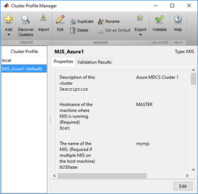

# Create MATLAB Distributed Computing Server clusters on Azure VMs
Use Azure virtual machines to create one or more MATLAB Distributed Computing Server clusters to run your compute-intensive parallel MATLAB workloads. Install your MATLAB Distributed Computing Server software on a VM to use as a base image and use an Azure quickstart template or Azure PowerShell script (available on [GitHub](https://github.com/Azure/azure-quickstart-templates/tree/master/matlab-cluster)) to deploy and manage the cluster. After deployment, connect to the cluster to run your workloads.

## About MATLAB and MATLAB Distributed Computing Server
The [MATLAB](http://www.mathworks.com/products/matlab/) platform is optimized for solving engineering and scientific problems. MATLAB users with large-scale simulations and data processing tasks can use MathWorks parallel computing products to speed up their compute-intensive workloads by taking advantage of compute clusters and grid services. [Parallel Computing Toolbox](http://www.mathworks.com/products/parallel-computing/) lets MATLAB users parallelize applications and take advantage of multi-core processors, GPUs, and compute clusters. [MATLAB Distributed Computing Server](http://www.mathworks.com/products/distriben/) enables MATLAB users to utilize many computers in a compute cluster.

By using Azure virtual machines, you can create MATLAB Distributed Computing Server clusters that have all the same mechanisms available to submit parallel work as on-premises clusters, such as interactive jobs, batch jobs, independent tasks, and communicating tasks. Using Azure in conjunction with the MATLAB platform has many benefits compared to provisioning and using traditional on-premises hardware: a range of virtual machine sizes, creation of clusters on-demand so you pay only for the compute resources you use, and the ability to test models at scale.  

## Prerequisites
* **Client computer** - You'll need a Windows-based client computer to communicate with Azure and the MATLAB Distributed Computing Server cluster after deployment.
* **Azure PowerShell** - See [How to install and configure Azure PowerShell](https://docs.microsoft.com/powershell/azure/overview) to install it on your client computer.
* **Azure subscription** - If you don't have a subscription, you can create a [trial account](https://www.azure.cn/pricing/1rmb-trial/) in just a couple of minutes. For larger clusters, consider a pay-as-you-go subscription or other purchase options.
* **Cores quota** - You might need to increase the core quota to deploy a large cluster or more than one MATLAB Distributed Computing Server cluster. To increase a quota, [open an online customer support request](https://azure.microsoft.com/blog/2014/06/04/azure-limits-quotas-increase-requests/) at no charge.
* **MATLAB, Parallel Computing Toolbox, and MATLAB Distributed Computing Server licenses** - The scripts assume that the [MathWorks Hosted License Manager](http://www.mathworks.com/products/parallel-computing/mathworks-hosted-license-manager/) is used for all licenses.  
* **MATLAB Distributed Computing Server software** - Will be installed on a VM that will be used as the base VM image for the cluster VMs.

## High level steps
To use Azure virtual machines for your MATLAB Distributed Computing Server clusters, the following high-level steps are required. Detailed instructions are in the documentation accompanying the quickstart template and scripts on [GitHub](https://github.com/Azure/azure-quickstart-templates/tree/master/matlab-cluster).

1. **Create a base VM image**  

   * Download and install MATLAB Distributed Computing Server software onto this VM.

     > [!NOTE]
     > This process can take a couple of hours, but you only have to do it once for each version of MATLAB you use.   
     >
     >
2. **Create one or more clusters**  

   * Use the supplied PowerShell script or use the quickstart template to create a cluster from the base VM image.   
   * Manage the clusters using the supplied PowerShell script which allows you to list, pause, resume, and delete clusters.

## Cluster configurations
Currently, the cluster creation script and template enable you to create a single MATLAB Distributed Computing Server topology. If you want, create one or more additional clusters, with each cluster having a different number of worker VMs, using different VM sizes, and so on.

### MATLAB client and cluster in Azure
The MATLAB client node, MATLAB Job Scheduler node, and MATLAB Distributed Computing Server "worker" nodes are all configured as Azure VMs in a virtual network, as shown in the following figure.

* To use the cluster, connect by Remote Desktop to the client node. The client node runs the MATLAB client.
* The client node has a file share that can be accessed by all workers.
* MathWorks Hosted License Manager is used for the license checks for all MATLAB software.
* By default, one MATLAB Distributed Computing Server worker per core is created on the worker VMs, but you can specify any number.

## Use an Azure-based Cluster
As with other types of MATLAB Distributed Computing Server clusters, you need to use the Cluster Profile Manager in the MATLAB client (on the client VM) to create a MATLAB Job Scheduler cluster profile.

## Next steps
* For detailed instructions to deploy and manage MATLAB Distributed Computing Server clusters in Azure, see the [GitHub](https://github.com/Azure/azure-quickstart-templates/tree/master/matlab-cluster) repository containing the templates and scripts.
* Go to the [MathWorks site](http://www.mathworks.com/) for detailed documentation for MATLAB and MATLAB Distributed Computing Server.
