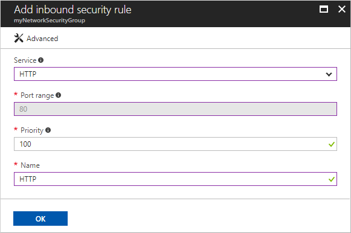
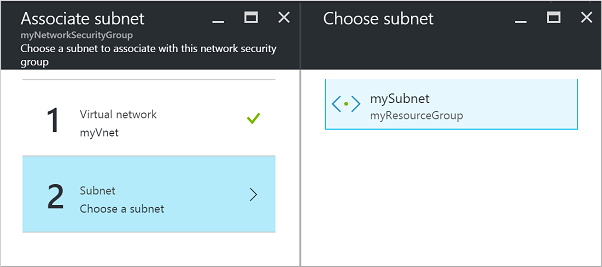

# How to open ports to a virtual machine with the Azure portal preview
[!INCLUDE [virtual-machines-common-nsg-quickstart](../../../includes/virtual-machines-common-nsg-quickstart.md)]

## Quick commands
You can also [perform these steps using Azure PowerShell](nsg-quickstart-powershell.md).

First, create your Network Security Group. Select a resource group in the portal, click **Add**, then search for and select 'Network security group':

Enter a name for your Network Security Group, select or create a resource group, and select a location. Click **Create** when finished:

Select your new Network Security Group. Select 'Inbound security rules', then click the **Add** button to create a rule:

Provide a name for your new rule. Port 80 is already entered by default. This blade is where you would change the source, protocol, and destination when adding additional rules to your Network Security Group. Click **OK** to create the rule:

Your final step is to associate your Network Security Group with a subnet or a specific network interface. Let's associate the Network Security Group with a subnet. Select 'Subnets', then click **Associate**:

Select your virtual network, and then select the appropriate subnet:

You have now created a Network Security Group, created an inbound rule that allows traffic on port 80, and associated it with a subnet. Any VMs you connect to that subnet are reachable on port 80.

## More information on Network Security Groups
The quick commands here allow you to get up and running with traffic flowing to your VM. Network Security Groups provide many great features and granularity for controlling access to your resources. You can read more about [creating a Network Security Group and ACL rules here](../../virtual-network/virtual-networks-create-nsg-arm-ps.md).

You can define Network Security Groups and ACL rules as part of Azure Resource Manager templates. Read more about [creating Network Security Groups with templates](../../virtual-network/virtual-networks-create-nsg-arm-template.md).

If you need to use port-forwarding to map a unique external port to an internal port on your VM, use a load balancer and Network Address Translation (NAT) rules. For example, you may want to expose TCP port 8080 externally and have traffic directed to TCP port 80 on a VM. You can learn about [creating an Internet-facing load balancer](../../load-balancer/load-balancer-get-started-internet-arm-ps.md).

## Next steps
In this example, you created a simple rule to allow HTTP traffic. You can find information on creating more detailed environments in the following articles:

* [Azure Resource Manager overview](../../azure-resource-manager/resource-group-overview.md)
* [What is a Network Security Group (NSG)?](../../virtual-network/virtual-networks-nsg.md)
* [Azure Resource Manager Overview for Load Balancers](../../load-balancer/load-balancer-arm.md)
