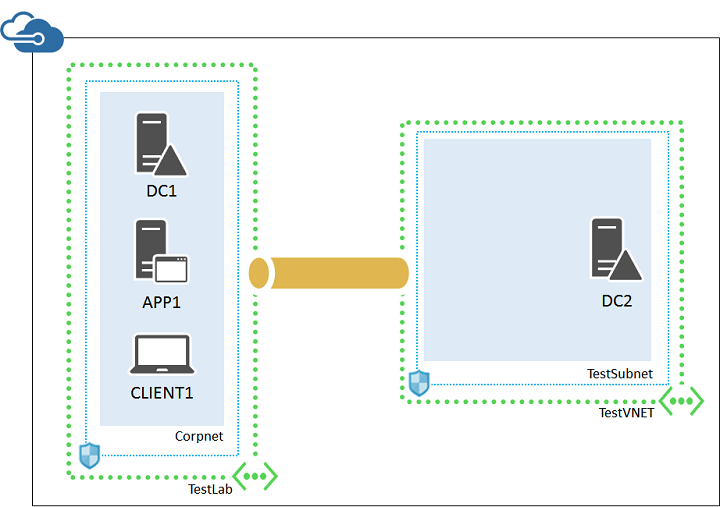
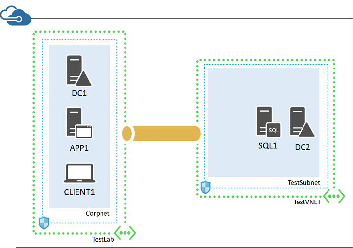

# Set up a web-based LOB application in a hybrid cloud for testing
This topic steps you through creating a simulated hybrid cloud environment for testing a web-based line of business (LOB) application hosted in Azure. Here is the resulting configuration.

This configuration consists of:

* A simulated on-premises network hosted in Azure (the TestLab VNet).
* A cross-premises virtual network hosted in Azure (TestVNET).
* A VNet-to-VNet VPN connection.
* A web-based LOB server, SQL server, and secondary domain controller in the TestVNET virtual network.

This configuration provides a basis and common starting point from which you can:

* Develop and test LOB applications hosted on Internet Information Services (IIS) with a SQL Server 2014 database backend in Azure.
* Perform testing of this simulated hybrid cloud-based IT workload.

There are three major phases to setting up this hybrid cloud test environment:

1. Set up the simulated hybrid cloud environment.
2. Configure the SQL server computer (SQL1).
3. Configure the LOB server (LOB1).

For an example of a production LOB application hosted in Azure, see the **Line of business applications** architecture blueprint at [Microsoft Software Architecture Diagrams and Blueprints](http://msdn.microsoft.com/dn630664).

## Phase 1: Set up the simulated hybrid cloud environment
Create the [simulated hybrid cloud test environment](ps-hybrid-cloud-test-env-sim.md?toc=%2fvirtual-machines%2fwindows%2ftoc.json). Because this test environment does not require the presence of the APP1 server on the Corpnet subnet, you can shut it down for now.

This is your current configuration.

## Phase 2: Configure the SQL server computer (SQL1)
From the Azure portal preview, start the DC2 computer if needed.

Next, create a virtual machine for SQL1 with these commands at an Azure PowerShell command prompt on your local computer. Prior to running these commands, fill in the variable values and remove the < and > characters.

    $rgName="<your resource group name>"
    $locName="<the Azure location of your resource group>"
    $saName="<your storage account name>"

    $vnet=Get-AzureRMVirtualNetwork -Name "TestVNET" -ResourceGroupName $rgName
    $subnet=Get-AzureRmVirtualNetworkSubnetConfig -VirtualNetwork $vnet -Name "TestSubnet"
    $pip=New-AzureRMPublicIpAddress -Name SQL1-NIC -ResourceGroupName $rgName -Location $locName -AllocationMethod Dynamic
    $nic=New-AzureRMNetworkInterface -Name SQL1-NIC -ResourceGroupName $rgName -Location $locName -Subnet $subnet -PublicIpAddress $pip
    $vm=New-AzureRMVMConfig -VMName SQL1 -VMSize Standard_A4
    $storageAcc=Get-AzureRMStorageAccount -ResourceGroupName $rgName -Name $saName
    $vhdURI=$storageAcc.PrimaryEndpoints.Blob.ToString() + "vhds/SQL1-SQLDataDisk.vhd"
    Add-AzureRMVMDataDisk -VM $vm -Name "Data" -DiskSizeInGB 100 -VhdUri $vhdURI  -CreateOption empty

    $cred=Get-Credential -Message "Type the name and password of the local administrator account for the SQL Server computer." 
    $vm=Set-AzureRMVMOperatingSystem -VM $vm -Windows -ComputerName SQL1 -Credential $cred -ProvisionVMAgent -EnableAutoUpdate
    $vm=Set-AzureRMVMSourceImage -VM $vm -PublisherName MicrosoftSQLServer -Offer SQL2014-WS2012R2 -Skus Standard -Version "latest"
    $vm=Add-AzureRMVMNetworkInterface -VM $vm -Id $nic.Id
    $storageAcc=Get-AzureRMStorageAccount -ResourceGroupName $rgName -Name $saName
    $osDiskUri=$storageAcc.PrimaryEndpoints.Blob.ToString() + "vhds/SQL1-OSDisk.vhd"
    $vm=Set-AzureRMVMOSDisk -VM $vm -Name "OSDisk" -VhdUri $osDiskUri -CreateOption fromImage
    New-AzureRMVM -ResourceGroupName $rgName -Location $locName -VM $vm

Use the Azure portal preview to connect to SQL1 using the local administrator account of SQL1.

Next, configure Windows Firewall rules to allow basic connectivity testing and SQL Server traffic. From an administrator-level Windows PowerShell command prompt on SQL1, run these commands.

    New-NetFirewallRule -DisplayName "SQL Server" -Direction Inbound -Protocol TCP -LocalPort 1433,1434,5022 -Action allow 
    Set-NetFirewallRule -DisplayName "File and Printer Sharing (Echo Request - ICMPv4-In)" -enabled True
    ping dc2.corp.contoso.com

The ping command should result in four successful replies from IP address 192.168.0.4.

Next, add the extra data disk on SQL1 as a new volume with the drive letter F:.

1. In the left pane of Server Manager, click **File and Storage Services**, and then click **Disks**.
2. In the contents pane, in the **Disks** group, click **disk 2** (with the **Partition** set to **Unknown**).
3. Click **Tasks**, and then click **New Volume**.
4. On the Before you begin page of the New Volume Wizard, click **Next**.
5. On the Select the server and disk page, click **Disk 2**, and then click **Next**. When prompted, click **OK**.
6. On the Specify the size of the volume page, click **Next**.
7. On the Assign to a drive letter or folder page, click **Next**.
8. On the Select file system settings page, click **Next**.
9. On the Confirm selections page, click **Create**.
10. When complete, click **Close**.

Run these commands at the Windows PowerShell command prompt on SQL1:

    md f:\Data
    md f:\Log
    md f:\Backup

Next, join SQL1 to the CORP Windows Server Active Directory domain with these commands at the Windows PowerShell prompt on SQL1.

    Add-Computer -DomainName corp.contoso.com
    Restart-Computer

Use the CORP\User1 account when prompted to supply domain account credentials for the **Add-Computer** command.

After restarting, use the Azure portal preview to connect to SQL1 *with the local administrator account of SQL1*.

Next, configure SQL Server 2014 to use the F: drive for new databases and for user account permissions.

1. From the Start screen, type **SQL Server Management**, and then click **SQL Server 2014 Management Studio**.
2. In **Connect to Server**, click **Connect**.
3. In the Object Explorer tree pane, right-click **SQL1**, and then click **Properties**.
4. In the **Server Properties** window, click **Database Settings**.
5. Locate the **Database default locations** and set these values: 
    * For **Data**, type the path **f:\Data**.
    * For **Log**, type the path **f:\Log**.
    * For **Backup**, type the path **f:\Backup**.
    * Note: Only new databases use these locations.
6. Click the **OK** to close the window.
7. In the **Object Explorer** tree pane, open **Security**.
8. Right-click **Logins** and then click **New Login**.
9. In **Login name**, type **CORP\User1**.
10. On the **Server Roles** page, click **sysadmin**, and then click **OK**.
11. Close Microsoft SQL Server Management Studio.

This is your current configuration.

## Phase 3: Configure the LOB server (LOB1)
First, create a virtual machine for LOB1 with these commands at the Azure PowerShell command prompt on your local computer.

    $rgName="<your resource group name>"
    $locName="<your Azure location, such as China North>"
    $saName="<your storage account name>"

    $vnet=Get-AzureRMVirtualNetwork -Name "TestVNET" -ResourceGroupName $rgName
    $subnet=Get-AzureRmVirtualNetworkSubnetConfig -VirtualNetwork $vnet -Name "TestSubnet"
    $pip=New-AzureRMPublicIpAddress -Name LOB1-NIC -ResourceGroupName $rgName -Location $locName -AllocationMethod Dynamic
    $nic=New-AzureRMNetworkInterface -Name LOB1-NIC -ResourceGroupName $rgName -Location $locName -Subnet $subnet -PublicIpAddress $pip
    $vm=New-AzureRMVMConfig -VMName LOB1 -VMSize Standard_A2
    $storageAcc=Get-AzureRMStorageAccount -ResourceGroupName $rgName -Name $saName
    $cred=Get-Credential -Message "Type the name and password of the local administrator account for LOB1."
    $vm=Set-AzureRMVMOperatingSystem -VM $vm -Windows -ComputerName LOB1 -Credential $cred -ProvisionVMAgent -EnableAutoUpdate
    $vm=Set-AzureRMVMSourceImage -VM $vm -PublisherName MicrosoftWindowsServer -Offer WindowsServer -Skus 2012-R2-Datacenter -Version "latest"
    $vm=Add-AzureRMVMNetworkInterface -VM $vm -Id $nic.Id
    $osDiskUri=$storageAcc.PrimaryEndpoints.Blob.ToString() + "vhds/LOB1-TestLab-OSDisk.vhd"
    $vm=Set-AzureRMVMOSDisk -VM $vm -Name LOB1-TestVNET-OSDisk -VhdUri $osDiskUri -CreateOption fromImage
    New-AzureRMVM -ResourceGroupName $rgName -Location $locName -VM $vm

Next, use the Azure portal preview to connect to LOB1 with the credentials of the local administrator account of LOB1.

Next, configure a Windows Firewall rule to allow traffic for basic connectivity testing. From an administrator-level Windows PowerShell command prompt on LOB1, run these commands.

    Set-NetFirewallRule -DisplayName "File and Printer Sharing (Echo Request - ICMPv4-In)" -enabled True
    ping dc2.corp.contoso.com

The ping command should result in four successful replies from IP address 192.168.0.4.

Next, join LOB1 to the CORP Active Directory domain with these commands at the Windows PowerShell prompt.

    Add-Computer -DomainName corp.contoso.com
    Restart-Computer

Use the CORP\User1 account when prompted to supply domain account credentials for the **Add-Computer** command.

After restarting, use the Azure portal preview to connect to LOB1 with the CORP\User1 account and password.

Next, configure LOB1 for IIS and test access from CLIENT1.

1. From Server Manager, click **Add roles and features**.
2. On the **Before you begin** page, click **Next**.
3. On the **Select installation type** page, click **Next**.
4. On the **Select destination server** page, click **Next**.
5. On the **Server roles** page, click **Web Server (IIS)** in the list of **Roles**.
6. When prompted, click **Add Features**, and then click **Next**.
7. On the **Select features** page, click **Next**.
8. On the **Web Server (IIS)** page, click **Next**.
9. On the **Select role services** page, select or clear the check boxes for the services you need for testing your LOB application, and then click **Next**.
10. On the **Confirm installation selections** page, click **Install**.
11. Wait until the installation of components has completed and then click **Close**.
12. From the Azure portal preview, connect to the CLIENT1 computer with the CORP\User1 account credentials, and then start Internet Explorer.
13. In the Address bar, type **http://lob1/** and then press ENTER. You should see the default IIS 8 web page.

This is your current configuration.

This environment is now ready for you to deploy your web-based application on LOB1 and test functionality from CLIENT1 on the Corpnet subnet.

## Next step
* Add a new virtual machine using the [Azure portal preview](../virtual-machines-windows-hero-tutorial.md?toc=%2fvirtual-machines%2fwindows%2ftoc.json).
