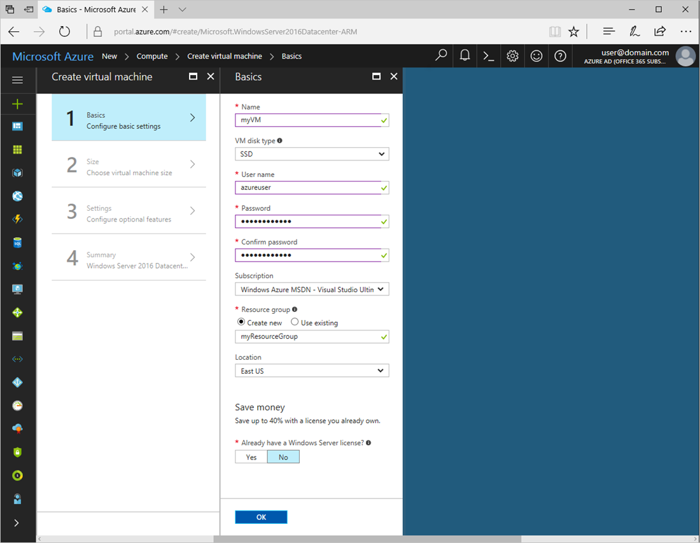
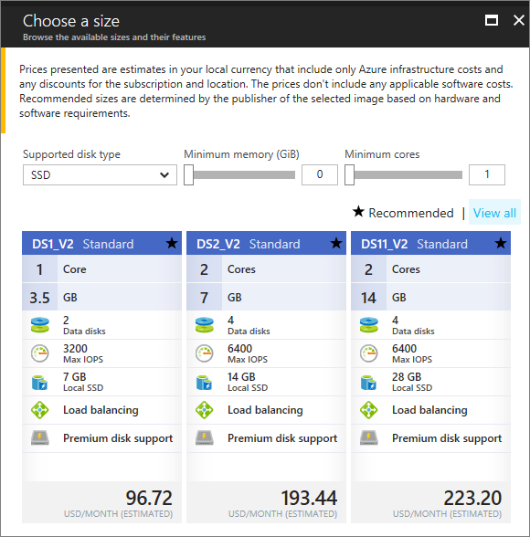

# Create a Windows virtual machine with the Azure portal

Azure virtual machines can be created through the Azure portal. This method provides a browser-based user interface for creating and configuring virtual machines and all related resources. This Quickstart steps through creating a virtual machine and installing a webserver on the VM.

If you don't have an Azure subscription, create a [trial account](https://www.azure.cn/pricing/1rmb-trial/?WT.mc_id=A261C142F) before you begin.

## Log in to Azure

Log in to the Azure portal at http://portal.azure.cn.

## Create virtual machine

1. Click the **New** button found on the upper left-hand corner of the Azure portal.

2. Select **Compute**, and then select **Windows Server 2016 Datacenter**. 

3. Enter the virtual machine information. The user name and password entered here is used to log in to the virtual machine. When complete, click **OK**.

      

4. Select a size for the VM. To see more sizes, select **View all** or change the **Supported disk type** filter. 

      

5. Under **Settings**, keep the defaults and click **OK**. 

6. On the summary page, click **Ok** to start the virtual machine deployment.

7. The VM will be pinned to the Azure portal dashboard. Once the deployment has completed, the VM summary automatically opens.

## Connect to virtual machine

Create a remote desktop connection to the virtual machine.

1. Click the **Connect** button on the virtual machine properties. A Remote Desktop Protocol file (.rdp file) is created and downloaded.

     

2. To connect to your VM, open the downloaded RDP file. If prompted, click **Connect**. On a Mac, you need an RDP client such as this [Remote Desktop Client](https://itunes.apple.com/us/app/microsoft-remote-desktop/id715768417?mt=12) from the Mac App Store.

3. Enter the user name and password you specified when creating the virtual machine, then click **Ok**.

4. You may receive a certificate warning during the sign-in process. Click **Yes** or **Continue** to proceed with the connection.

## Install IIS using PowerShell

On the virtual machine, start a PowerShell session and run the following command to install IIS.

```powershell
Install-WindowsFeature -name Web-Server -IncludeManagementTools
```

When done, exit the RDP session and return the VM properties in the Azure portal.

## Open port 80 for web traffic 

A Network security group (NSG) secures inbound and outbound traffic. When a VM is created from the Azure portal, an inbound rule is created on port 3389 for RDP connections. Because this VM hosts a webserver, an NSG rule needs to be created for port 80.

1. On the virtual machine, click the name of the **Resource group**.
2. Select the **network security group**. The NSG can be identified using the **Type** column. 
3. On the left-hand menu, under settings, click **Inbound security rules**.
4. Click on **Add**.
5. In **Name**, type **http**. Make sure **Port range** is set to 80 and **Action** is set to **Allow**. 
6. Click **OK**.

## View the IIS welcome page

With IIS installed, and port 80 open to your VM, the webserver can now be accessed from the internet. Open a web browser, and enter the public IP address of the VM. The public IP address can be found under *Virtual Machines* in the Azure portal.

 

## Clean up resources

When no longer needed, delete the resource group, virtual machine, and all related resources. To do so, select the resource group for the VM and click **Delete**.

## Next steps

In this quick start, you've deployed a simple virtual machine, a network security group rule, and installed a web server. To learn more about Azure virtual machines, continue to the tutorial for Windows VMs.

> [!div class="nextstepaction"]
> [Azure Windows virtual machine tutorials](./tutorial-manage-vm.md)

<!--Update_Description: wording update-->