# How to reset local Windows password for Azure VM
You can reset the local Windows password of a VM in Azure using the [Azure portal or Azure PowerShell](reset-rdp.md?toc=%2fvirtual-machines%2fwindows%2ftoc.json) provided the Azure guest agent is installed. This method is the primary way to reset a password for an Azure VM. If you encounter issues with the Azure guest agent not responding, or failing to install after uploading a custom image, you can manually reset a Windows password. This article details how to reset a local account password by attaching the source OS virtual disk to another VM. 

> [!WARNING]
> Only use this process as a last resort. Always try to reset a password using the [Azure portal or Azure PowerShell](reset-rdp.md?toc=%2fvirtual-machines%2fwindows%2ftoc.json) first.
> 
> 

## Overview of the process
The core steps for performing a local password reset for a Windows VM in Azure when there is no access to the Azure guest agent is as follows:

* Delete the source VM. The virtual disks are retained.
* Attach the source VM's OS disk to another VM on the same location within your Azure subscription. This VM is referred to as the troubleshooting VM.
* Using the troubleshooting VM, create some config files on the source VM's OS disk.
* Detach the VM's OS disk from the troubleshooting VM.
* Use a Resource Manager template to create a VM, using the original virtual disk.
* When the new VM boots, the config files you create update the password of the required user.

## Detailed steps
Always try to reset a password using the [Azure portal or Azure PowerShell](reset-rdp.md?toc=%2fvirtual-machines%2fwindows%2ftoc.json) before trying the following steps. Make sure you have a backup of your VM before you start. 

1. Delete the affected VM in Azure portal. Deleting the VM only deletes the metadata, the reference of the VM within Azure. The virtual disks are retained when the VM is deleted:

   * Select the VM in the Azure portal, click *Delete*:

     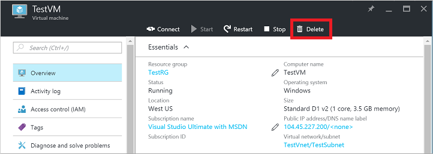
2. Attach the source VM's OS disk to the troubleshooting VM. The troubleshooting VM must be in the same region as the source VM's OS disk (such as `China North`):

   * Select the troubleshooting VM in the Azure portal. Click *Disks* | *Attach existing*:

     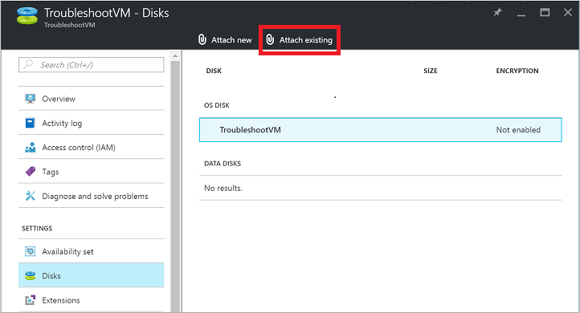

     Select *VHD File* and then select the storage account that contains your source VM:

     

     Select the source container. The source container is typically *vhds*:

     

     Select the OS vhd to attach. Click *Select* to complete the process:

     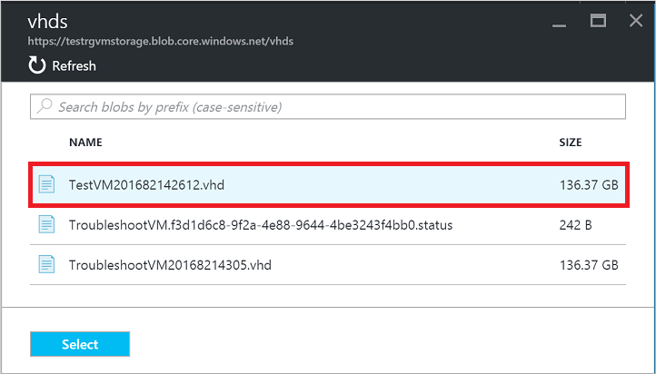
3. Connect to the troubleshooting VM using Remote Desktop and ensure the source VM's OS disk is visible:

   * Select the troubleshooting VM in the Azure portal and click *Connect*.
   * Open the RDP file that downloads. Enter the username and password of the troubleshooting VM.
   * In File Explorer, look for the data disk you attached. If the source VM's VHD is the only data disk attached to the troubleshooting VM, it should be the F: drive:

     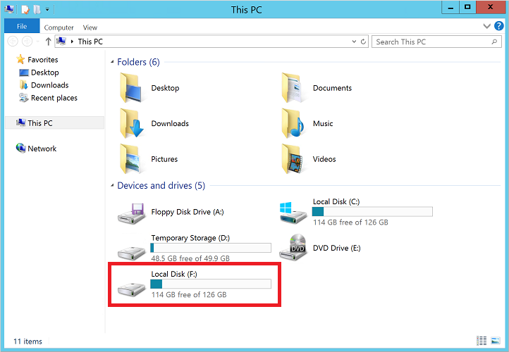
4. Create `gpt.ini` in `\Windows\System32\GroupPolicy` on the source VM's drive (if gpt.ini exists, rename to gpt.ini.bak):

   > [!WARNING]
   > Make sure that you do not accidentally create the following files in C:\Windows, the OS drive for the troubleshooting VM. Create the following files in the OS drive for your source VM that is attached as a data disk.
   > 
   > 

   * Add the following lines into the `gpt.ini` file you created:

     ```
     [General]
     gPCFunctionalityVersion=2
     gPCMachineExtensionNames=[{42B5FAAE-6536-11D2-AE5A-0000F87571E3}{40B6664F-4972-11D1-A7CA-0000F87571E3}]
     Version=1
     ```

     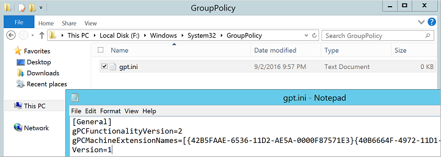
5. Create `scripts.ini` in `\Windows\System32\GroupPolicy\Machine\Scripts`. Make sure hidden folders are shown. If needed, create the `Machine` or `Scripts` folders.

   * Add the following lines the `scripts.ini` file you created:

     ```
     [Startup]
     0CmdLine=C:\Windows\System32\FixAzureVM.cmd
     0Parameters=
     ```

     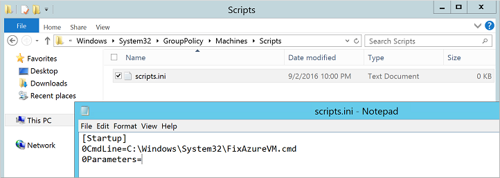
6. Create `FixAzureVM.cmd` in `\Windows\System32` with the following contents, replacing `<username>` and `<newpassword>` with your own values:

    ```
    net user <username> <newpassword> /add
    net localgroup administrators <username> /add
    net localgroup "remote desktop users" <username> /add

    ```

    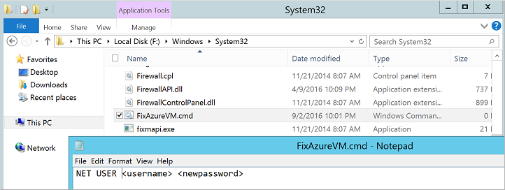

    You must meet the configured password complexity requirements for your VM when defining the new password.
7. In Azure portal, detach the disk from the troubleshooting VM:

   * Select the troubleshooting VM in the Azure portal, click *Disks*.
   * Select the data disk attached in step 2, click *Detach*:

     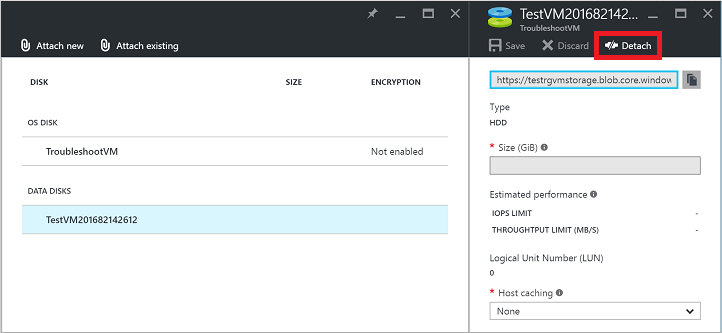
8. Before you create a VM, obtain the URI to your source OS disk:

   * Select the storage account in the Azure portal, click *Blobs*.
   * Select the container. The source container is typically *vhds*:

     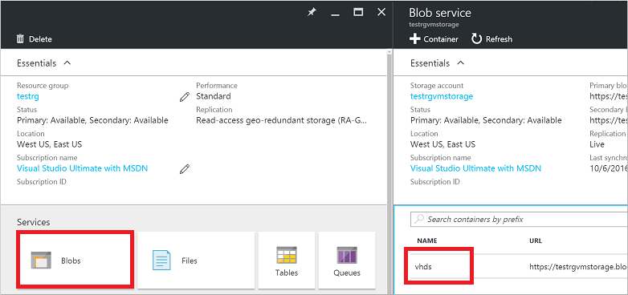

     Select your source VM OS VHD and click the *Copy* button next to the *URL* name:

     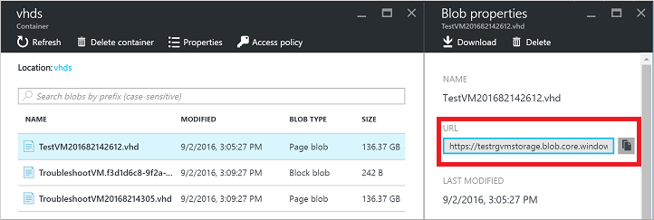
9. Create a VM from the source VM's OS disk:

   * Use [this Azure Resource Manager template](https://github.com/Azure/azure-quickstart-templates/tree/master/201-vm-specialized-vhd) to create a VM from a specialized VHD. Click the `Deploy to Azure` button to open the Azure portal with the templated details populated for you.
   * If you want to retain all the previous settings for the VM, select *Edit template* to provide your existing VNet, subnet, network adapter, or public IP.
   * In the `OSDISKVHDURI` parameter text box, paste the URI of your source VHD obtain in the preceding step:

     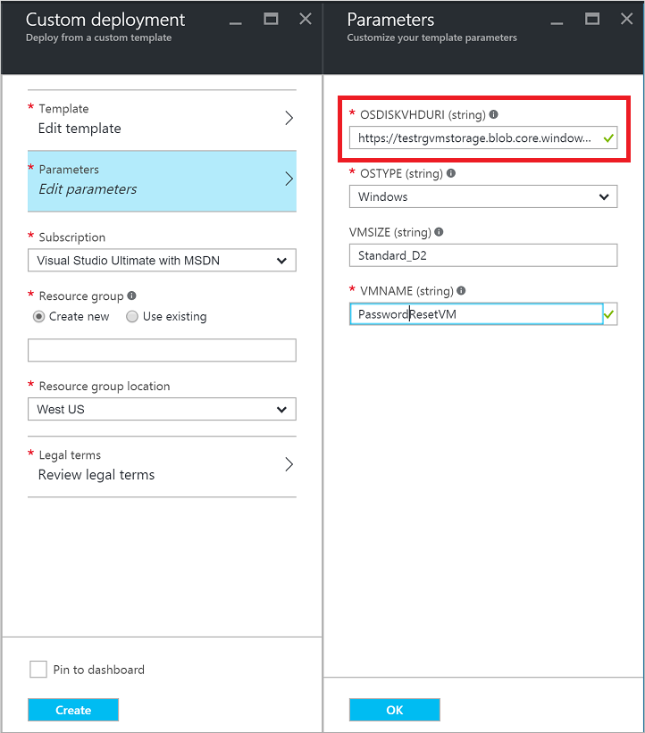
10. After the new VM is running, connect to the VM using Remote Desktop with the new password you specified in the `FixAzureVM.cmd` script.
11. From your remote session to the new VM, remove the following files to clean up the environment:

    * From %windir%\System32
      * remove FixAzureVM.cmd
    * From %windir%\System32\GroupPolicy\Machine\
      * remove scripts.ini
    * From %windir%\System32\GroupPolicy
      * remove gpt.ini (if gpt.ini existed before, and you renamed it to gpt.ini.bak, rename the .bak file back to gpt.ini)

## Next steps
If you still cannot connect using Remote Desktop, see the [RDP troubleshooting guide](troubleshoot-rdp-connection.md?toc=%2fvirtual-machines%2fwindows%2ftoc.json). The [detailed RDP troubleshooting guide](detailed-troubleshoot-rdp.md?toc=%2fvirtual-machines%2fwindows%2ftoc.json) looks at troubleshooting methods rather than specific steps. You can also [open an Azure support request](https://www.azure.cn/support/contact/) for hands-on assistance.
