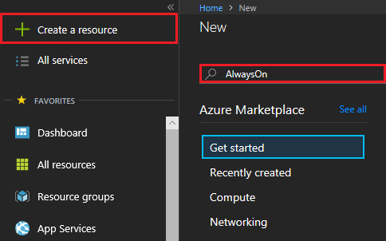
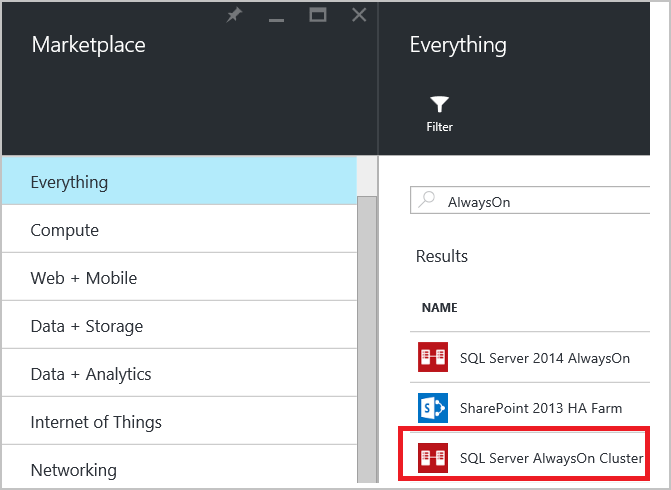
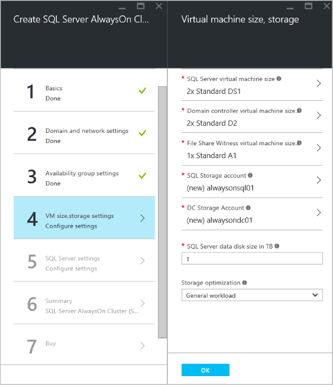

<!-- not suitable for Mooncake -->

---
title: Set up high availability for Azure Resource Manager VMs | Azure
description: This tutorial shows you how to create an Always On availability group with Azure virtual machines in Azure Resource Manager mode.
services: virtual-machines-windows
documentationcenter: na
author: MikeRayMSFT
manager: jhubbard
editor: ''
tags: azure-resource-manager

ms.assetid: 64e85527-d5c8-40d9-bbe2-13045d25fc68
ms.service: virtual-machines-sql
ms.devlang: na
ms.topic: article
ms.tgt_pltfrm: vm-windows-sql-server
ms.workload: iaas-sql-server
ms.date: 03/17/2017
wacn.date: ''
ms.author: mikeray
---

# Configure Always On availability group in Azure VM automatically - Resource Manager
> [!div class="op_single_selector"]
>- [Resource Manager: Template](./virtual-machines-windows-portal-sql-alwayson-availability-groups.md)
>- [Resource Manager: Manual](/documentation/articles/virtual-machines-windows-portal-sql-alwayson-availability-groups-manual/)
>- [Classic: UI](../sqlclassic/virtual-machines-windows-classic-portal-sql-alwayson-availability-groups.md)
>- [Classic: PowerShell](../sqlclassic/virtual-machines-windows-classic-ps-sql-alwayson-availability-groups.md)

 

This tutorial shows you how to create a SQL Server availability group with Azure Resource Manager virtual machines. The tutorial uses Azure blades to configure a template. You can review the default settings, type required settings, and update the blades in the portal as you walk through this tutorial.

The complete tutorial creates a SQL Server availability group on Azure VMs - including the following elements:

* A virtual network containing multiple subnets, including a front-end and a back-end subnet
* Two domain controller with an Active Directory (AD) domain
* Two SQL Server VMs deployed to the back-end subnet and joined to the AD domain
* A 3-node failover cluster with the Node Majority quorum model
* An availability group with two synchronous-commit replicas of an availability database

The following picture represents the complete solution.

All the resources in this solution belong to a single resource group.

Before you start this tutorial, make sure:

* You already have an Azure account. If you don't have one, [sign up for a trial account](https://www.azure.cn/pricing/1rmb-trial/).
* You already know how to provision a SQL Server VM from the virtual machine gallery using the GUI. For more information, see [Provisioning a SQL Server virtual machine on Azure](./virtual-machines-windows-portal-sql-server-provision.md)
* You already have a solid understanding of availability groups. For more information, see [Always On availability groups (SQL Server)](http://msdn.microsoft.com/zh-cn/library/hh510230.aspx).

> [!NOTE]
> If you are interested in using availability groups with SharePoint, also see [Configure SQL Server 2012 Always On availability groups for SharePoint 2013](http://technet.microsoft.com/zh-cn/library/jj715261.aspx).
> 
> 

In this tutorial, use the Azure portal preview to:

* Select the Always On template from the portal
* Review the template settings and update a few configuration settings for your environment
* Monitor Azure as it creates the entire environment
* Connect to one of the domain controllers and then to one of the SQL Servers

[!INCLUDE [availability-group-template](../../includes/virtual-machines-windows-portal-sql-alwayson-ag-template.md)]

## Provision the cluster from the gallery
Azure provides a gallery image for the entire solution. In order to locate the template:

1. Log in to the Azure portal preview using your account.
2. On the Azure portal preview click **+New.** The portal opens the New blade.
3. On the New blade search for **AlwaysOn**.
   
4. In the search results, locate **SQL Server AlwaysOn Cluster**.
   
5. On **Select a deployment model**, choose **Resource Manager**.

### Basics
Click **Basics** and configure the following settings:

* **Administrator user name** is a user account with domain administrator permissions and a member of the SQL Server sysadmin fixed server role on both instances of SQL Server. For this tutorial use **DomainAdmin**.
* **Password** is the password for the domain administrator account. Use a complex password. Confirm the password.
* **Subscription** is the subscription that Azure bills to run all resources deployed for the availability group. If your account has multiple subscriptions, you can specify a different subscription.
* **Resource group** is the name for the group that all the Azure resources created by this template belong to. For this tutorial use **SQL-HA-RG**. For more information, see (Azure Resource Manager overview)[resource-group-overview.md/#resource-groups].
* **Location** is the Azure region where the tutorial creates the resources. Select an Azure region.

The following picture is a completed **Basics** blade:

* Click **OK**.

### Domain and network settings
This Azure gallery template creates a domain and domain controllers. It also creates a network and two subnets. The template does not enable creating the servers in an existing domain or virtual network. The next step is to configure the domain and network settings.

On **Domain and network settings** blade, review the preset values for the domain and network settings:

* **Forest root domain name** is the domain name that for the AD domain that hosts the cluster. For the tutorial use **contoso.com**.
* **Virtual Network name** is the network name for the Azure virtual network. FUse **autohaVNET**.
* **Domain Controller subnet name** is the name of a portion of the virtual network that hosts the domain controller. Use **subnet-1**. This subnet uses address prefix **10.0.0.0/24**.
* **SQL Server subnet name** is the name of a portion of the virtual network that hosts the SQL Servers and the file share witness. Use **subnet-2**. This subnet uses address prefix **10.0.1.0/26**.

Learn more about virtual networks in [Azure see Virtual Network Overview](../../../virtual-network/virtual-networks-overview.md).  

The **Domain and network settings** should look like the following image:

If necessary, you may change these values. For this tutorial, use the preset values.

* Review the settings and click **OK**.

### Availability group settings
On **Availability group settings**, review the preset values for the availability group and the listener.

* **Availability group name** is the clustered resource name for the availability group. For this tutorial use **Contoso-ag**.
* **availability group listener name** is used by the cluster and the internal load balancer. Clients connecting to SQL Server can use this name to connect to the appropriate replica of the database. For this tutorial use **Contoso-listener**.
* **availability group listener port** specifies the TCP port the SQL Server listener. For this tutorial use the default port, **1433**.

If necessary, you may change these values. For this tutorial use the preset values.  

* Click **OK**.

### VM size, storage settings
On **VM size, storage settings** choose a SQL Server virtual machine size and review the other settings.

* **SQL Server virtual machine size** is the Azure virtual machine size for both SQL Servers. Choose a virtual machine size appropriate for your workload. If you are building this environment for the tutorial use **DS2**. For production workloads, choose a virtual machine size that can support the workload. Many production workloads require **DS4** or larger. The template builds two virtual machines of this size and installs SQL Server on each one. For more information, see [Sizes for virtual machines](../../virtual-machines-windows-sizes.md).

> [!NOTE]
> Azure installs Enterprise Edition of SQL Server. The cost depends on the edition and the virtual machine size. For detailed information about current costs, see [virtual machines Pricing](https://www.azure.cn/pricing/details/virtual-machines/#Sql).
> 
> 

* **Domain controller virtual machine size** is the virtual machine size for the domain controllers. For this tutorial use **D2**.
* **File Share Witness virtual machine size** is the virtual machine size for the file share witness. For this tutorial use **A1**.
* **SQL Storage account** is the name of the storage account to hold the SQL Server data and operating system disks. For this tutorial use **alwaysonsql01**.
* **DC Storage account** is the name of the storage account for the domain controllers. For this tutorial use **alwaysondc01**.
* **SQL Server data disk size** in TB is the size of the SQL Server data disk in TB. Specify a number from 1 through 4. For this tutorial use **1**.
* **Storage optimization** sets specific storage configuration settings for the SQL Server virtual machines based on the workload type. All SQL Servers in this scenario use premium storage with Azure disk host cache set to read only. In addition, you can optimize SQL Server settings for the workload by choosing one of these three settings:

    * **General workload** sets no specific configuration settings
    * **Transactional processing** sets trace flag 1117 and 1118
    * **Data warehousing** sets trace flag 1117 and 610

For this tutorial use **General workload**.

* Review the settings and click **OK**.

#### A note about storage
Additional optimizations depend on the size of the SQL Server data disks. For each terabyte of data disk, Azure adds an additional 1 TB premium storage (SSD). When a server requires 2 TB or more, the template creates a storage pool on each SQL Server. A storage pool is a form of storage virtualization where multiple discs are configured to provide higher capacity, resiliency, and performance.  The template then creates a storage space on the storage pool and presents a single data disk to the operating system. The template designates this disk as the data disk for SQL Server. The template tunes the storage pool for SQL Server with the following settings:

* Stripe size is the interleave setting for the virtual disk. Transactional workloads use 64 KB. Data warehousing workloads use 256 KB.
* Resiliency is simple (no resiliency).

> [!NOTE]
> Azure premium storage is locally redundant and keeps three copies of the data within a single region, so additional resiliency at the storage pool is not required.
> 
> 

* Column count equals the number of disks in the storage pool.

For additional information, about storage space and storage pools see:

* [Storage Spaces Overview](http://technet.microsoft.com/zh-cn/library/hh831739.aspx).
* [Windows Server Backup and Storage Pools](http://technet.microsoft.com/zh-cn/library/dn390929.aspx)

For more information about SQL Server configuration best practices, see
[Performance best practices for SQL Server in Azure virtual machines](./virtual-machines-windows-sql-performance.md)

### SQL Server settings
On **SQL Server settings** review and modify the SQL Server VM name prefix, SQL Server version, SQL Server service account and password, and the SQL auto patching maintenance schedule.

* **SQL Server Name Prefix** is used to create a name for each SQL Server. For this tutorial use **sqlserver**. The template names the SQL Server VMs *sqlserver-0* and *sqlserver-1*.
* **SQL Server version** is the version of SQL Server. For this tutorial use **SQL Server 2014**. You can also choose **SQL Server 2012** or **SQL Server 2016**.
* **SQL Server service account user name** is the domain account name for the SQL Server service. For this tutorial use **sqlservice**.
* **Password** is the password for the SQL Server service account.  Use a complex password. Confirm the password.
* **SQL Auto Patching maintenance schedule** identifies the weekday that Azure automatically patches the SQL Servers. For this tutorial type **Sunday**.
* **SQL Auto Patching maintenance start hour** is the time of day for the Azure region when automatic patching begins.

> [!NOTE]
> The patching window for each VM is staggered by one hour. Only one virtual machine is patched at a time in order to prevent disruption of services.
> 
> 

Review the settings and click **OK**.

### Summary
On the summary page Azure validates the settings. You can also download the template. Review the summary. Click **OK**.

### Buy
This final blade contains **Terms of use**, and **privacy policy**. Review this information. When you are ready for Azure to start creating the virtual machines, and all the other required resources for the availability group, click **Create**.

The Azure portal preview creates the resource group and all the resources.

## Monitor deployment
Monitor the deployment progress from the Azure portal preview. An icon representing the deployment is automatically pinned to the Azure portal preview dashboard.

## Connect to SQL Server
The new instances of SQL Server are running on virtual machines have internet connected IP addresses. You can RDP directly to each SQL Server.

To RDP to a SQL Server, follow these steps:

1. From the Azure portal preview dashboard very that the deployment has succeeded.
2. Click **Resources**.
3. In the **Resources** blade, click **sqlserver-0** which is the computer name of the virtual machine for one of the SQL Servers.
4. On the blade for **sqlserver-0** click **Connect**. Your browser asks if you want to open or save the remote connection object. Click **Open**.
5. **Remote desktop connection** may warn you that the publisher of this remote connection can't be identified. Click **Connect**.
6. Windows security prompts you to enter your credentials to connect to the IP address of the primary domain controller. Click **Use another account**. For **User name** type **contoso\DomainAdmin**. You configured this account when you set the administrator user name in the template. Use the complex password that you chose when you configured the template.
7. **Remote desktop** may warn you that the remote computer could not be authenticated due to problems with its security certificate. It shows you the security certificate name. If you followed the tutorial the name is **sqlserver-0.contoso.com**. Click **Yes**.

You are now connected with RDP to the SQL Server. You can open SQL Server management studio, connect to the default instance of SQL Server and verify the availability group is configured.