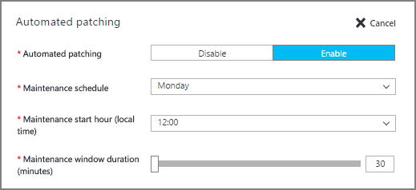

# Automated Patching for SQL Server in Azure Virtual Machines (Resource Manager)
> [!div class="op_single_selector"]
>- [Resource Manager](./virtual-machines-windows-sql-automated-patching.md)
>- [Classic](../sqlclassic/virtual-machines-windows-classic-sql-automated-patching.md)

Automated Patching establishes a maintenance window for an Azure Virtual Machine running SQL Server. Automated Updates can only be installed during this maintenance window. For SQL Server, this rescriction ensures that system updates and any associated restarts occur at the best possible time for the database. Automated Patching depends on the [SQL Server IaaS Agent Extension](./virtual-machines-windows-sql-server-agent-extension.md).

[!INCLUDE [learn-about-deployment-models](../../includes/learn-about-deployment-models-rm-include.md)]

To view the classic version of this article, see [Automated Patching for SQL Server in Azure Virtual Machines Classic](../sqlclassic/virtual-machines-windows-classic-sql-automated-patching.md).

## Prerequisites
To use Automated Patching, consider the following prerequisites:

**Operating System**:

* Windows Server 2012
* Windows Server 2012 R2

**SQL Server version**:

* SQL Server 2012
* SQL Server 2014
* SQL Server 2016

**Azure PowerShell**:

* [Install the latest Azure PowerShell commands](https://docs.microsoft.com/powershell/azureps-cmdlets-docs) if you plan to configure Automated Patching with PowerShell.

> [!NOTE]
> Automated Patching relies on the SQL Server IaaS Agent Extension. Current SQL virtual machine gallery images add this extension by default. For more information, see [SQL Server IaaS Agent Extension](./virtual-machines-windows-sql-server-agent-extension.md).
> 
> 

## Settings
The following table describes the options that can be configured for Automated Patching. The actual configuration steps vary depending on whether you use the Azure portal preview or Azure Windows PowerShell commands.

| Setting | Possible values | Description |
| --- | --- | --- |
| **Automated Patching** |Enable/Disable (Disabled) |Enables or disables Automated Patching for an Azure virtual machine. |
| **Maintenance schedule** |Everyday, Monday, Tuesday, Wednesday, Thursday, Friday, Saturday, Sunday |The schedule for downloading and installing Windows, SQL Server, and Microsoft updates for your virtual machine. |
| **Maintenance start hour** |0-24 |The local start time to update the virtual machine. |
| **Maintenance window duration** |30-180 |The number of minutes permitted to complete the download and installation of updates. |
| **Patch Category** |Important |The category of updates to download and install. |

## Configuration in the Portal
You can use the Azure portal preview to configure Automated Patching during provisioning or for existing VMs.

### New VMs
Use the Azure portal preview to configure Automated Patching when you create a new SQL Server Virtual Machine in the Resource Manager deployment model.

In the **SQL Server settings** blade, select **Automated patching**. The following Azure portal preview screenshot shows the **SQL Automated Patching** blade.


For context, see the complete topic on [provisioning a SQL Server virtual machine in Azure](./virtual-machines-windows-portal-sql-server-provision.md).

### Existing VMs
For existing SQL Server virtual machines, select your SQL Server virtual machine. Then select the **SQL Server configuration** section of the **Settings** blade.


In the **SQL Server configuration** blade, click the **Edit** button in the Automated patching section.



When finished, click the **OK** button on the bottom of the **SQL Server configuration** blade to save your changes.

If you are enabling Automated Patching for the first time, Azure configures the SQL Server IaaS Agent in the background. During this time, the Azure portal preview might not show that Automated Patching is configured. Wait several minutes for the agent to be installed, configured. After that the Azure portal preview reflects the new settings.

> [!NOTE]
> You can also configure Automated Patching using a template. For more information, see [Azure quickstart template for Automated Patching](https://github.com/Azure/azure-quickstart-templates/tree/master/101-vm-sql-existing-autopatching-update).
> 
> 

## Configuration with PowerShell
After provisioning your SQL VM, use PowerShell to configure Automated Patching.

In the following example, PowerShell is used to configure Automated Patching on an existing SQL Server VM. The **AzureRM.Compute\New-AzureVMSqlServerAutoPatchingConfig** command configures a new maintenance window for automatic updates.

```
$vmname = "vmname"
$resourcegroupname = "resourcegroupname"
$aps = AzureRM.Compute\New-AzureVMSqlServerAutoPatchingConfig -Enable -DayOfWeek "Thursday" -MaintenanceWindowStartingHour 11 -MaintenanceWindowDuration 120  -PatchCategory "Important"

Set-AzureRmVMSqlServerExtension -AutoPatchingSettings $aps -VMName $vmname -ResourceGroupName $resourcegroupname
```

Based on this example, the following table describes the practical effect on the target Azure VM:

| Parameter | Effect |
| --- | --- |
| **DayOfWeek** |Patches installed every Thursday. |
| **MaintenanceWindowStartingHour** |Begin updates at 11:00am. |
| **MaintenanceWindowsDuration** |Patches must be installed within 120 minutes. Based on the start time, they must complete by 1:00pm. |
| **PatchCategory** |The only possible setting for this parameter is **Important**. |

It could take several minutes to install and configure the SQL Server IaaS Agent.

To disable Automated Patching, run the same script without the **-Enable** parameter to the **AzureRM.Compute\New-AzureVMSqlServerAutoPatchingConfig**. The absence of the **-Enable** parameter signals the command to disable the feature.

## Next steps
For information about other available automation tasks, see [SQL Server IaaS Agent Extension](./virtual-machines-windows-sql-server-agent-extension.md).

For more information about running SQL Server on Azure VMs, see [SQL Server on Azure Virtual Machines overview](./virtual-machines-windows-sql-server-iaas-overview.md).