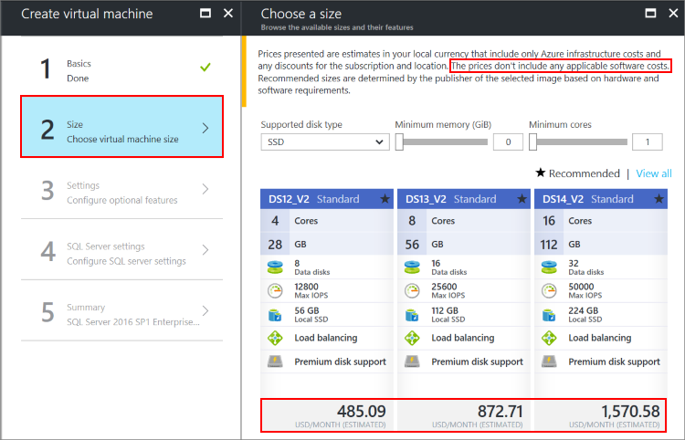
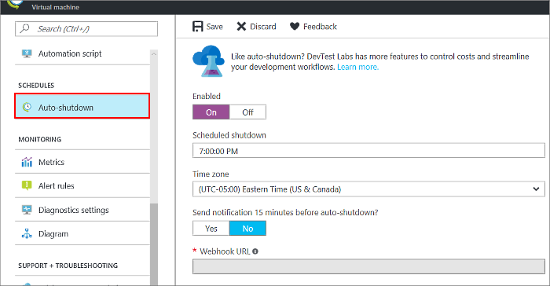

# Pricing guidance for SQL Server Azure VMs

This article provides pricing guidance for SQL Server virtual machines in Azure. There are several options that affect cost, and it is important to pick the right image that balances costs with business requirements.

## Free-licensed SQL Server editions

If you want to develop, test, or build a proof of concept, then use the free-licensed **SQL Server Developer edition**. This edition has everything in SQL Server Enterprise edition, thus you can use it to build whatever application you want. It's only not allowed to run in production. A SQL Server Developer VM only charges for the cost of the VM,not for SQL Server licensing.

If you want to run a lightweight workload in production (<4 cores, <1 GB memory, <10 GB/database), then use the free-licensed **SQL Server Express edition**. A SQL Express VM only charges for the cost of the VM, not SQL licensing.

For these development/test or lightweight production workloads, you can also save money by choosing a smaller VM size that matches these workloads. The DS1v2 might be a good choice for these workloads.

To create a SQL Server 2017 Azure VM with one of these images, see the following links:

| Platform | Freely licensed images |
|---|---|
| Windows Server 2016 | [SQL Server 2017 Developer Azure VM](https://portal.azure.cn/#create/Microsoft.FreeSQLServerLicenseSQLServer2017DeveloperonWindowsServer2016) [SQL Server 2017 Express Azure VM](https://portal.azure.cn/#create/Microsoft.FreeSQLServerLicenseSQLServer2017ExpressonWindowsServer2016) |
<!--Not Available on Red Hat Enterprise Linux  -->
<!--Not Available on SUSE Linux Enterprise Server  -->
<!--Not Available on Red Hat Enterprise Linux  -->

## Paid SQL Server editions

If you have a non-lightweight production workload, use one of the following SQL Server editions:

| SQL Server Edition | Workload |
|-----|-----|
| Web | Small web sites |
| Standard | Small to medium workloads |
| Enterprise | Large or mission-critical workloads|

You have one way to pay for SQL Server licensing for these editions: *pay per usage*.

### Pay per usage

**Paying the SQL Server license per usage** means that the per-minute cost of running the Azure VM includes the cost of the SQL Server license. You can see the pricing for the different SQL Server editions (Web, Standard, Enterprise) in the [Azure VM pricing page](https://www.azure.cn/pricing/details/virtual-machines/). The cost is the same for all versions of SQL Server (2012 SP3 to 2017). As with SQL Server licensing in general, the per-minute licensing cost depends on the number of VM cores.

Paying the SQL Server licensing per usage is recommended for:

- Temporary or periodic workloads. For example, an app that needs to support an event for a couple of months every year, or business analysis on Mondays.
- Workloads with unknown lifetime or scale. For example, an app that may not be required in a few months, or which may require more, or less compute power, depending on demand.

To create a SQL Server 2017 Azure VM with one of these pay-per-usage images, see the following links:

| Platform | Licensed images |
|---|---|
| Windows Server 2016 | [SQL Server 2017 Web Azure VM](https://portal.azure.cn/#create/Microsoft.SQLServer2017WebonWindowsServer2016) [SQL Server 2017 Standard Azure VM](https://portal.azure.cn/#create/Microsoft.SQLServer2017StandardonWindowsServer2016) [SQL Server 2017 Enterprise Azure VM](https://portal.azure.cn/#create/Microsoft.SQLServer2017EnterpriseWindowsServer2016) |
<!--Not Available on Red Hat Enterprise Linux  -->
<!--Not Available on SUSE Linux Enterprise Server  -->
<!--Not Available on Red Hat Enterprise Linux  -->

> [!IMPORTANT]
> When you create a SQL Server virtual machine in the portal, the **Choose a size** window shows an estimated cost. It is important to note that this estimate is only the compute costs for running the VM along with any Windows licensing costs for Windows VMs. It does not include additional SQL Server licensing costs for Web, Standard, and Enterprise editions. To get the most accurate pricing estimate, select your operating system and SQL Server edition on the pricing page for [Windows](https://www.azure.cn/pricing/details/virtual-machines/).
>
> 

<!-- Not Available on ### Bring your own license (BYOL) -->

## Avoid unnecessary costs

To avoid unnecessary costs, choose an optimal virtual machine size and consider intermittent shutdowns for non-continuous workloads.

###  Correctly size your VM

The licensing cost of SQL Server is directly related to the number of cores. Choose a VM size that matches your expected needs for CPU, memory, storage, and I/O bandwidth. For a complete list of machine size options, see [Windows VM sizes](/virtual-machines/windows/sizes) and [Linux VM sizes](/virtual-machines/linux/sizes?toc=%2fvirtual-machines%2flinux%2ftoc.json).

There are new machine sizes that work well with certain types of SQL Server workloads. These machines sizes maintain high levels of memory, storage, and I/O bandwidth, but they have a lower virtualized core count. For example, consider the following example:

| VM Size | vCPUs | Memory | Max Disks | Max I/O Throughput | SQL licensing costs | Total costs (Compute + licensing) |
|---|---|---|---|---|---|---|
| **Standard_DS14v2** | 16 | 112 GB | 32 | 51,200 IOPS or 768 MB/s | | |
| **Standard_DS14-4v2** | 4 | 112 GB | 32 | 51,200 IOPS or 768 MB/s | 75% lower | 57% lower |

> [!IMPORTANT]
> This is a point-in-time example. For the most recent specifications, refer to the machine sizes articles and the Azure pricing page for [Windows](https://www.azure.cn/pricing/details/virtual-machines/) and [Linux](https://www.azure.cn/pricing/details/virtual-machines/).

In the previous example, you can see that the specifications for **Standard_DS14v2** and **Standard_DS14-4v2** are identical except for vCPUs. The suffix **-4v2** at the end of the **Standard_DS14-4v2** machine size indicates the number of active vCPUs. Because SQL Server licensing costs are tied to the number of cores, this significantly reduces the cost of the VM in scenarios where the extra vCPUs are not needed. This is one example, and there are many machine sizes with constrained vCPUs that are identified with this suffix pattern. For more information, see the blog post [Announcing new Azure VM sizes for more cost-effective database work](https://azure.microsoft.com/blog/announcing-new-azure-vm-sizes-for-more-cost-effective-database-workloads/).

### Shut down your VM when possible

If you are using any workloads that do not run continuously, consider shutting down the virtual machine during the inactive periods. You only pay for what you use.

For example, if you are simply trying out SQL Server on an Azure VM, you would not want to incur charges by accidentally leaving it running for weeks. One solution is to use the [automatic shutdown feature](https://azure.microsoft.com/blog/announcing-auto-shutdown-for-vms-using-azure-resource-manager/).

<!-- Not Available on  [Azure DevTest Labs](https://www.azure.cn/home/features/devtest-lab/). -->

For other workflows, consider automatically shutting down and restarting Azure VMs with a scripting solution, such as [Azure Automation](https://www.azure.cn/home/features/automation/).

> [!IMPORTANT]
> Shutting down and deallocating your VM is the only way to avoid charges. Simply stopping or using power options to shut down the VM still incurs usage charges.

## Next steps

<!-- Not Available on [Prevent unexpected costs with Azure billing and cost management](../../../billing/billing-getting-started.md).  -->
For the latest Virtual Machines pricing, including SQL Server, see the [Azure VM pricing page](https://www.azure.cn/pricing/details/virtual-machines/).

Learn more about SQL Server virtual machines for both [SQL Server Windows VMs](virtual-machines-windows-sql-server-iaas-overview.md).
<!-- Not Available on  and [SQL Server Linux VMs](../../linux/sql/sql-server-linux-virtual-machines-overview.md) -->
<!-- Update_Description: update meta properties, wording update, update link -->