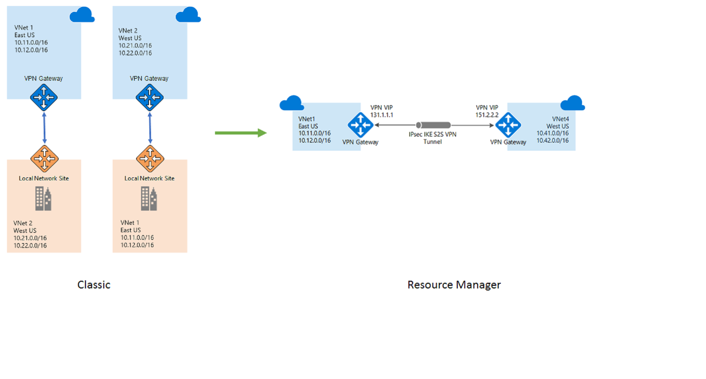
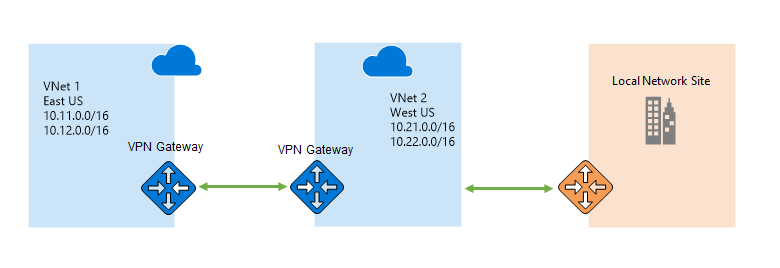

# VPN Gateway classic to Resource Manager migration
VPN Gateways can now be migrated from classic to Resource Manager deployment model. You can read more about Azure Resource Manager [features and benefits](../azure-resource-manager/resource-group-overview.md). In this article, we  detail how to migrate from classic deployments to newer Resource Manager based model. 

VPN Gateways are migrated as part of VNet migration from classic to Resource Manager. This migration is done one VNet at a time. There is no additional requirement in terms of tools or prerequisites to migration. Migration steps are identical to existing VNet migration and are documented at [IaaS resources migration page](../virtual-machines/windows/migration-classic-resource-manager-ps.md). There is no data path downtime during migration and thus existing workloads would continue to function without loss of on-premises connectivity during migration. The public IP address associated with the VPN gateway does not change during the migration process. This implies that you will not need to reconfigure your on-premises router once the migration is completed.  

The model in Resource Manager is different from classic model and is composed of virtual network gateways, local network gateways and connection resources. These represent the VPN gateway itself, the local-site representing on premises address space and connectivity between the two respectively. Once migration is completed your gateways would not be available in classic model and all management operations on virtual network gateways, local network gateways, and connection objects must be performed using Resource Manager model.

## Supported scenarios
Most common VPN connectivity scenarios are covered by classic to Resource Manager migration. The supported scenarios include -

* Point to site connectivity
* Site to site connectivity with VPN Gateway connected to on premises location
* VNet to VNet connectivity between two VNets using VPN gateways
* Multiple VNets connected to same on premises location
* Multi-site connectivity
* Forced tunneling enabled VNets

Scenarios which are not supported include -  

* Currently VNets containing ExpressRoute gateways do not support migration. Therefore coexistence with ExpressRoute gateways on the same VNet is not currently supported.
* Transit scenarios where VM extensions are connected to on-premises servers. Transit VPN connectivity limitations are detailed below.

> [!NOTE]
> CIDR validation in Resource Manager model is more strict than the one in classic model. Before migrating ensure that classic address ranges given conform to valid CIDR format before beginning the migration. CIDR can be validated using any common CIDR validators. VNet or local sites with invalid CIDR ranges when migrated would result in failed state.
> 
> 

## VNet to VNet connectivity migration
VNet to VNet connectivity in classic was achieved by creating a local site representation of the connected VNet. Customers were required to create two local sites which represented the two VNets which needed to be connected together. These were then connected to the corresponding VNets using IPsec tunnel to establish connectivity between the two VNets. This model has manageability challenges since any address range changes in one VNet must also be maintained in the corresponding local site representation. In Resource Manager model this workaround is no longer needed. The connection between the two VNets can be directly achieved using 'Vnet2Vnet' connection type in Connection resource. 

During VNet migration we detect that the connected entity to current VNet's VPN gateway is another VNet and ensure that once migration of both VNets is completed, you would no longer see two local sites representing the other VNet. The classic model of two VPN gateways, two local sites and two connections between them is transformed to Resource Manager model with two VPN gateways and two connections of type Vnet2Vnet.

## Transit VPN connectivity
You can configure VPN gateways in a topology such that on-premises connectivity for a VNet is achieved by connecting to another VNet that is directly connected to on-premises. This is transit VPN connectivity where instances in first VNet are connected to on-premises resources via transit to the VPN gateway in connected VNet that is directly connected to on-premises. To achieve this configuration in classic deployment model, you would need to create a local site which has aggregated prefixes representing both the connected VNet and on-premises address space. This representational local site is then connected to the VNet to achieve transit connectivity. This classic model also has similar manageability challenges since any change in on-premises address range must also be maintained on the local site representing the aggregate of VNet and on-premises. Introduction of BGP support in Resource Manager supported gateways simplifies manageability since the connected gateways can learn routes from on premises without manual modification to prefixes.

Since we transform VNet to VNet connectivity without requiring local sites, the transit scenario loses on-premises connectivity for VNet that is indirectly connected to on-premises. The loss of connectivity can be mitigated in the following two ways, after migration is completed - 

* Enable BGP on VPN gateways that are connected together and to on-premises. Enabling BGP restores connectivity without any other configuration change since routes are learned and advertised between VNet gateways. Note that BGP option is only available on Standard and higher SKUs.
* Establish an explicit connection from affected VNet to the local network gateway representing on-premises location. This would also require changing configuration on the on-premises router to create and configure the IPsec tunnel.

## Next steps
After learning about VPN gateway migration support, go to [platform-supported migration of IaaS resources from classic to Resource Manager](../virtual-machines/windows/migration-classic-resource-manager-ps.md) to get started.
