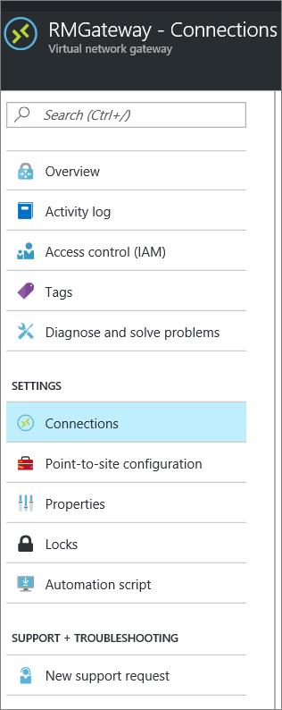
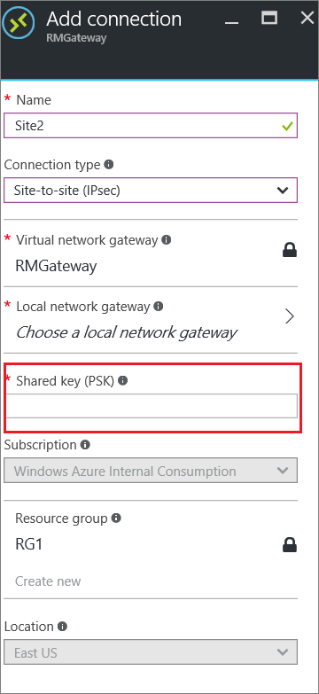

# Add a Site-to-Site connection to a VNet with an existing VPN gateway connection

> [!div class="op_single_selector"]
> * [Azure portal](vpn-gateway-howto-multi-site-to-site-resource-manager-portal.md)
> * [PowerShell (classic)](vpn-gateway-multi-site.md)
>
> 

This article walks you through using the Azure portal to add Site-to-Site (S2S) connections to a VPN gateway that has an existing connection. This type of connection is often referred to as a "multi-site" configuration. You can add a S2S connection to a VNet that already has a S2S connection, Point-to-Site connection, or VNet-to-VNet connection. There are some limitations when adding connections. Check the [Before you begin](#before) section in this article to verify before you start your configuration. 

This article applies to VNets created using the Resource Manager deployment model that have a RouteBased VPN gateway. These steps do not apply to ExpressRoute/Site-to-Site coexisting connection configurations. See [ExpressRoute/S2S coexisting connections](../expressroute/expressroute-howto-coexist-resource-manager.md) for information about coexisting connections.

### Deployment models and methods
[!INCLUDE [vpn-gateway-clasic-rm](../../includes/vpn-gateway-classic-rm-include.md)]

We update this table as new articles and additional tools become available for this configuration. When an article is available, we link directly to it from this table.

[!INCLUDE [vpn-gateway-table-multi-site](../../includes/vpn-gateway-table-multisite-include.md)]

## Before you begin
Verify the following items:

* You are not creating an ExpressRoute/S2S coexisting connection.
* You have a virtual network that was created using the Resource Manager deployment model with an existing connection.
* The virtual network gateway for your VNet is RouteBased. If you have a PolicyBased VPN gateway, you must delete the virtual network gateway and create a new VPN gateway as RouteBased.
* None of the address ranges overlap for any of the VNets that this VNet is connecting to.
* You have compatible VPN device and someone who is able to configure it. See [About VPN Devices](vpn-gateway-about-vpn-devices.md). If you aren't familiar with configuring your VPN device, or are unfamiliar with the IP address ranges located in your on-premises network configuration, you need to coordinate with someone who can provide those details for you.
* You have an externally facing public IP address for your VPN device. This IP address cannot be located behind a NAT.

## Part 1 - Configure a connection
1. From a browser, navigate to the [Azure portal](http://portal.azure.cn) and, if necessary, sign in with your Azure account.
2. Click **All resources** and locate your **virtual network gateway** from the list of resources and click it.
3. On the **Virtual network gateway** blade, click **Connections**.

     
4. On the **Connections** blade, click **+Add**.

     
5. On the **Add connection** blade, fill out the following fields:

   * **Name:** The name you want to give to the site you are creating the connection to.
   * **Connection type:** Select **Site-to-site (IPsec)**.

      

## Part 2 - Add a local network gateway
1. Click **Local network gateway** ***Choose a local network gateway***. This will open the **Choose local network gateway** blade.

     
2. Click **Create new** to open the **Create local network gateway** blade.

     
3. On the **Create local network gateway** blade, fill out the following fields:

   * **Name:** The name you want to give to the local network gateway resource.
   * **IP address:** The public IP address of the VPN device on the site that you want to connect to.
   * **Address space:** The address space that you want to be routed to the new local network site.
4. Click **OK** on the **Create local network gateway** blade to save the changes.

## Part 3 - Add the shared key and create the connection
1. On the **Add connection** blade, add the shared key that you want to use to create your connection. You can either get the shared key from your VPN device, or make one up here and then configure your VPN device to use the same shared key. The important thing is that the keys are exactly the same.

     
2. At the bottom of the blade, click **OK** to create the connection.

## Part 4 - Verify the VPN connection

[!INCLUDE [vpn-gateway-verify-connection-ps-rm](../../includes/vpn-gateway-verify-connection-ps-rm-include.md)]

## Next steps

Once your connection is complete, you can add virtual machines to your virtual networks. See the [virtual machines documents](/virtual-machines/) for more information.
