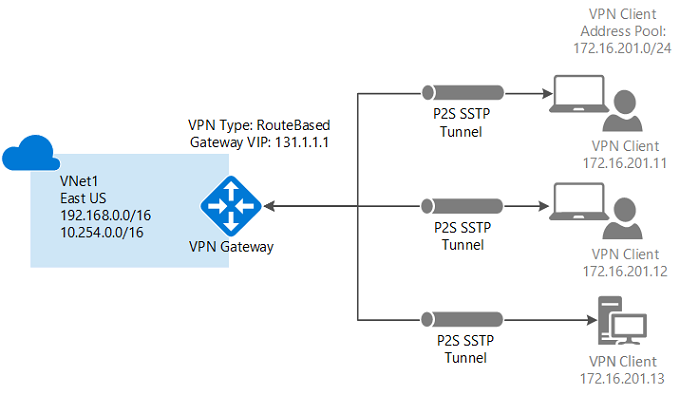
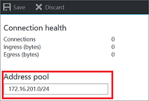
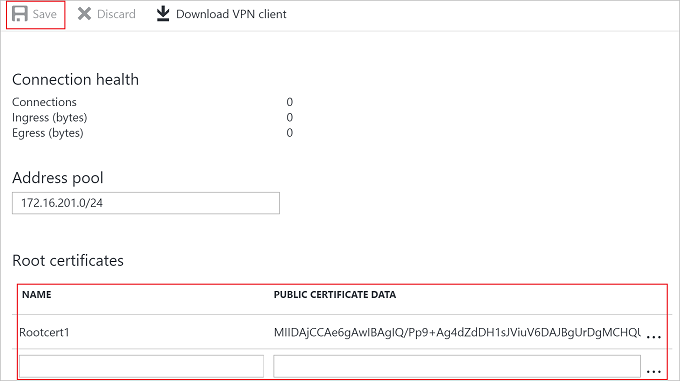

# Configure a Point-to-Site connection to a VNet using the Azure portal preview

This article shows you how to create a VNet with a Point-to-Site connection in the Resource Manager deployment model using the Azure portal preview. You can also create this configuration using a different deployment tool or deployment model by selecting a different option from the following list:

> [!div class="op_single_selector"]
> * [Resource Manager - Azure portal preview](vpn-gateway-howto-point-to-site-resource-manager-portal.md)
> * [Resource Manager - PowerShell](vpn-gateway-howto-point-to-site-rm-ps.md)
> * [Classic - Azure portal preview](vpn-gateway-howto-point-to-site-classic-azure-portal.md)
>
>

A Point-to-Site (P2S) configuration lets you create a secure connection from an individual client computer to a virtual network. P2S is a VPN connection over SSTP (Secure Socket Tunneling Protocol). Point-to-Site connections are useful when you want to connect to your VNet from a remote location, such as from home or a conference, or when you only have a few clients that need to connect to a virtual network. P2S connections do not require a VPN device or a public-facing IP address. You establish the VPN connection from the client computer.

P2S connections require the following:

* A RouteBased VPN gateway.
* The public key (.cer file) for a root certificate, uploaded to Azure. This is considered a trusted certificate and is used for authentication.
* A client certificate generated from the root certificate, and installed on each client computer that will connect. This certificate is used for client authentication.
* A VPN client configuration package must be generated and installed on every client computer that connects. The client configuration package configures the native VPN client that is already on the operating system with the necessary information to connect to the VNet.

### Example values

You can use the following values to create a test environment, or refer to these values to better understand the examples in this article:

* **Name: VNet1**
* **Address space: 192.168.0.0/16** For this example, we use only one address space. You can have more than one address space for your VNet.
* **Subnet name: FrontEnd**
* **Subnet address range: 192.168.1.0/24**
* **Subscription:** If you have more than one subscription, verify that you are using the correct one.
* **Resource Group: TestRG**
* **Location: China East**
* **GatewaySubnet: 192.168.200.0/24**
* **Virtual network gateway name: VNet1GW**
* **Gateway type: VPN**
* **VPN type: Route-based**
* **Public IP address: VNet1GWpip**
* **Connection type: Point-to-site**
* **Client address pool: 172.16.201.0/24** VPN clients that connect to the VNet using this Point-to-Site connection receive an IP address from the client address pool.

## 1 - Create a virtual network

Before beginning, verify that you have an Azure subscription. If you don't already have an Azure subscription, you can sign up for a [trial account](https://www.azure.cn/pricing/1rmb-trial). If you are creating this configuration as an exercise, you can refer to the [example values](#example).

[!INCLUDE [vpn-gateway-basic-vnet-rm-portal](../../includes/vpn-gateway-basic-vnet-rm-portal-include.md)]

## 2 - Specify address space and subnets

You can add additional address space and subnets to your VNet once it has been created.

[!INCLUDE [vpn-gateway-additional-address-space](../../includes/vpn-gateway-additional-address-space-include.md)]

## 3 - Add a gateway subnet

Before connecting your virtual network to a gateway, you first need to create the gateway subnet for the virtual network to which you want to connect. The gateway services use the IP addresses specified in the gateway subnet. If possible, create a gateway subnet using a CIDR block of /28 or /27 to provide enough IP addresses to accommodate additional future configuration requirements.

The screenshots in this section are provided as a reference example. Be sure to use the GatewaySubnet address range that corresponds with the required values for your configuration.

### To create a gateway subnet

[!INCLUDE [vpn-gateway-add-gwsubnet-rm-portal](../../includes/vpn-gateway-add-gwsubnet-rm-portal-include.md)]

## 4 - Specify a DNS server (optional)

After you create your virtual network, you can add the IP address of a DNS server to handle name resolution. The DNS server specified should be a DNS server that can resolve the names for the resources you are connecting to. The VPN client configuration package that you generate in a later step will contain the IP addresses of the DNS servers that you specify in this setting. If you need to update the list of DNS servers in the future, you can generate and install new VPN client configuration packages that reflect the new list.

[!INCLUDE [vpn-gateway-add-dns-rm-portal](../../includes/vpn-gateway-add-dns-rm-portal-include.md)]

## 5 - Create a virtual network gateway

Point-to-site connections require the following settings:

* Gateway type: VPN
* VPN type: Route-based

### To create a virtual network gateway

[!INCLUDE [vpn-gateway-add-gw-rm-portal](../../includes/vpn-gateway-add-gw-rm-portal-include.md)]

## 6 - Generate certificates

Certificates are used by Azure to authenticate VPN clients for Point-to-Site VPNs. You upload the public key information of the root certificate to Azure. The public key is then considered 'trusted'. Client certificates must be generated from the trusted root certificate, and then installed on each client computer in the Certificates-Current User/Personal certificate store. The certificate is used to authenticate the client when it initiates a connection to the VNet. For more information about generating and installing certificates, see [Certificates for Point-to-Site](vpn-gateway-certificates-point-to-site.md).

### Step 1 - Obtain the .cer file for the root certificate

[!INCLUDE [vpn-gateway-basic-vnet-rm-portal](../../includes/vpn-gateway-p2s-rootcert-include.md)]

### Step 2 - Generate a client certificate

[!INCLUDE [vpn-gateway-basic-vnet-rm-portal](../../includes/vpn-gateway-p2s-clientcert-include.md)]

## 7 - Add the client address pool

The client address pool is a range of private IP addresses that you specify. The clients that connect over P2S receive an IP address from this range. Use a private IP address range that does not overlap with the on-premises location that you will connect from, or the VNet that you want to connect to.

1. Once the virtual network gateway has been created, navigate to the **Settings** section of the virtual network gateway blade. In the **Settings** section, click **Point-to-site configuration** to open the **Configuration** blade.

    
2. You can delete the auto-filled range, then add the private IP address range that you want to use. Click **Save** to validate and save the setting.

    

## 8 - Upload the root certificate .cer file

After the gateway has been created, you can upload the .cer file (which contains the public key information) for a trusted root certificate to Azure. Once a.cer file is uploaded, Azure can use it to authenticate clients that have installed a client certificate generated from the trusted root certificate. You can upload additional trusted root certificate files - up to a total of 20 - later, if needed. 

1. Certificates are added on the **Point-to-site configuration** blade in the **Root certificate** section.  
2. Make sure that you exported the root certificate as a Base-64 encoded X.509 (.cer) file. You need to export the certificate in this format so you can open the certificate with text editor.
3. Open the certificate with a text editor, such as Notepad. When copying the certificate data, make sure that you copy the text as one continuous line without carriage returns or line feeds. You may need to modify your view in the text editor to 'Show Symbol/Show all characters' to see the carriage returns and line feeds. Copy only the following section as one continuous line:

    
4. Paste the certificate data into the **Public Certificate Data** field. **Name** the certificate, and then click **Save**. You can add up to 20 trusted root certificates.

    

## 9 - Install the VPN client configuration package

To connect to a VNet using a Point-to-Site VPN, each client must install a package to configure the native Windows VPN client. The configuration package configures the native Windows VPN client with the settings necessary to connect to the virtual network and, if you specified a DNS server for your VNet, it contains the DNS server IP address the client will use for name resolution. If you change the specified DNS server later, after generating the client configuration package, be sure to generate a new client configuration package to install on your client computers.

You can use the same VPN client configuration package on each client computer, as long as the version matches the architecture for the client. For the list of client operating systems that are supported, see the [Point-to-Site connections FAQ](#faq) at the end of this article.

### Step 1 - Download the client configuration package

1. On the **Point-to-site configuration** blade, click **Download VPN client** to open the **Download VPN client** blade. It takes a minute or two for the package to generate.

    
2. Select the correct package for your client, and then click **Download**. Save the configuration package file. You install the VPN client configuration package on each client computer that connects to the virtual network.

    

### Step 2 - Install the client configuration package

1. Copy the configuration file locally to the computer that you want to connect to your virtual network. 
2. Double-click the .exe file to install the package on the client computer. Because you created the configuration package, it is not signed and you may see a warning. If you get a Windows SmartScreen popup, click **More info** (on the left), then **Run anyway** to install the package.
3. Install the package on the client computer. If you get a Windows SmartScreen popup, click **More info** (on the left), then **Run anyway** to install the package.
4. On the client computer, navigate to **Network Settings** and click **VPN**. The VPN connection shows the name of the virtual network that it connects to.

## 10 - Install the client certificate

If you want to create a P2S connection from a client computer other than the one you used to generate the client certificates, you need to install a client certificate. When installing a client certificate, you need the password that was created when the client certificate was exported. Typically, this is just a matter of double-clicking the certificate and installing it. For more information see, [Install an exported client certificate](vpn-gateway-certificates-point-to-site.md#install).

## 11 - Connect to Azure

1. To connect to your VNet, on the client computer, navigate to VPN connections and locate the VPN connection that you created. It is named the same name as your virtual network. Click **Connect**. A pop-up message may appear that refers to using the certificate. Click **Continue** to use elevated privileges.

2. On the **Connection** status page, click **Connect** to start the connection. If you see a **Select Certificate** screen, verify that the client certificate showing is the one that you want to use to connect. If it is not, use the drop-down arrow to select the correct certificate, and then click **OK**.

    
3. Your connection is established.

    

If you are having trouble connecting, check the following items:

- Open **Manage user certificates** and navigate to **Trusted Root Certification Authorities\Certificates**. Verify that the root certificate is listed. The root certificate must be present in order for authentication to work. When you export a client certificate .pfx using the default value 'Include all certificates in the certification path if possible', the root certificate information is also exported. When you install the client certificate, the root certificate is then also installed on the client computer. 

- If you are using a certificate that was issued using an Enterprise CA solution and are having trouble authenticating, check the authentication order on the client certificate. You can check the authentication list order by double-clicking the client certificate, and going to **Details > Enhanced Key Usage**. Make sure the list shows 'Client Authentication' as the first item. If not, you need to issue a client certificate based on the User template that has Client Authentication as the first item in the list.

## 12 - Verify your connection

1. To verify that your VPN connection is active, open an elevated command prompt, and run *ipconfig/all*.
2. View the results. Notice that the IP address you received is one of the addresses within the Point-to-Site VPN Client Address Pool that you specified in your configuration. The results are similar to this example:

        PPP adapter VNet1:
            Connection-specific DNS Suffix .:
            Description.....................: VNet1
            Physical Address................:
            DHCP Enabled....................: No
            Autoconfiguration Enabled.......: Yes
            IPv4 Address....................: 172.16.201.3(Preferred)
            Subnet Mask.....................: 255.255.255.255
            Default Gateway.................:
            NetBIOS over Tcpip..............: Enabled

If you are having trouble connecting to a virtual machine over P2S, use 'ipconfig' to check the IPv4 address assigned to the Ethernet adapter on the computer from which you are connecting. If the IP address is within the address range of the VNet that you are connecting to, or within the address range of your VPNClientAddressPool, this is referred to as an overlapping address space. When your address space overlaps in this way, the network traffic doesn't reach Azure, it stays on the local network. If your network address spaces don't overlap and you still can't connect to your VM, see [Troubleshoot Remote Desktop connections to a VM](../virtual-machines/windows/troubleshoot-rdp-connection.md).

## Connect to a virtual machine

[!INCLUDE [Connect to a VM](../../includes/vpn-gateway-connect-vm-p2s-include.md)]

## Add or remove trusted root certificates

You can add and remove trusted root certificates from Azure. When you remove a root certificate, clients that have a certificate generated from that root won't be able to authenticate, and thus will not be able to connect. If you want a client to authenticate and connect, you need to install a new client certificate generated from a root certificate that is trusted (uploaded) to Azure.

### To add a trusted root certificate

You can add up to 20 trusted root certificate .cer files to Azure. For instructions, see the section [Upload a trusted root certificate](#uploadfile) in this article.

### To remove a trusted root certificate

1. To remove a trusted root certificate, navigate to the **Point-to-site configuration** blade for your virtual network gateway.
2. In the **Root certificate** section of the blade, locate the certificate that you want to remove.
3. Click the ellipsis next to the certificate, and then click 'Remove'.

## Revoke a client certificate

You can revoke client certificates. The certificate revocation list allows you to selectively deny Point-to-Site connectivity based on individual client certificates. This differs from removing a trusted root certificate. If you remove a trusted root certificate .cer from Azure, it revokes the access for all client certificates generated/signed by the revoked root certificate. Revoking a client certificate, rather than the root certificate, allows the other certificates that were generated from the root certificate to continue to be used for authentication.

The common practice is to use the root certificate to manage access at team or organization levels, while using revoked client certificates for fine-grained access control on individual users.

### To revoke a client certificate

You can revoke a client certificate by adding the thumbprint to the revocation list.

1. Retrieve the client certificate thumbprint. For more information, see [How to retrieve the Thumbprint of a Certificate](https://msdn.microsoft.com/library/ms734695.aspx).
2. Copy the information to a text editor and remove all spaces so that it is a continuous string.
3. Navigate to the virtual network gateway **Point-to-site-configuration** blade. This is the same blade that you used to [upload a trusted root certificate](#uploadfile).
4. In the **Revoked certificates** section, input a friendly name for the certificate (it doesn't have to be the certificate CN).
5. Copy and paste the thumbprint string to the **Thumbprint** field.
6. The thumbprint will validate is automatically added to the revocation list. A message appears on the screen that the list is updating. 
7. After updating has completed, the certificate can no longer be used to connect. Clients that try to connect using this certificate receive a message saying that the certificate is no longer valid.

## Point-to-Site FAQ

[!INCLUDE [Point-to-Site FAQ](../../includes/vpn-gateway-point-to-site-faq-include.md)]

## Next steps
Once your connection is complete, you can add virtual machines to your virtual networks. For more information, see [Virtual Machines](/virtual-machines/). To understand more about networking and virtual machines, see [Azure and Linux VM network overview](../virtual-machines/linux/azure-vm-network-overview.md).
