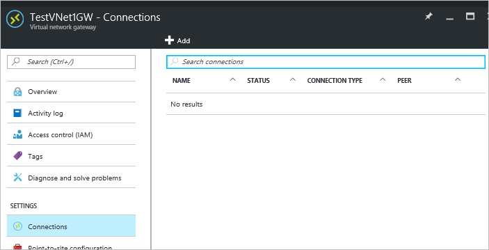
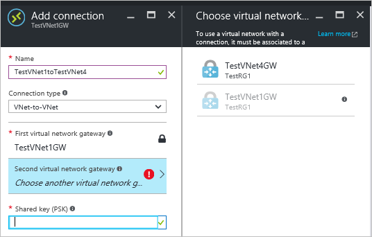

# Configure a VNet-to-VNet connection using the Azure portal preview
> [!div class="op_single_selector"]
> * [Resource Manager - Azure Portal Preview](vpn-gateway-howto-vnet-vnet-resource-manager-portal.md)
> * [Resource Manager - PowerShell](vpn-gateway-vnet-vnet-rm-ps.md)
> * [Classic - Classic Management Portal](virtual-networks-configure-vnet-to-vnet-connection.md)
> 
> 

This article walks you through the steps to create a connection between VNets in the Resource Manager deployment model by using VPN Gateway and the Azure portal preview.

When you use the Azure portal preview to connect virtual networks, the VNets must be in the same subscription. If your virtual networks are in different subscriptions, you can still connect them by using the [PowerShell](vpn-gateway-vnet-vnet-rm-ps.md) steps.

### Deployment models and methods for VNet-to-VNet connections
[!INCLUDE [deployment models](../../includes/vpn-gateway-deployment-models-include.md)]

The following table shows the currently available deployment models and methods for VNet-to-VNet configurations. When an article with configuration steps is available, we link directly to it from this table.

[!INCLUDE [vpn-gateway-table-vnet-vnet](../../includes/vpn-gateway-table-vnet-to-vnet-include.md)]

**VNet peering**

[!INCLUDE [vpn-gateway-vnetpeeringlink](../../includes/vpn-gateway-vnetpeeringlink-include.md)]

## About VNet-to-VNet connections
Connecting a virtual network to another virtual network (VNet-to-VNet) is similar to connecting a VNet to an on-premises site location. Both connectivity types use an Azure VPN gateway to provide a secure tunnel using IPsec/IKE. The VNets you connect can be in different regions, or in different subscriptions.

You can even combine VNet-to-VNet communication with multi-site configurations. This lets you establish network topologies that combine cross-premises connectivity with inter-virtual network connectivity, as shown in the following diagram:

### Why connect virtual networks?
You may want to connect virtual networks for the following reasons:

* **Cross region geo-redundancy and geo-presence**

    * You can set up your own geo-replication or synchronization with secure connectivity without going over Internet-facing endpoints.
    * With Azure Traffic Manager and Load Balancer, you can set up highly available workload with geo-redundancy across multiple Azure regions. One important example is to set up SQL Always On with Availability Groups spreading across multiple Azure regions.
* **Regional multi-tier applications with isolation or administrative boundary**

    * Within the same region, you can set up multi-tier applications with multiple virtual networks connected together due to isolation or administrative requirements.

For more information about VNet-to-VNet connections, see [VNet-to-VNet considerations](#faq) at the end of this article.

### Example settings
When using these steps as an exercise, you can use the sample configuration values. For example purposes, we use multiple address spaces for each VNet. However, VNet-to-VNet configurations don't require multiple address spaces.

**Values for TestVNet1:**

* VNet Name: TestVNet1
* Address space: 10.11.0.0/16
    * Subnet name: FrontEnd
    * Subnet address range: 10.11.0.0/24
* Resource Group: TestRG1
* Location: China East
* Address Space: 10.12.0.0/16
    * Subnet name: BackEnd
    * Subnet address range: 10.12.0.0/24
* Gateway Subnet name: GatewaySubnet (this will auto-fill in the portal)
    * Gateway Subnet address range: 10.11.255.0/27
* DNS Server: Use the IP address of your DNS Server
* Virtual Network Gateway Name: TestVNet1GW
* Gateway Type: VPN
* VPN type: Route-based
* SKU: Select the Gateway SKU you want to use
* Public IP address name: TestVNet1GWIP
* Connection values:
    * Name: TestVNet1toTestVNet4
    * Shared key: You can create the shared key yourself. For this example, we'll use abc123. The important thing is that when you create the connection between the VNets, the value must match.

**Values for TestVNet4:**

* VNet Name: TestVNet4
* Address space: 10.41.0.0/16
    * Subnet name: FrontEnd
    * Subnet address range: 10.41.0.0/24
* Resource Group: TestRG1
* Location: China North
* Address Space: 10.42.0.0/16
    * Subnet name: BackEnd
    * Subnet address range: 10.42.0.0/24
* GatewaySubnet name: GatewaySubnet (this will auto-fill in the portal)
    * GatewaySubnet address range: 10.41.255.0/27
* DNS Server: Use the IP address of your DNS Server
* Virtual Network Gateway Name: TestVNet4GW
* Gateway Type: VPN
* VPN type: Route-based
* SKU: Select the Gateway SKU you want to use
* Public IP address name: TestVNet4GWIP
* Connection values:
    * Name: TestVNet4toTestVNet1
    * Shared key: You can create the shared key yourself. For this example, we'll use abc123. The important thing is that when you create the connection between the VNets, the value must match.

## 1. Create and configure TestVNet1
If you already have a VNet, verify that the settings are compatible with your VPN gateway design. Pay particular attention to any subnets that may overlap with other networks. If you have overlapping subnets, your connection won't work properly. If your VNet is configured with the correct settings, you can begin the steps in the [Specify a DNS server](#dns) section.

### To create a virtual network
[!INCLUDE [vpn-gateway-basic-vnet-rm-portal](../../includes/vpn-gateway-basic-vnet-rm-portal-include.md)]

## 2. Add additional address space and create subnets
You can add additional address space and create subnets once your VNet has been created.

[!INCLUDE [vpn-gateway-additional-address-space](../../includes/vpn-gateway-additional-address-space-include.md)]

## 3. Create a gateway subnet
Before connecting your virtual network to a gateway, you first need to create the gateway subnet for the virtual network to which you want to connect. If possible, it's best to create a gateway subnet using a CIDR block of /28 or /27 in order to provide enough IP addresses to accommodate additional future configuration requirements.

If you are creating this configuration as an exercise, refer to these [Example settings](#values) when creating your gateway subnet.

[!INCLUDE [vpn-gateway-no-nsg](../../includes/vpn-gateway-no-nsg-include.md)]

### To create a gateway subnet
[!INCLUDE [vpn-gateway-add-gwsubnet-rm-portal](../../includes/vpn-gateway-add-gwsubnet-rm-portal-include.md)]

## 4. Specify a DNS server (optional)
If you want to have name resolution for virtual machines that are deployed to your VNets, you should specify a DNS server.

[!INCLUDE [vpn-gateway-add-dns-rm-portal](../../includes/vpn-gateway-add-dns-rm-portal-include.md)]

## 5. Create a virtual network gateway
In this step, you create the virtual network gateway for your VNet. This step can take up to 45 minutes to complete. If you are creating this configuration as an exercise, you can refer to the [Example settings](#values).

### To create a virtual network gateway
[!INCLUDE [vpn-gateway-add-gw-rm-portal](../../includes/vpn-gateway-add-gw-rm-portal-include.md)]

## 6. Create and configure TestVNet4
Once you've configured TestVNet1, create TestVNet4 by repeating the previous steps, replacing the values with those of TestVNet4. You don't need to wait until the virtual network gateway for TestVNet1 has finished creating before configuring TestVNet4. If you are using your own values, make sure that the address spaces don't overlap with any of the VNets that you want to connect to.

## 7. Configure the TestVNet1 connection
When the virtual network gateways for both TestVNet1 and TestVNet4 have completed, you can create your virtual network gateway connections. In this section, you will create a connection from VNet1 to VNet4.

1. In **All resources**, navigate to the virtual network gateway for your VNet. For example, **TestVNet1GW**. Click **TestVNet1GW** to open the virtual network gateway blade.

    
2. Click **+Add** to open the **Add connection** blade.
3. On the **Add connection** blade, in the name field, type a name for your connection. For example, **TestVNet1toTestVNet4**.

    
4. For **Connection type**. select **VNet-to-VNet** from the dropdown.
5. The **First virtual network gateway** field value is automatically filled in because you are creating this connection from the specified virtual network gateway.
6. The **Second virtual network gateway** field is the virtual network gateway of the VNet that you want to create a connection to. Click **Choose another virtual network gateway** to open the **Choose virtual network gateway** blade.

    
7. View the virtual network gateways that are listed on this blade. Notice that only virtual network gateways that are in your subscription are listed. If you want to connect to a virtual network gateway that is not in your subscription, please use the [PowerShell article](vpn-gateway-vnet-vnet-rm-ps.md). 
8. Click the virtual network gateway that you want to connect to.
9. In the **Shared key** field, type a shared key for your connection. You can generate or create this key yourself. In a site-to-site connection, the key you use would be exactly the same for your on-premises device and your virtual network gateway connection. The concept is similar here, except that rather than connecting to a VPN device, you are connecting to another virtual network gateway.

    
10. Click **OK** at the bottom of the blade to save your changes.

## 8. Configure the TestVNet4 connection
Next, create a connection from TestVNet4 to TestVNet1. Use the same method that you used to create the connection from TestVNet1 to TestVNet4. Make sure that you use the same shared key.

## 9. Verify your connection
Verify the connection. For each virtual network gateway, do the following:

1. Locate the blade for the virtual network gateway. For example, **TestVNet4GW**. 
2. On the virtual network gateway blade, click **Connections** to view the connections blade for the virtual network gateway.

View the connections and verify the status. Once the connection is created, you will see **Succeeded** and **Connected** as the Status values.

You can double-click each connection separately to view more information about the connection.

## VNet-to-VNet considerations
View the FAQ details for additional information about VNet-to-VNet connections.

[!INCLUDE [vpn-gateway-vnet-vnet-faq](../../includes/vpn-gateway-vnet-vnet-faq-include.md)]

## Next steps
Once your connection is complete, you can add virtual machines to your virtual networks. See the [Virtual Machines documentation](../virtual-machines/index.md) for more information.