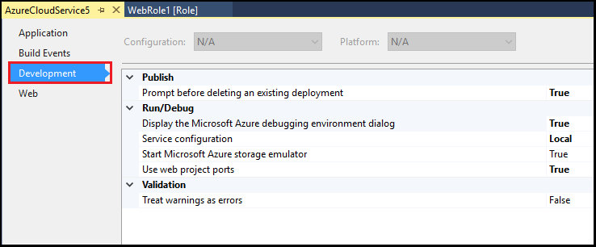

# Configure an Azure cloud service project with Visual Studio
You can configure an Azure cloud service project, depending on your requirements for that project. You can set properties for the project for the following categories:

- **Publish a cloud service to Azure** - You can set a property to make sure that an existing cloud service deployed to Azure is not accidentally deleted.
- **Run or debug a cloud service on the local computer** - You can select a service configuration to use and indicate whether you want to start the Azure storage emulator.
- **Validate a cloud service package when it is created** - You can decide to treat any warnings as errors so that you can ensure that the cloud service package deploys without any issues. 

## Steps to configure an Azure cloud service project
1. Open or create a cloud service project in Visual Studio

2. In **Solution Explorer**, right-click the project, and, from the context menu, select **Properties**.
   
3. In the project's properties page, select the **Development** tab.

	

4. Set **Prompt before deleting an existing deployment** to **True**. This setting helps to ensure you don't accidentally delete an existing deployment in Azure

5. Select the desired **Service configuration** to indicate which service configuration you want to use when you run or debug your cloud service locally. For more information on how to modify a service configuration for a role, see [How to configure the roles for an Azure cloud service with Visual Studio](./vs-azure-tools-configure-roles-for-cloud-service.md).

6. Set **Start Azure storage emulator** to **True** to start the Azure storage emulator when you run or debug your cloud service locally.

7. Set **Treat warnings as errors** to **True** to make sure you cannot publish if there are package validation errors.

8. Set **Use web project ports** to **True** to make sure that your web role uses the same port each time it starts locally in IIS Express.

9. From the Visual Studio toolbar, select **Save**.

## Next steps
- [Configure an Azure project using multiple service configurations](vs-azure-tools-multiple-services-project-configurations.md)

