# Using Storage Explorer (Preview) with Azure File storage

Azure File storage is a service that offers file shares in the cloud using the standard Server Message Block (SMB) Protocol. Both SMB 2.1 and SMB 3.0 are supported. With Azure File storage, you can migrate legacy applications that rely on file shares to Azure quickly and without costly rewrites. You can use File storage to expose data publicly to the world, or to store application data privately. In this article, you'll learn how to use Storage Explorer (Preview) to work with file shares and files.

## Prerequisites

To complete the steps in this article, you'll need the following:

- [Download and install Storage Explorer (preview)](http://www.storageexplorer.com/)

- [Connect to a Azure storage account or service](https://docs.microsoft.com//azure/vs-azure-tools-storage-manage-with-storage-explorer#connect-to-a-storage-account-or-service)

## Create a File Share

All files must reside in a file share, which is simply a logical grouping of files. An account can contain an unlimited number of file shares, and each share can store an unlimited number of files.

The following steps illustrate how to create a file share within Storage Explorer (Preview).

1. Open Storage Explorer (Preview).

2. In the left pane, expand the storage account within which you wish to create the File Share

3. Right-click **File Shares**, and - from the context menu - select **Create File Share**.

    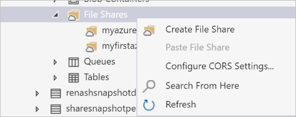

4. A text box will appear below the **File Shares** folder. Enter the name for your file share. See the [Share naming rules](https://docs.microsoft.com//azure/storage/storage-dotnet-how-to-use-blobs#create-a-container) section for a list of rules and restrictions on naming file shares.

    

5. Press **Enter** when done to create the file share, or **Esc** to cancel. Once the file share has been successfully created, it will be displayed under the **File Shares** folder for the selected storage account.

    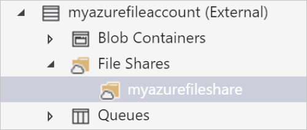

## View a file share's contents

File shares contain files and folders (that can also contain files).

The following steps illustrate how to view the contents of a file share within Storage Explorer (Preview):+

1. Open Storage Explorer (Preview).

2. In the left pane, expand the storage account containing the file share you wish to view.

3. Expand the storage account's **File Shares**.

4. Right-click the file share you wish to view, and - from the context menu - select **Open**. You can also double-click the file share you wish to view.

    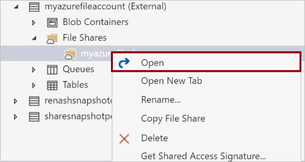

5. The main pane will display the file share's contents.
    
    

## Delete a file share

File shares can be easily created and deleted as needed. (To see how to delete individual files, refer to the section, [Managing files in a file share](https://docs.microsoft.com//azure/vs-azure-tools-storage-explorer-blobs#managing-blobs-in-a-blob-container).)

The following steps illustrate how to delete a file share within Storage Explorer (Preview):

1. Open Storage Explorer (Preview).

2. In the left pane, expand the storage account containing the file share you wish to view.

3. Expand the storage account's **File Shares**.

4. Right-click the file share you wish to delete, and - from the context menu - select **Delete**. You can also press **Delete** to delete the currently selected file share.

    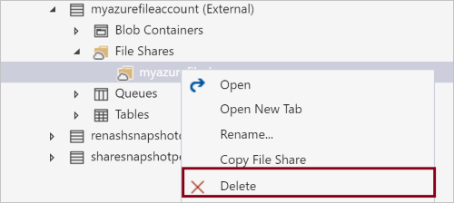

5. Select **Yes** to the confirmation dialog.
    
    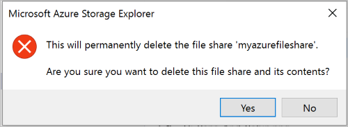

## Copy a file share

Storage Explorer (Preview) enables you to copy a file share to the clipboard, and then paste that file share into another storage account. (To see how to copy individual files, refer to the section, [Managing files in a file share](https://docs.microsoft.com//azure/vs-azure-tools-storage-explorer-blobs#managing-blobs-in-a-blob-container).)

The following steps illustrate how to copy a file share from one storage account to another.

1. Open Storage Explorer (Preview).

2. In the left pane, expand the storage account containing the file share you wish to copy.

3. Expand the storage account's **File Shares**.

4. Right-click the file share you wish to copy, and - from the context menu - select **Copy File Share**.

    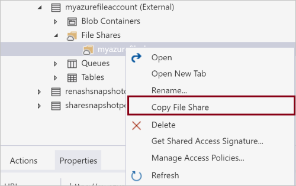

5. Right-click the desired "target" storage account into which you want to paste the file share, and - from the context menu - select **Paste File Share**.

    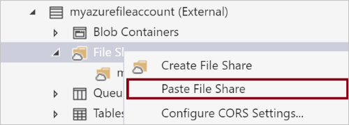

## Get the SAS for a file share

A [shared access signature (SAS)](https://docs.microsoft.com//azure/storage/storage-dotnet-shared-access-signature-part-1) provides delegated access to resources in your storage account. This means that you can grant a client limited permissions to objects in your storage account for a specified period of time and with a specified set of permissions, without having to share your account access keys.

The following steps illustrate how to create a SAS for a file share:+

1. Open Storage Explorer (Preview).

2. In the left pane, expand the storage account containing the file share for which you wish to get a SAS.

3. Expand the storage account's **File Shares**.

4. Right-click the desired file share, and - from the context menu - select **Get Shared Access Signature**.

    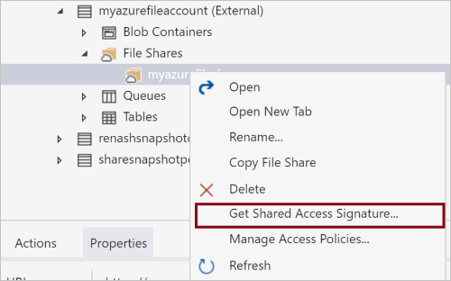

5. In the **Shared Access Signature** dialog, specify the policy, start and expiration dates, time zone, and access levels you want for the resource.

    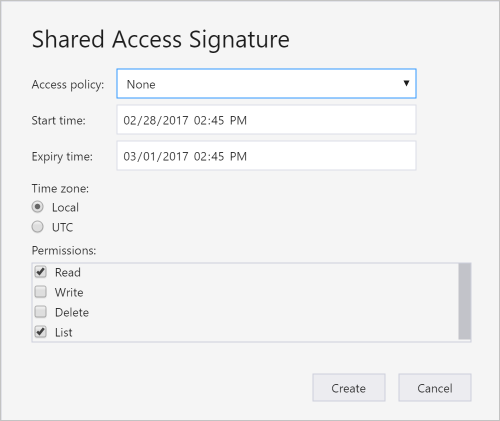

6. When you're finished specifying the SAS options, select **Create**.

7. A second **Shared Access Signature** dialog will then display that lists the file share along with the URL and QueryStrings you can use to access the storage resource. Select **Copy** next to the URL you wish to copy to the clipboard.
    
    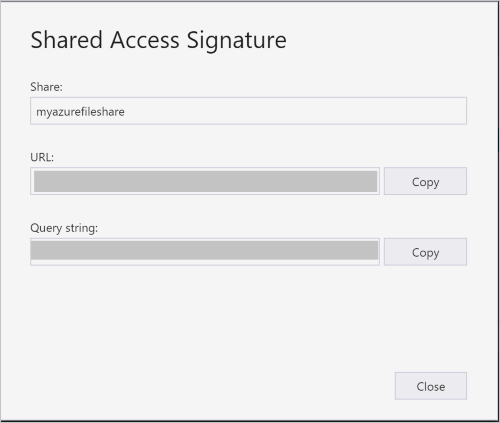

8. When done, select **Close**.

## Manage Access Policies for a file share

The following steps illustrate how to manage (add and remove) access policies for a file share:+ . The Access Policies is used for creating SAS URLs through which people can use to access the Storage File resource during a defined period of time.

1. Open Storage Explorer (Preview).

2. In the left pane, expand the storage account containing the file share whose access policies you wish to manage.

3. Expand the storage account's **File Shares**.

4. Select the desired file share, and - from the context menu - select **Manage Access Policies**.

    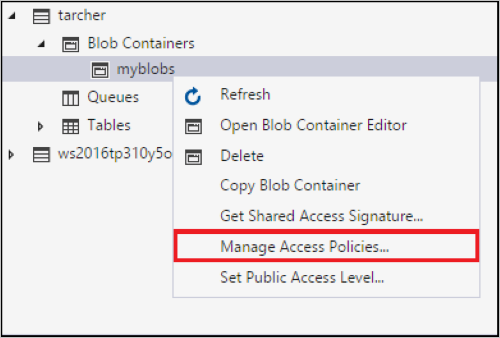

5. The **Access Policies** dialog will list any access policies already created for the selected file share.
    
    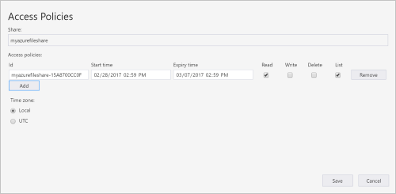

6. Follow these steps depending on the access policy management task:
    
    - **Add a new access policy** - Select **Add**. Once generated, the **Access Policies** dialog will display the newly added access policy (with default settings).

    - **Edit an access policy** - Make any desired edits, and select **Save**.

    - **Remove an access policy** - Select **Remove** next to the access policy you wish to remove.

7. Create a new SAS URL using the Access Policy you created earlier:
    
    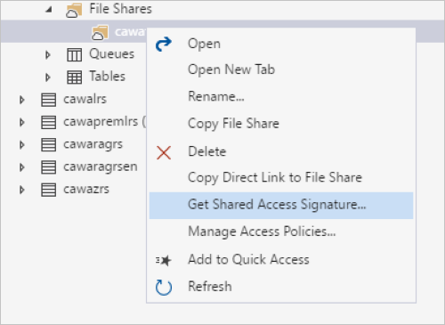
    
    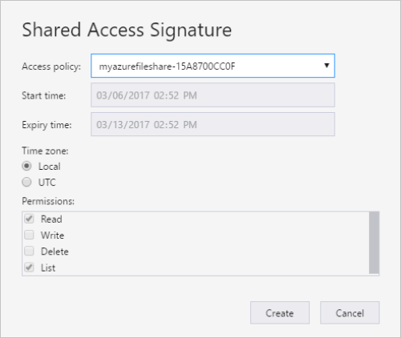

## Managing files in a file share

Once you've created a file share, you can upload a file to that file share, download a file to your local computer, open a file on your local computer, and much more.

The following steps illustrate how to manage the files (and folders) within a file share.

1.  Open Storage Explorer (Preview).

2.  In the left pane, expand the storage account containing the file share you wish to manage.

3.  Expand the storage account's **File Shares**.

4.  Double-click the file share you wish to view.

5.  The main pane will display the file share's contents.

    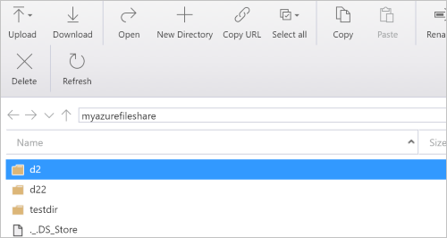

6.  The main pane will display the file share's contents.

7.  Follow these steps depending on the task you wish to perform:

    - **Upload files to a file share**

        a.  On the main pane's toolbar, select **Upload**, and then **Upload Files** from the drop-down menu.

        
        
        b. In the **Upload files** dialog, select the ellipsis (**…**) button on the right side of the **Files** text box to select the file(s) you wish to upload.

        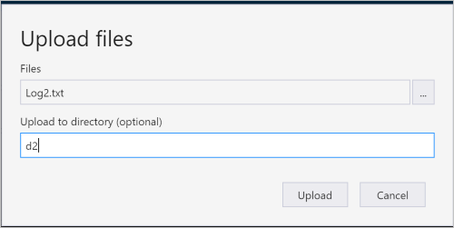

        c. Select **Upload**.

    - **Upload a folder to a file share**
        
        a. On the main pane's toolbar, select **Upload**, and then **Upload Folder** from the drop-down menu.

        

        b. In the **Upload folder** dialog, select the ellipsis (**…**) button on the right side of the **Folder** text box to select the folder whose contents you wish to upload.

        c. Optionally, specify a target folder into which the selected folder's contents will be uploaded. If the target folder doesn’t exist, it will be created.

        d. Select **Upload**.

    - **Download a file to your local computer**
        
        a. Select the file you wish to download.
        
        b. On the main pane's toolbar, select **Download**.
        
        c. In the **Specify where to save the downloaded file** dialog, specify the location where you want the file downloaded, and the name you wish to give it.

        d. Select **Save**.

    - **Open a file on your local computer**
        
        a.  Select the file you wish to open.
        
        b.  On the main pane's toolbar, select **Open**.
        
        c.  The file will be downloaded and opened using the application associated with the file's underlying file type.

    - **Copy a file to the clipboard**

        a. Select the file you wish to copy.

        b. On the main pane's toolbar, select **Copy**.

        c. In the left pane, navigate to another file share, and double-click it to view it in the main pane.

        d. On the main pane's toolbar, select **Paste** to create a copy of the file.

    - **Delete a file**

        a. Select the file you wish to delete.

        b. On the main pane's toolbar, select **Delete**.

        c. Select **Yes** to the confirmation dialog.

## Next steps

- View the [latest Storage Explorer (Preview) release notes and videos](http://www.storageexplorer.com/).

- Learn how to [create applications using Azure blobs, tables, queues, and files](/documentation/services/storage/).

