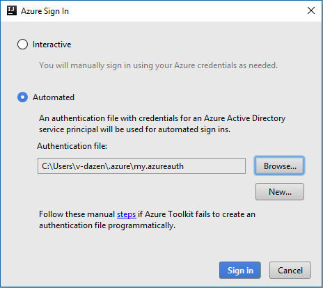

> [!NOTE]
> In order to sign in to Azure China with Azure Toolkit, you need to prepare a service principal authentication file first.
>
> You can easily create a service principal and grant it access privileges for a given subscription through Azure CLI 2.0.
>
> 1. Use `az cloud set -n AzureChinaCloud` command to switch to Azure China before login.
> 1. Login as a user by running command `az login`.
> 1. Select the subscription you want your service principal to have access to by running `az account set --subscription <subscription id>`. You can view your subscriptions by `az account list --out jsonc`.
> 1. Run the following command to create a service principal authentication file.
> 
>     Bash:
>     ```
>     curl -L https://raw.githubusercontent.com/Azure/azure-sdk-for-java/master/tools/authgen.py | python > my.azureauth
>     ```
>     PowerShell:
>     ```
>     Invoke-RestMethod -Method GET -Uri  https://raw.githubusercontent.com/Azure/azure-sdk-for-java/master/tools/authgen.py | python | Out-File -encoding ASCII my.azureauth
>     ```
>
> 1. To sign in to Azure China with Azure Toolkit, use `Automated` instead of `Interactive`.
>
>     