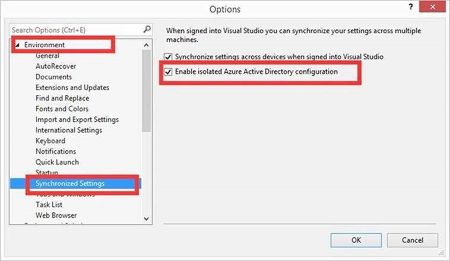

> [!NOTE]
> To connect Visual Studio to Azure China, you can follow the instuctions in [Use Visual Studio 2015 to connect Azure China](/articles/developerdifferences/#使用-visual-studio-2015连接中国区-azure).
>
> If you are using Visual Studio 2015 update 2 or later, you can check the option "Enable isolated Azure Active Directory configuration" as what it is shown in the following images.
>
>
>
> If you are using Visual Studio 2017, you can follow the instuctions in [Use Visual Studio 2017 to connect Azure China](/articles/developerdifferences/#使用-visual-studio-2017连接中国区-azure)