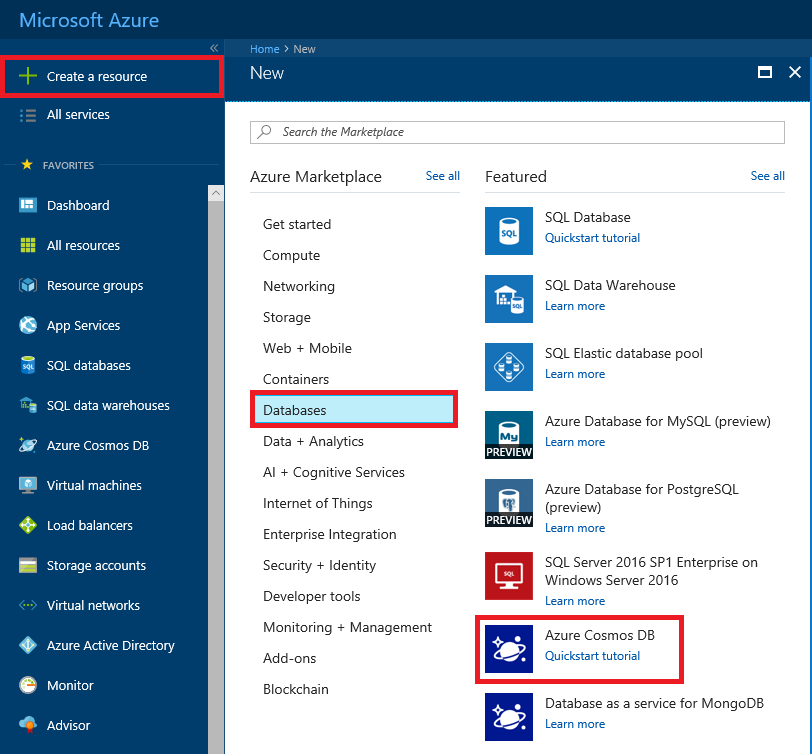

1. In a new window, sign in to the [Azure portal](https://portal.azure.cn/).
2. In the left menu, click **New**, click **Databases**, and then under **Azure Cosmos DB**, click **Create**.

   

3. In the **New account** blade, specify the desired configuration for the Azure Cosmos DB account. 

    With Azure Cosmos DB, you can choose one of three programming models: MongoDB, SQL, and Table (key-value). 
    <!-- Not Available on Gremlin (graph database) and Cassandra -->

    In this quick start we'll be programming against the MongoDB API so you'll choose **MongoDB** as you fill out the form. But if you have document data from a catalog app, or key/value (table) data, realize that Azure Cosmos DB can provide a highly available, multiple region-distributed database service platform for all your mission-critical applications.
    <!-- NOTICE: global-distributed TO multiple region-distributed -->
    <!-- Not Available on Graph data for a social media app-->

    Fill out the **New account** blade using the information in the table as a guide.

    

    Setting|Suggested value|Description
    ---|---|---
    ID|*Unique value*|A unique name you choose to identify the Azure Cosmos DB account. *documents.azure.cn* is appended to the ID you provide to create your URI, so use a unique but identifiable ID. The ID may contain only lowercase letters, numbers, and the '-' character, and must be between 3 and 50 characters.
    API|MongoDB|The API determines the type of account to create. Azure Cosmos DB provides three APIs to suits the needs of your application: SQL (document database), MongoDB (document database), and Azure Table, each which currently require a separate account.   Select **MongoDB** because in this quickstart you are creating a document database that is queryable using MongoDB.  [Learn more about the MongoDB API](../articles/cosmos-db/mongodb-introduction.md)|
    Subscription|*Your subscription*|The Azure subscription that you want to use for the Azure Cosmos DB account. 
    Resource Group|*The same value as ID*|The new resource group name for your account. For simplicity, you can use the same name as your ID. 
    Location|*The region closest to your users*|The geographic location in which to host your Azure Cosmos DB account. Choose the location closest to your users to give them the fastest access to the data.

4. Click **Create** to create the account.
5. On the toolbar, click **Notifications** to monitor the deployment process.

    

6.  When the deployment is complete, open the new account from the All Resources tile. 

    
<!--Update_Description: wording update -->
<!--ms.date: 12/25/2017-->