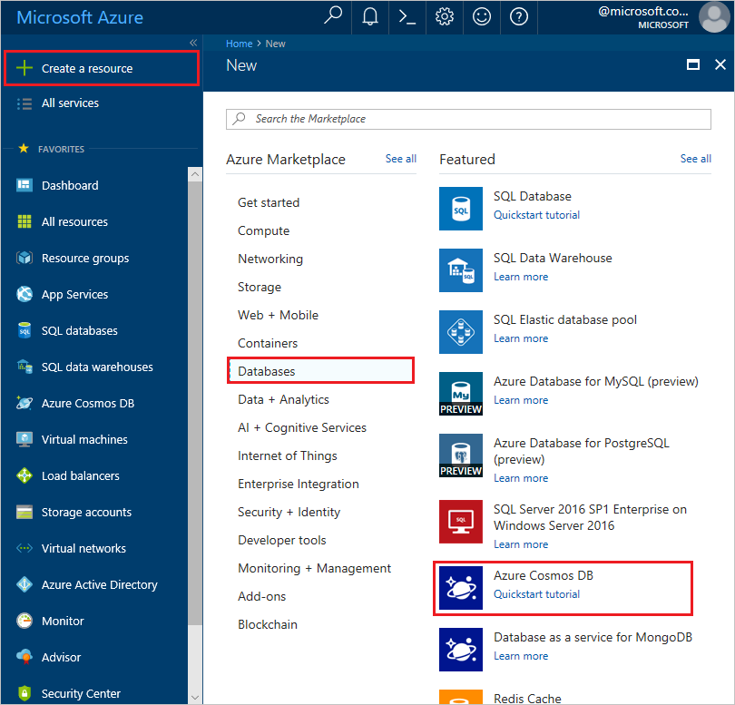
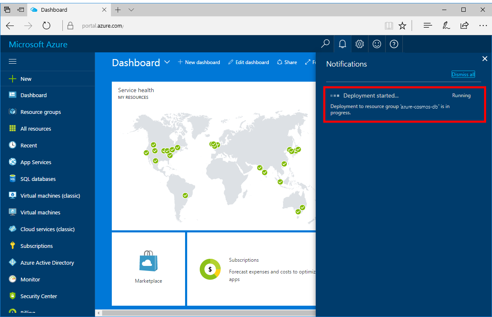
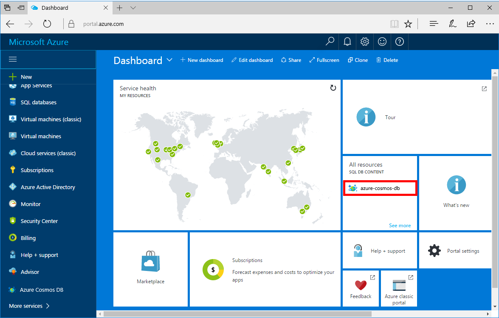

1. In a new window, sign in to the [Azure portal](https://portal.azure.cn/).
2. In the left pane, click **New**, click **Databases**, and then click **Azure Cosmos DB**.

   

3. On the **New account** blade, specify the configuration that you want for the Azure Cosmos DB account. 

    With Azure Cosmos DB, you can choose one of three programming models: MongoDB, SQL (DocumentDB), and Table (key-value). 

    In this quick-start article we program against the DocumentDB API, so choose **SQL (DocumentDB)** as you fill out the form. But if you have graph data for a social media app, or key/value (table) data, or data migrated from a MongoDB app, realize that Azure Cosmos DB can provide a highly available, globally distributed database service platform for all your mission-critical applications.

    Complete the fields on the **New account** blade, using the information in the following screenshot as a guide. When you set up your account, choose unique values that do not match those in the screenshot. 

    

    Setting|Suggested value|Description
    ---|---|---
    ID|*Unique value*|A unique name that identifies your Azure Cosmos DB account. The string *documents.azure.cn* is appended to the ID you provide to create your URI, so use a unique but identifiable ID. The ID can contain only lowercase letters, numbers, and the hyphen (-) character, and it must contain from 3 through 50 characters.
    API|SQL (DocumentDB)|We program against the [DocumentDB API](../articles/documentdb/documentdb-introduction.md) later in this article.|
    Subscription|*Your subscription*|The Azure subscription that you want to use for your Azure Cosmos DB account. 
    Resource Group|*The same value as ID*|The new resource-group name for your account. For simplicity, you can use the same name as your ID. 
    Location|*The region closest to your users*|The geographic location in which to host your Azure Cosmos DB account. Choose the location that's closest to your users to give them the fastest access to the data.
4. Click **Create** to create the account.
5. On the top toolbar, click **Notifications** to monitor the deployment process.

    

6.  When the deployment is complete, open the new account from the **All Resources** tile. 

    