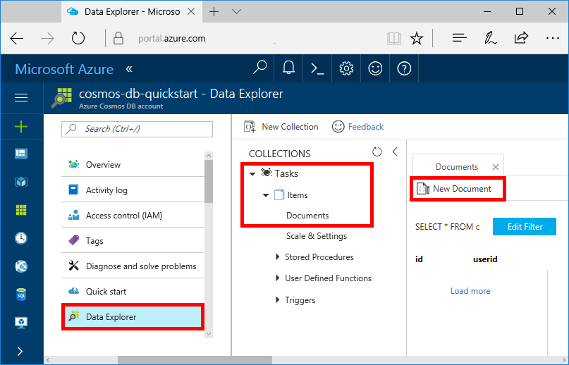
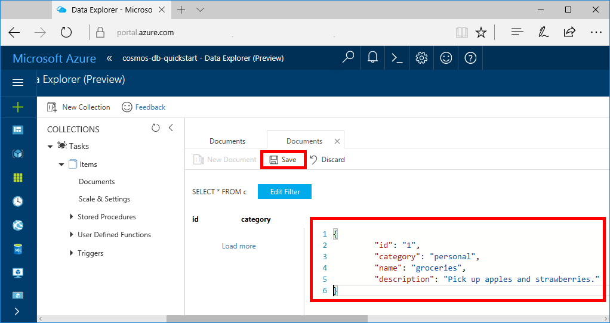

You can now add data to your new collection using Data Explorer.

1. In Data Explorer, the new database appears in the Collections pane. Expand the **Tasks** database, expand the **Items** collection, click **Documents**, and then click **New Documents**. 

   

2. Now add a document to the collection with the following structure.

     ```json
     {
         "id": "1",
         "category": "personal",
         "name": "groceries",
         "description": "Pick up apples and strawberries.",
         "isComplete": false
     }
     ```

3. Once you've added the json to the **Documents** tab, click **Save**.

    

4.  Create and save one more document where you insert a unique value for the `id` property, and change the other properties as you see fit. Your new documents can have any structure you want as Azure Cosmos DB doesn't impose any schema on your data.
<!-- Update_Description: new articles on cosmos db create sql api add sample data -->
<!--ms.date: 04/23/2018-->