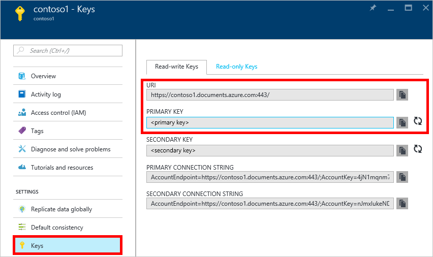

Now navigate to the Azure Cosmos DB account page, and click **Keys**, as these values are used in the web application you create next.

<!--Update_Description: wording update-->
<!--ms.date:03/05/2018-->