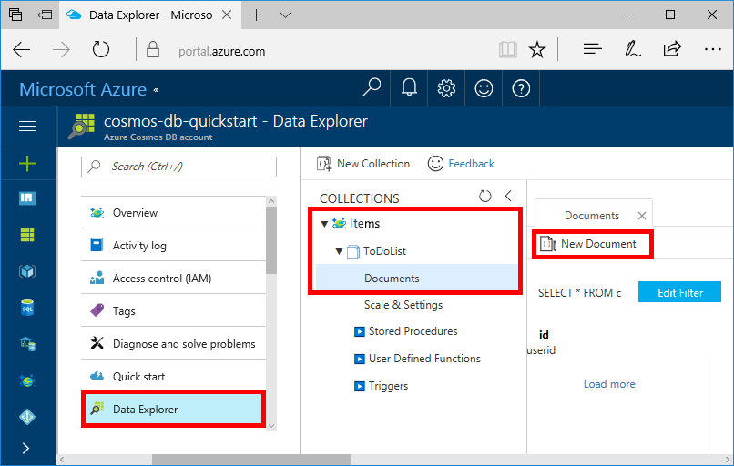

You can now add data to your new collection using Data Explorer.

1. In Data Explorer, the new database appears in the Collections pane. Expand the **Items** database, expand the **ToDoList** collection, click **Documents**, and then click **New Documents**. 

   

2. Now add a few new documents to the collection with the following structure, where you insert unique values for id in each document and change the other properties as you see fit. Your new documents can have any structure you want as Azure Cosmos DB doesn't impose any schema on your data.

     ```json
     {
         "id": "1",
         "category": "personal",
         "name": "groceries",
         "description": "Pick up apples and strawberries."
     }
     ```

     You can now use queries in Data Explorer to retrieve your data. By default, Data Explorer uses SELECT * FROM c to retrieve all documents in the collection, but you can change that to SELECT * FROM c ORDER BY c.name ASC, to return all the documents in alphabetic ascending order of the name property. 

     You can also use Data Explorer to create stored procedures, UDFs, and triggers to perform server-side business logic. Data Explorer exposes all of the built in programmatic data access available in the APIs, but provides easy access to your data in the Azure Portal Preview.